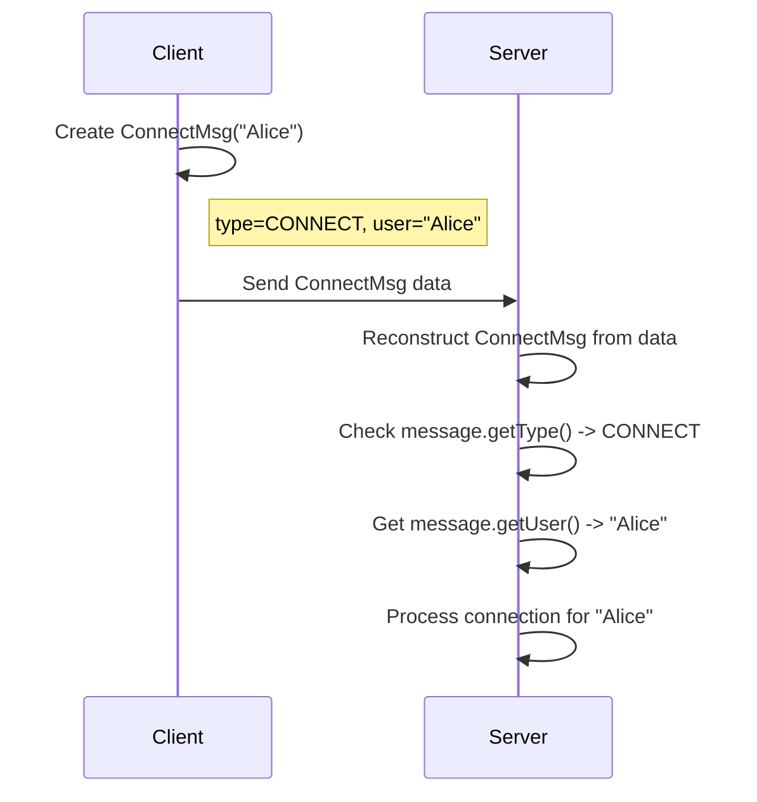

# Chapter 1: Message Hierarchy (Communication Protocol)

Welcome to the `dat110-project2-javafx-chatapp` tutorial! We're going to build a chat application, and the very first thing we need to figure out is how different parts of our application will talk to each other.

Imagine you want to send different kinds of information through the postal mail. You wouldn't use the same format for a quick postcard as you would for a formal registration form, right? Each serves a different purpose and needs different information.

Our chat application faces a similar challenge. The **Client** (your chat window) needs to talk to the **Server** (the central hub managing the chat). They need to exchange various types of information:

*   A user wanting to join the chat.
*   A user wanting to send a message to a specific chat topic.
*   A user wanting to start receiving messages from a topic (subscribing).
*   A user wanting to leave the chat.

If the client just sent raw text, how would the server know *what the client wants to do*? Is "hello" a message to publish, or is it the name of a topic the user wants to create? It's confusing!

To solve this, we need a **Communication Protocol** – a set of rules and standardized formats for messages. In our project, this is achieved through a **Message Hierarchy**.

## What is the Message Hierarchy?

Think of it like creating standardized templates for different kinds of postal mail:

*   A basic template (`Message`) with common fields like the sender's name (`user`).
*   A specialized template for connecting (`ConnectMsg`).
*   A specialized template for sending a message (`PublishMsg`).
*   A specialized template for joining a topic (`SubscribeMsg`).
*   And so on...

This way, when the server receives a message, it can look at its type (like looking at the type of envelope or form) and immediately understand its purpose and what information to expect inside.

## The Base: `Message.java`

Everything starts with the `Message` class. This is the most basic building block, like a generic envelope.

```java
// File: src/main/java/no/hvl/dat110/messages/Message.java
package no.hvl.dat110.messages;

public abstract class Message { // 'abstract' means you can't create a plain 'Message', only specific types

	private MessageType type; // What kind of message is this? (e.g., CONNECT, PUBLISH)
	private String user;      // Which user sent this message?

	// Constructor to set the type and user when creating a specific message
	public Message(MessageType type, String user) {
		this.type = type;
		this.user = user;
	}

	public MessageType getType() { return this.type; }
	public String getUser() { return user; }

	@Override
	public String toString() { // A helpful way to print message info for debugging
		return "Message [type=" + type + ", user=" + user + "]";
	}
}
```

*   **`MessageType type`**: This is crucial! It tells us exactly what kind of action this message represents (Connect? Publish? Subscribe?). We'll see `MessageType` in a moment.
*   **`String user`**: Stores the username associated with the message.
*   **`abstract class`**: This means we can't just make a generic `Message` object. We *must* use one of the specific types (like `ConnectMsg`, `PublishMsg`, etc.) that *extend* this base class.

## Message Types: `MessageType.java`

To keep track of the different kinds of messages, we use an `enum` (a special type for defining a set of constants).

```java
// File: src/main/java/no/hvl/dat110/messages/MessageType.java
package no.hvl.dat110.messages;

// Defines all possible types of messages in our system
public enum MessageType {
	CONNECT,      // User wants to connect
	DISCONNECT,   // User wants to disconnect
	SUBSCRIBE,    // User wants to subscribe to a topic
	UNSUBSCRIBE,  // User wants to unsubscribe from a topic
	PUBLISH,      // User wants to send a message to a topic
	CREATETOPIC,  // User wants to create a new topic
	DELETETOPIC;  // User wants to delete a topic
	// STATUS; // (Note: STATUS might be used by the server, omitted for client focus here)
}
```

This `enum` provides clear, readable names for each message type used in the `Message` class's `type` field.

## Specialized Messages: Adding Specific Details

Now, let's look at how we create specific message types based on the `Message` template.

**1. Connecting (`ConnectMsg.java`)**

When a user wants to connect, they just need to tell the server their username.

```java
// File: src/main/java/no/hvl/dat110/messages/ConnectMsg.java
package no.hvl.dat110.messages;

// Inherits from the base Message class
public class ConnectMsg extends Message {

	// Constructor for a Connect message
	public ConnectMsg (String user) {
		// Calls the base Message constructor, setting the type to CONNECT
		// and passing along the username.
		super(MessageType.CONNECT, user);
		// No extra information needed for connecting, just the user.
	}
}
```

*   `extends Message`: This means `ConnectMsg` *is a* type of `Message` and gets the `type` and `user` fields automatically.
*   `super(MessageType.CONNECT, user)`: This calls the constructor of the base `Message` class, setting the `type` specifically to `CONNECT` and storing the provided `user`.

**2. Publishing a Message (`PublishMsg.java`)**

When a user wants to send ("publish") a message, they need to specify *which topic* it belongs to and *what the message content* is, in addition to their username.

```java
// File: src/main/java/no/hvl/dat110/messages/PublishMsg.java
package no.hvl.dat110.messages;

public class PublishMsg extends Message {

	// Additional fields specific to publishing
	private String topic;   // Which topic to publish to?
	private String message; // What is the actual message content?

	public PublishMsg(String user, String topic, String message) {
		// Set the type to PUBLISH and store the user
		super(MessageType.PUBLISH, user);
		// Store the topic and message specific to this type
		this.topic = topic;
		this.message = message;
	}

	// Methods to get the topic and message (Getters)
	public String getTopic() { return topic; }
	public String getMessage() { return message; }

	// ... (Setters and toString methods are also usually here)
}
```

*   `extends Message`: Again, it inherits from `Message`.
*   `private String topic;`, `private String message;`: These are *new* fields added specifically for `PublishMsg`.
*   `super(MessageType.PUBLISH, user)`: Sets the type to `PUBLISH`.
*   `this.topic = topic;`, `this.message = message;`: Stores the extra information needed for publishing.

Other message types like `SubscribeMsg`, `UnsubscribeMsg`, `CreateTopicMsg`, `DeleteTopicMsg`, and `DisconnectMsg` follow the same pattern: they extend `Message`, set the appropriate `MessageType`, and add any extra fields they need (like `topic` for most topic-related actions).

## How It Works in Practice (Conceptual)

Imagine you are the `Client` and want to connect to the `Server` as user "Alice".

1.  **Client:** Creates a `ConnectMsg` object: `new ConnectMsg("Alice")`. This object internally has `type = MessageType.CONNECT` and `user = "Alice"`.
2.  **Client:** Sends this `ConnectMsg` object over the network to the Server. (We'll cover *how* it's sent in later chapters about [TransportMessage](06_transportmessage__network_data_framing__.md) and [Connection](07_connection__network_stream_handling__.md)).
3.  **Server:** Receives the message data. It reconstructs the `ConnectMsg` object (using helpers from [MessageUtils](08_messageutils__serialization_deserialization__.md)).
4.  **Server:** Checks the message's type: `message.getType()`. It sees `MessageType.CONNECT`.
5.  **Server:** Ah! This is a connection request. It gets the username: `message.getUser()` which returns "Alice".
6.  **Server:** Performs the actions needed to register Alice as a connected user.

Here's a simplified diagram of this flow:



By using this hierarchy, the Server can easily understand the Client's intentions without ambiguity. Each message type clearly defines the required information for a specific action.

## Conclusion

We've seen how the Message Hierarchy acts as a communication protocol for our chat application.

*   It defines a base `Message` with common information (`type`, `user`).
*   It uses specific message classes (`ConnectMsg`, `PublishMsg`, etc.) that extend the base class and add action-specific data.
*   It uses the `MessageType` enum to clearly identify the purpose of each message.

This structured approach ensures that the Client and Server can communicate effectively and understand each other's requests and information.

In the next chapter, we'll dive into the [Client (Network Interaction Logic)](02_client__network_interaction_logic__.md) and see how it actually *uses* these message objects to interact with the network and the server.

---

