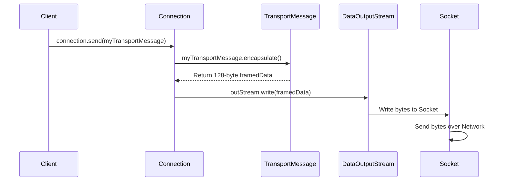

# Chapter 7: Connection (Network Stream Handling)

In [Chapter 6: TransportMessage (Network Data Framing)](06_transportmessage__network_data_framing__.md), we learned how to package our messages (like `PublishMsg`) into standard-sized 128-byte "envelopes" called `TransportMessage`s. We know how to put the message length and the message data inside this envelope using `encapsulate()`.

But how does this digital envelope actually get sent across the internet wires? And how do we receive similar envelopes coming back from the server? Simply creating the `TransportMessage` frame isn't enough; we need something to handle the actual pickup and delivery over the network.

## The Delivery Truck: Handling Network Streams

Think back to our analogy:
*   Your application wants to send a message (`PublishMsg`).
*   `MessageUtils` ([Chapter 8](08_messageutils__serialization_deserialization__.md)) turns it into raw bytes (the package content).
*   `TransportMessage` ([Chapter 6](06_transportmessage__network_data_framing__.md)) puts these bytes into a standard 128-byte frame (the shipping box with a length label).

Now we need the **delivery truck and driver**. This is the part that knows the network "roads" (the underlying TCP/IP connection) and how to physically load the box (`TransportMessage` bytes) onto the truck, drive it to the destination (server), and unload incoming boxes.

In our project, the `Connection` class (`Connection.java`) is this delivery truck and driver. It manages the low-level details of sending and receiving streams of bytes over an established network connection. It doesn't need to understand *what* is inside the `TransportMessage` box; it just needs to know how to send the box reliably and receive incoming boxes.

## Key Parts of the Delivery System

Before we look at the `Connection` class itself, let's understand two key concepts it uses:

1.  **Socket:** When the `Client` ([Chapter 2](02_client__network_interaction_logic__.md)) connects to the server, it establishes a **TCP Socket** connection. Think of the socket as a specific, numbered docking bay at the post office dedicated to communication between your application and the server. It's the endpoint of the network link.

2.  **Input/Output Streams:** How does Java code actually put data onto the socket (send) or get data from the socket (receive)? It uses **Streams**. Imagine these as conveyor belts attached to the docking bay:
    *   **`OutputStream` (specifically `DataOutputStream`):** This is the "outgoing" conveyor belt. You put bytes onto it, and they get sent out through the socket. `DataOutputStream` is helpful because it has methods designed for sending primitive Java data types, like raw bytes.
    *   **`InputStream` (specifically `DataInputStream`):** This is the "incoming" conveyor belt. Bytes arriving at the socket come in on this stream, and you can read them. `DataInputStream` helps read primitive data, including raw bytes.

The `Connection` class manages the `Socket` and these two streams.

## Creating a `Connection`

We don't usually create the `Connection` object directly in our main application logic. Remember from [Chapter 2](02_client__network_interaction_logic__.md), the `Client` uses a helper called `MessagingClient` to establish the initial network connection. This helper creates the `Socket` and then immediately wraps it in a `Connection` object.

Here's the constructor of the `Connection` class:

```java
// File: src/main/java/no/hvl/dat110/messagetransport/Connection.java

import java.io.DataInputStream;
import java.io.DataOutputStream;
import java.io.IOException;
import java.net.Socket;

public class Connection {

	private DataOutputStream outStream; // Outgoing conveyor belt
	private DataInputStream inStream;   // Incoming conveyor belt
	private Socket socket;              // The docking bay

	public Connection(Socket socket) { // Takes the established connection point

		try {
			this.socket = socket; // Store the socket

			// Attach the outgoing stream to the socket
			outStream = new DataOutputStream(socket.getOutputStream());

			// Attach the incoming stream to the socket
			inStream = new DataInputStream(socket.getInputStream());

		} catch (IOException ex) {
			System.out.println("Connection Error: " + ex.getMessage());
			// In a real app, handle this error more gracefully
		}
	}

	// ... methods for sending, receiving, closing ...
}
```

*   The constructor receives an already connected `Socket`.
*   It creates a `DataOutputStream` linked to the socket's output, storing it in `outStream`.
*   It creates a `DataInputStream` linked to the socket's input, storing it in `inStream`.
*   Now the `Connection` object is ready to send and receive data using these streams.

## Sending a Package: `Connection.send()`

How does the `Client` tell the `Connection` to send one of our prepared `TransportMessage` boxes? It calls the `send()` method.

```java
// File: src/main/java/no/hvl/dat110/messagetransport/Connection.java

	public void send(TransportMessage message) {

		try {
			// 1. Get the 128-byte framed data from the TransportMessage
			//    (This uses the encapsulate() method from Chapter 6)
			byte[] sendbuf = message.encapsulate();

			// 2. Write the entire 128-byte buffer to the output stream
			outStream.write(sendbuf);

		} catch (IOException ex) {
			System.out.println("Connection Send Error: " + ex.getMessage());
			// Handle errors
		}
	}
```

*   The method takes a `TransportMessage` object as input (this object already contains the payload bytes).
*   **Step 1:** It calls `message.encapsulate()`. As we learned in [Chapter 6](06_transportmessage__network_data_framing__.md), this creates the standard 128-byte array with the length byte followed by the payload bytes.
*   **Step 2:** It uses `outStream.write(sendbuf)` to put the entire 128-byte array onto the outgoing conveyor belt (the `DataOutputStream`). The underlying network system takes care of sending these bytes through the `Socket` to the server.

Simple! The `Connection` doesn't need to know what's inside `message`, only how to get the framed bytes from it and write them to the stream.

## Receiving a Package: `Connection.receive()`

When data arrives from the server, how does the `Client` get it? It asks the `Connection` object by calling the `receive()` method. Since we know (from Chapter 6) that all data is sent in 128-byte frames, the `receive()` method expects to read exactly 128 bytes.

```java
// File: src/main/java/no/hvl/dat110/messagetransport/Connection.java

	public TransportMessage receive() {

		TransportMessage message = null; // Where we'll store the result
		byte[] recvbuf; // A temporary buffer to hold the incoming 128 bytes

		try {
			// 1. Create an empty byte array exactly 128 bytes long
			recvbuf = new byte[MessageConfig.SEGMENTSIZE];

			// 2. Read exactly 128 bytes from the input stream into the buffer
			//    This will wait ('block') if data isn't available yet.
			int read = inStream.read(recvbuf, 0, MessageConfig.SEGMENTSIZE);

			// Basic check if we actually read the expected amount
			if (read != MessageConfig.SEGMENTSIZE) {
				throw new IOException("Receive - did not read full segment");
			}

			// 3. Create a new, empty TransportMessage object
			message = new TransportMessage();

			// 4. Tell the TransportMessage to extract the payload
			//    from the received 128 bytes using decapsulate() (Chapter 6)
			message.decapsulate(recvbuf);

		} catch (IOException ex) {
			System.out.println("Connection Receive Error: " + ex.getMessage());
			// Handle errors (e.g., connection closed)
			// Returning null indicates failure
			message = null;
		}

		// 5. Return the TransportMessage, now containing the extracted payload
		return message;
	}
```

*   **Step 1:** An empty byte array `recvbuf` of size 128 is created. This is where the incoming data will be temporarily stored.
*   **Step 2:** `inStream.read(recvbuf, 0, MessageConfig.SEGMENTSIZE)` is the crucial part. This command tells the `DataInputStream` to read bytes from the network and fill the `recvbuf`. It will wait until exactly 128 bytes have been received.
*   **Step 3:** A new, empty `TransportMessage` object is created.
*   **Step 4:** `message.decapsulate(recvbuf)` is called. As we saw in [Chapter 6](06_transportmessage__network_data_framing__.md), this method looks at the first byte of `recvbuf` to find the length, then copies the actual payload bytes from `recvbuf` into the `message` object's internal `payload` field.
*   **Step 5:** The `message` object, now containing the extracted payload bytes, is returned. The caller (usually the `Client`) now has the raw data of the message that was sent by the server.

## How Sending Works: Under the Hood

Let's visualize the `send()` process:



The `Client` asks the `Connection` to send. The `Connection` gets the framed bytes from the `TransportMessage` and writes them to the `DataOutputStream`, which sends them through the `Socket`.

## Closing the Docking Bay: `Connection.close()`

When the user disconnects or the application shuts down, it's important to clean up the network resources. This means closing the streams and the socket.

```java
// File: src/main/java/no/hvl/dat110/messagetransport/Connection.java

	// Close the connection by closing streams and the underlying socket
	public void close() {
		try {
			// Close the outgoing stream
			outStream.close();
			// Close the incoming stream
			inStream.close();
			// Close the network socket itself
			socket.close();

		} catch (IOException ex) {
			System.out.println("Connection Close Error: " + ex.getMessage());
			// Handle errors
		}
	}
```

This method simply calls `close()` on both streams and the socket to release the network connection gracefully.

## Conclusion

The `Connection` class is our application's "delivery truck," responsible for the low-level task of sending and receiving byte streams over the network.

*   It wraps a `Socket` (the connection endpoint) and manages `DataInputStream` and `DataOutputStream` (the conveyor belts).
*   `send(TransportMessage message)` uses `message.encapsulate()` to get the 128-byte frame and writes it to the `DataOutputStream`.
*   `receive()` reads exactly 128 bytes from the `DataInputStream`, creates a `TransportMessage`, and uses `message.decapsulate()` to extract the payload.
*   It relies on the framing strategy defined in `TransportMessage` ([Chapter 6](06_transportmessage__network_data_framing__.md)) to know how much data to read and how to extract the payload.
*   `close()` cleans up the network resources.

The `Connection` deals only with the framed bytes. It successfully delivers the `TransportMessage` box, but the box still contains raw payload bytes. How do we turn those bytes back into the meaningful `Message` objects (like `PublishMsg` or `ConnectMsg`) that our application logic understands?

That's the final piece of the puzzle! In the next chapter, we'll explore [Chapter 8: MessageUtils (Serialization/Deserialization)](08_messageutils__serialization_deserialization__.md), the utility that converts our Java message objects *to* bytes (for sending) and converts received bytes *back* into objects.

---

