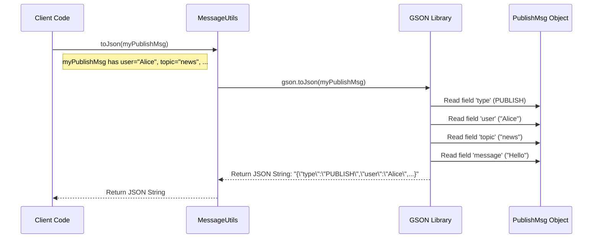
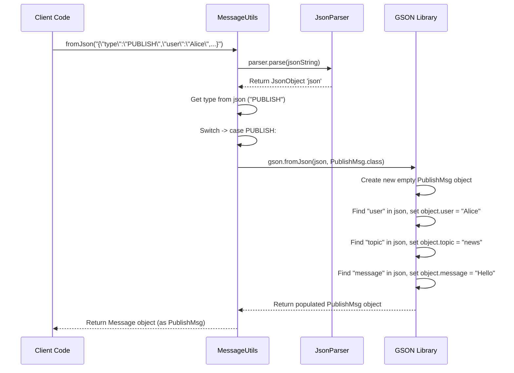

# Chapter 8: MessageUtils (Serialization/Deserialization)

Welcome to the final chapter of our core tutorial! In [Chapter 7: Connection (Network Stream Handling)](07_connection__network_stream_handling__.md), we saw how the `Connection` class acts like a delivery truck, sending and receiving standard-sized 128-byte packages (`TransportMessage` from [Chapter 6](06_transportmessage__network_data_framing__.md)) over the network.

However, there's a crucial step we haven't fully explored. Inside those 128-byte packages are the raw *payload bytes*. When we *send* a message, how do we convert our meaningful Java `Message` objects (like `PublishMsg` from [Chapter 1](01_message_hierarchy__communication_protocol__.md)) into those raw bytes? And when we *receive* a package, how do we turn the payload bytes back into a usable `Message` object that our application logic ([Chapter 5: Controller](05_controller__ui_logic_coordinator__.md)) can understand?

This conversion process is like translating between languages – the language of our Java application (objects) and the language of the network (bytes).

## The Translator and Packager: `MessageUtils`

Imagine you want to send a detailed instruction manual (our `Message` object) to someone overseas. You can't just beam the manual directly!
1.  **Translate:** You might first translate it into a universally understood format, like simple English or maybe a standard code (like JSON).
2.  **Package:** Then, you need to write this translated version down onto paper (convert to bytes) and put it in a standard shipping box (`TransportMessage`).

When the person receives the box, they do the reverse:
1.  **Unpack:** They take the paper out of the box.
2.  **Translate Back:** They read the standard format and reconstruct the original instruction manual in their own language.

The `MessageUtils` class (`MessageUtils.java`) acts as our application's **translator and packager**. It's a collection of helper tools (static methods) specifically designed to:

*   **Serialize:** Convert a `Message` object into a standard format (JSON string) and then into raw bytes, ready to be put into a `TransportMessage` for sending.
*   **Deserialize:** Take raw bytes received from a `TransportMessage`, convert them back into the standard format (JSON string), and then reconstruct the original `Message` object.

## Why JSON? A Universal Language

Instead of inventing our own complex way to represent message objects as bytes, we use a popular, standard format called **JSON (JavaScript Object Notation)**.

JSON is human-readable text that uses key-value pairs. A `PublishMsg` object might look like this in JSON:

```json
{
  "type": "PUBLISH",
  "user": "Alice",
  "topic": "general",
  "message": "Hello there!"
}
```

Why use JSON?
*   **Readable:** Humans can easily read and understand it (great for debugging!).
*   **Standard:** Many programming languages and systems understand JSON, making it great for communication.
*   **Simple:** It's relatively easy to convert Java objects to and from JSON.

## Using GSON: Our JSON Translator Tool

To handle the conversion between our Java `Message` objects and JSON strings, we use a popular Java library called **GSON** (from Google). Think of GSON as a specialized translator that knows how to read Java object fields (like `user`, `topic`) and write them into JSON format, and vice-versa.

You'll notice `import com.google.gson.*;` at the top of `MessageUtils.java` - that's us bringing in the GSON library.

## Serialization: Object -> JSON -> Bytes

Let's see how `MessageUtils` handles serialization when we want to send a message.

**Step 1: Object to JSON String (`toJson`)**

This method takes any `Message` object and uses GSON to turn it into a JSON string.

```java
// File: src/main/java/no/hvl/dat110/messages/MessageUtils.java

import com.google.gson.Gson; // Import the GSON library

// ... other imports ...

public class MessageUtils {

	public static String toJson(Message msg) {
		// Create a GSON translator instance
		Gson gson = new Gson();
		// Tell GSON to convert the Message object into a JSON string
		String json = gson.toJson(msg);
		// Return the resulting JSON string
		return json;
	}

	// ... other methods ...
}
```
*   Input: A `Message` object (e.g., `new PublishMsg("Alice", "general", "Hello!")`).
*   Output: A JSON string (e.g., `{"type":"PUBLISH","user":"Alice","topic":"general","message":"Hello there!"}`).
*   How: It simply uses `gson.toJson(msg)`. GSON automatically looks at the fields in the `msg` object and creates the corresponding JSON structure.

**Step 2: JSON String to Bytes (`getBytes`)**

Now that we have the JSON string, we need to convert it into the raw bytes that can be sent over the network. Java strings have a built-in method for this.

```java
// File: src/main/java/no/hvl/dat110/messages/MessageUtils.java

public class MessageUtils {

	// ... toJson method ...

	public static byte[] getBytes(Message msg) {
		// First, convert the Message object to a JSON string
		String jsonString = toJson(msg);
		// Then, convert the string into an array of bytes
		// using the default character encoding (usually UTF-8)
		byte[] bytes = jsonString.getBytes();
		// Return the byte array
		return bytes;
	}

	// ... other methods ...
}
```
*   Input: A `Message` object.
*   Output: A `byte[]` array representing the JSON string.
*   How: It calls `toJson()` first, then calls the standard Java `.getBytes()` method on the resulting string.

**Step 3: Bytes into a TransportMessage (`toTransportMessage`)**

Finally, we take these bytes and put them into the `TransportMessage` frame we learned about in [Chapter 6](06_transportmessage__network_data_framing__.md).

```java
// File: src/main/java/no/hvl/dat110/messages/MessageUtils.java

import no.hvl.dat110.messagetransport.TransportMessage; // Import TransportMessage

// ... other imports ...

public class MessageUtils {

	// ... toJson, getBytes methods ...

	public static TransportMessage toTransportMessage(Message msg) {
		// 1. Convert the Message object to bytes (via JSON)
		byte[] payloadBytes = getBytes(msg);
		// 2. Create a new TransportMessage containing these bytes as payload
		TransportMessage transportMsg = new TransportMessage(payloadBytes);
		// Return the prepared TransportMessage
		return transportMsg;
	}

	// ... other methods ...
}
```
*   Input: A `Message` object.
*   Output: A `TransportMessage` object ready to be sent by the `Connection`.
*   How: It calls `getBytes()` to get the payload, then creates a `new TransportMessage()` using those bytes.

This `toTransportMessage` method is the primary serialization helper used by the `Client` before sending.

## Deserialization: Bytes -> JSON -> Object

Now let's look at the reverse process when we receive data. The `Connection` gives us a `TransportMessage` containing payload bytes.

**Step 1: Extract Bytes from TransportMessage (`fromTransportMessage`)**

This method takes the received `TransportMessage` and extracts the raw payload bytes.

```java
// File: src/main/java/no/hvl/dat110/messages/MessageUtils.java

public class MessageUtils {

	// ... serialization methods ...

	public static Message fromTransportMessage(TransportMessage msg) {
		// 1. Get the raw payload bytes from the TransportMessage
		byte[] payloadBytes = msg.getData();
		// 2. Convert these bytes back into a Message object
		Message originalMessage = fromBytes(payloadBytes);
		// Return the reconstructed Message object
		return originalMessage;
	}

	// ... other methods ...
}
```
*   Input: A `TransportMessage` received from the `Connection`.
*   Output: The reconstructed `Message` object.
*   How: It calls `msg.getData()` to get the payload bytes, then passes these bytes to the `fromBytes` method (explained next).

**Step 2: Bytes to JSON String (`fromBytes`)**

This method takes the raw bytes and converts them back into a JSON string.

```java
// File: src/main/java/no/hvl/dat110/messages/MessageUtils.java

public class MessageUtils {

	// ... fromTransportMessage method ...

	public static Message fromBytes(byte[] payload) {
		// Convert the byte array back into a String
		String jsonString = new String(payload);
		// Convert the JSON string into a Message object
		Message message = fromJson(jsonString);
		// Return the reconstructed object
		return message;
	}

	// ... fromJson method ...
}
```
*   Input: A `byte[]` array (the payload).
*   Output: A `Message` object.
*   How: It uses `new String(payload)` to turn the bytes back into a string (assuming the same character encoding, usually UTF-8). Then, it calls `fromJson()` (explained next) to parse this string.

**Step 3: JSON String to Object (`fromJson`)**

This is the core of deserialization where GSON reconstructs the specific `Message` object. Since the JSON only tells us the `type` (like "PUBLISH"), we need to help GSON figure out *which* Java class to create (`PublishMsg`, `ConnectMsg`, etc.).

```java
// File: src/main/java/no/hvl/dat110/messages/MessageUtils.java

import com.google.gson.*; // Need more GSON classes here
import no.hvl.dat110.messages.MessageType; // Need the enum

// ... other imports ...

public class MessageUtils {

	// ... fromBytes method ...

	public static Message fromJson(String msgJson) {

		// 1. Parse the raw JSON string into a generic JSON object structure
		JsonParser jsonParser = new JsonParser();
		JsonObject json = jsonParser.parse(msgJson).getAsJsonObject();

		// 2. Look inside the JSON to find the "type" field's value
		String typestr = json.get("type").getAsString(); // e.g., "PUBLISH"

		// 3. Convert the type string into our MessageType enum
		MessageType type = MessageType.valueOf(typestr); // e.g., MessageType.PUBLISH

		// 4. Create a GSON instance
		Gson gson = new Gson();
		Message message = null; // Variable to hold the final object

		// 5. Use a switch based on the type to tell GSON which class to build
		switch (type) {
			case CONNECT:
				message = gson.fromJson(json, ConnectMsg.class);
				break;
			case PUBLISH:
				message = gson.fromJson(json, PublishMsg.class);
				break;
			case SUBSCRIBE:
				message = gson.fromJson(json, SubscribeMsg.class);
				break;
			// ... cases for all other MessageTypes ...
			default:
				System.out.println("fromJson - unknown message type: " + typestr);
				break;
		}

		// Return the specific Message object (e.g., a PublishMsg instance)
		return message;
	}

	// ... other methods ...
}
```
*   Input: A JSON string (e.g., `{"type":"PUBLISH","user":"Alice",...}`).
*   Output: A specific `Message` object (e.g., a `PublishMsg` instance).
*   How:
    *   It first parses the string into a general `JsonObject`.
    *   It extracts the value of the `"type"` field.
    *   It uses a `switch` statement based on this type.
    *   Inside the correct `case`, it calls `gson.fromJson(json, SpecificMsgClass.class)`. This tells GSON: "Take the data from this `json` object and use it to create an instance of *this specific class* (e.g., `PublishMsg.class`)". GSON automatically matches JSON fields to the Java class fields.

This `fromTransportMessage` (which uses `fromBytes` and `fromJson`) is the primary deserialization helper used by the `Client` after receiving data.

## Convenience Methods: `send` and `receive`

`MessageUtils` also provides two high-level convenience methods that combine the translation step with the actual network sending/receiving.

```java
// File: src/main/java/no/hvl/dat110/messages/MessageUtils.java

import no.hvl.dat110.messagetransport.Connection; // Need Connection

// ... other imports ...

public class MessageUtils {

	// ... all the conversion methods ...

	// Sends a Message object over a Connection
	public static void send (Connection connection, Message message) {
		// 1. Convert the Message object to a TransportMessage
		TransportMessage transportMsg = toTransportMessage(message);
		// 2. Tell the connection to send it
		connection.send(transportMsg);
	}

	// Receives the next Message object from a Connection
	public static Message receive (Connection connection) {
		// 1. Tell the connection to receive the next 128-byte frame
		TransportMessage transportMsg = connection.receive();
		// 2. If successful, convert the TransportMessage back to a Message object
		Message message = null;
		if (transportMsg != null) {
			message = fromTransportMessage(transportMsg);
		}
		// Return the reconstructed Message object (or null if receive failed)
		return message;
	}
}
```
*   `send(connection, message)`: A shortcut that takes your `Message` object, serializes it into a `TransportMessage` using `toTransportMessage`, and then calls `connection.send()` to send it over the network.
*   `receive(connection)`: A shortcut that calls `connection.receive()` to get the next `TransportMessage`, and if successful, deserializes it back into the original `Message` object using `fromTransportMessage`.

The `Client` primarily uses these `send` and `receive` methods for cleaner code.

## Under the Hood: GSON at Work

Let's visualize the core GSON translation steps.

**Serialization (`toJson`):**



**Deserialization (`fromJson` for a PublishMsg):**



## Conclusion

The `MessageUtils` class is the essential translator between our application's Java `Message` objects and the raw bytes needed for network transmission.

*   It uses the **JSON** format as a standard, readable intermediate representation.
*   It relies on the **GSON library** to perform the actual conversion between Java objects and JSON strings.
*   **Serialization (`toTransportMessage`)**: Converts `Message` -> JSON String -> `byte[]` -> `TransportMessage`.
*   **Deserialization (`fromTransportMessage`)**: Converts `TransportMessage` -> `byte[]` -> JSON String -> `Message`.
*   The `fromJson` method uses the `"type"` field within the JSON to determine which specific `Message` subclass to create.
*   Helper methods `send` and `receive` simplify the process for the `Client`.

With `MessageUtils`, we complete the communication pipeline. We can now create message objects, translate and package them, send them over the network using the connection, receive packages, and translate them back into objects the application can understand.

This concludes our tour of the core components of the `dat110-project2-javafx-chatapp` client! We've covered the message structure, client logic, application entry point, UI areas, controller, network framing, connection handling, and finally, the serialization/deserialization mechanism. You now have a foundational understanding of how these pieces work together to create a functional chat client.

---

