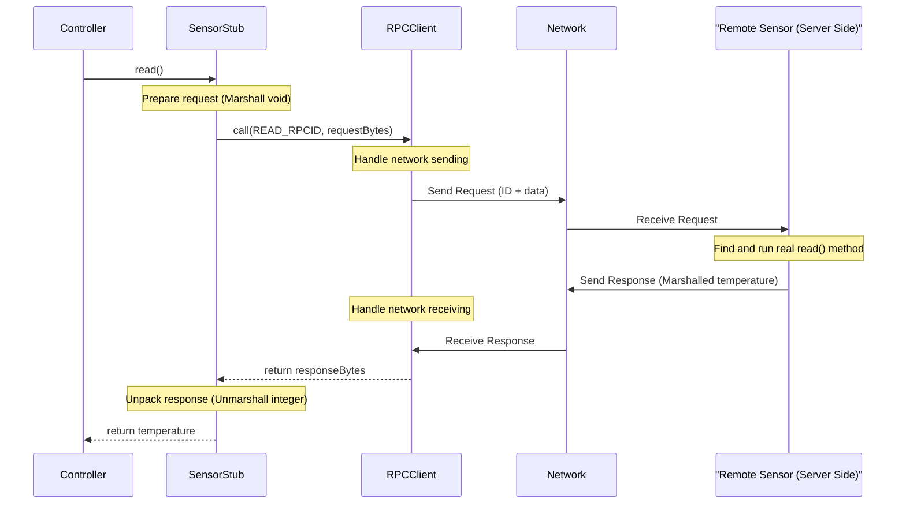

# Chapter 1: RPC Client Stub

Welcome to the first chapter of our tutorial for `dat110-project1-gruppe69`! We're going to build a small system where different parts talk to each other over a network. Let's start with a common problem: How can one program ask another program, possibly running on a different computer, to do something for it?

Imagine you have a Controller application that needs to know the current temperature. This temperature reading comes from a Sensor application, which might be running on a separate device. How does the Controller ask the Sensor for the temperature? It sounds complicated, involving networks and sending data back and forth.

This is where the **RPC Client Stub** comes in. RPC stands for **Remote Procedure Call**. The RPC Client Stub makes this network communication *look* like a simple, normal function call within your Controller program.

## What is an RPC Client Stub?

Think of an RPC Client Stub like a helpful **local travel agent**. You want to book a flight to another country (call a function on another computer). Instead of figuring out international phone lines, different time zones, and booking systems yourself (dealing with network details), you just talk to your local travel agent (the stub).

You tell the agent, "I want to fly to London on this date." (You call a method like `sensor.read()`). The agent takes your request, handles all the complex booking details with the airline (sends the request over the network), waits for confirmation (waits for the response), and then gives you your ticket (returns the result, like the temperature).

So, the **RPC Client Stub** is:

1.  **A Local Object:** It lives inside your client application (e.g., the Controller).
2.  **A Proxy/Stand-in:** It pretends to be the remote service (e.g., the Sensor).
3.  **A Network Hider:** It takes care of packaging your request (marshalling), sending it over the network using the underlying [RPC Client](03_rpc_client_.md), receiving the response, and unpacking it (unmarshalling) for you.

This makes your life as a programmer much easier!

## Using the Stub: Making Remote Calls Look Local

Let's look at how the Controller application uses a stub to get the temperature from the Sensor.

```java
// Inside Controller.java (Simplified)

public class Controller {
    public static void main(String[] args) {
        // ... setup code ...

        // Assume 'sensorclient' is an RPCClient connected to the Sensor server
        RPCClient sensorclient = new RPCClient(Common.SENSORHOST, Common.SENSORPORT);
        sensorclient.connect();

        // Create the stub, giving it the RPCClient to use for communication
        SensorStub sensor = new SensorStub(sensorclient);

        // Now, call the 'read' method ON THE STUB as if it were local!
        int currentTemperature = sensor.read();

        System.out.println("Controller received temperature: " + currentTemperature);

        // ... cleanup code ...
    }
}
```

In this code:
*   We create a `SensorStub` called `sensor`.
*   We call `sensor.read()`. This *looks* exactly like calling a method on a normal Java object.
*   The `SensorStub` handles all the networking behind the scenes.
*   We get the temperature back as an integer, just like a regular method call.

## How the Stub Works (Under the Hood)

So, what actually happens inside the `sensor.read()` call? Let's peek inside the `SensorStub.java` file.

First, all client stubs in our project extend a base class called `RPCLocalStub`. This base class simply holds a reference to the [RPC Client](03_rpc_client_.md) which is responsible for the actual network communication.

```java
// File: src/main/java/no/hvl/dat110/rpc/RPCLocalStub.java
package no.hvl.dat110.rpc;

// Base class for all client-side stubs
public abstract class RPCLocalStub {

	protected RPCClient rpcclient; // Holds the client that handles network calls

	public RPCLocalStub(RPCClient rpcclient) {
		this.rpcclient = rpcclient; // Store the RPCClient when stub is created
	}
}
```

Now, let's look at the `SensorStub` itself and its `read()` method:

```java
// File: src/main/java/no/hvl/dat110/system/controller/SensorStub.java
package no.hvl.dat110.system.controller;

import no.hvl.dat110.rpc.*; // Import necessary RPC classes

public class SensorStub extends RPCLocalStub { // Extends the base stub class

	// Constructor: receives the RPCClient and passes it to the base class
	public SensorStub(RPCClient rpcclient) {
		super(rpcclient);
	}

	// The method our Controller calls
	public int read() {

		// 1. Marshall parameters: 'read' takes no arguments (void).
		// We still need to marshal this lack of arguments.
		byte[] request = RPCUtils.marshallVoid();

		// 2. Make the remote call: Tell the RPCClient to call the method
		// identified by READ_RPCID, sending the marshalled 'void' parameter.
		// The rpcclient handles sending/receiving over the network.
		byte[] response = rpcclient.call((byte)Common.READ_RPCID, request);

		// 3. Unmarshall the return value: The response byte array contains
		// the marshalled integer (temperature). We need to convert it back.
		int temp = RPCUtils.unmarshallInteger(response);

		// 4. Return the result to the Controller
		return temp;
	}
}
```

Let's break down the `read()` method step-by-step:

1.  **Marshall Parameters:** The `read()` method on the *remote* Sensor doesn't need any input data. However, the RPC system needs *something* to send. `RPCUtils.marshallVoid()` creates a standardized empty byte array representing "no parameters". We'll learn more about marshalling in [RPC Data Marshalling/Unmarshalling](05_rpc_data_marshalling_unmarshalling_.md).
2.  **Invoke `rpcclient.call()`:** This is the core step where the stub delegates the network communication. It calls the `call` method on the `rpcclient` object (which was passed into the stub's constructor).
    *   `Common.READ_RPCID`: This is a unique number (like an ID) that tells the server *which* method we want to run (in this case, the `read` method).
    *   `request`: This is the marshalled data (the empty bytes for `void`) to send.
    *   The `rpcclient.call()` method (covered in [RPC Client](03_rpc_client_.md)) handles sending the request ID and the data over the network and waits until it receives a response back from the server. It returns the raw bytes of the response.
3.  **Unmarshall Return Value:** The server executed the `read` method, got the temperature (an integer), marshalled it into bytes, and sent it back. The `response` variable now holds these bytes. `RPCUtils.unmarshallInteger(response)` converts these bytes back into a Java `int`. Again, see [RPC Data Marshalling/Unmarshalling](05_rpc_data_marshalling_unmarshalling_.md) for details.
4.  **Return Result:** The final integer `temp` is returned to the code that called `sensor.read()` (our `Controller`).

Here's a simplified diagram showing the flow:

## Conclusion

The RPC Client Stub is a powerful abstraction. It acts as a local representative for a remote service, allowing your application code (like the `Controller`) to call methods on remote objects (like the `Sensor`) as if they were right there in the same program. It hides the complexities of marshalling data, network communication, and unmarshalling results.

You've now seen how the client side initiates a remote call using a stub. But how does the server side receive this request and actually run the code? That's where the server-side counterpart comes in. In the next chapter, we'll look at the basic structure needed on the server to handle these incoming requests.

Next up: [RPC Server Implementation (Skeleton)](02_rpc_server_implementation__skeleton__.md)

---
