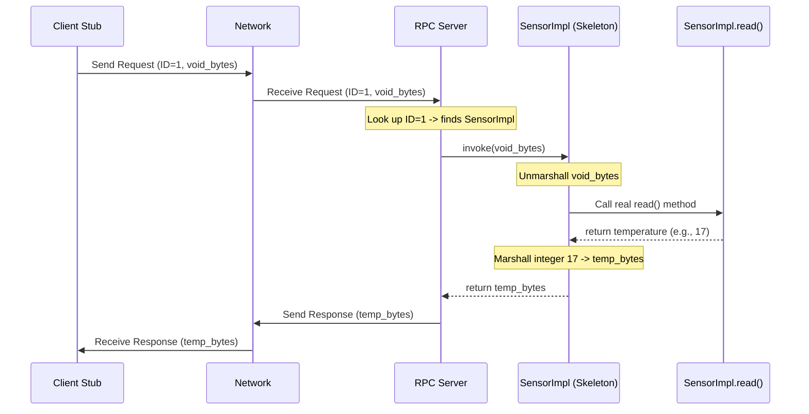

# Chapter 2: RPC Server Implementation (Skeleton)

In the [previous chapter](01_rpc_client_stub_.md), we saw how the **RPC Client Stub** acts like a local travel agent, making a request to a remote service (like getting the temperature from a Sensor) look like a simple local function call (`sensor.read()`).

But what happens on the *other side*? When the request travels across the network and arrives at the Sensor application (the RPC Server), who actually handles it? How does the server know what to do and how to perform the requested action?

That's where the **RPC Server Implementation (Skeleton)** comes in.

## What is an RPC Server Implementation (Skeleton)?

Think back to our travel agent analogy from Chapter 1. You (the Controller) told your local agent (the Client Stub) you wanted the temperature. The agent sent the request over the network. Now, the request arrives at the "remote travel agency" (the RPC Server).

The agency manager (the [RPC Server](04_rpc_server_.md)) receives the request, which says "Execute action #1" (the `READ_RPCID`). The manager doesn't handle temperature readings directly. Instead, they look up who *specializes* in action #1 and forward the request to that specific department.

This specialist department is the **RPC Server Implementation (Skeleton)**. In our case, it's the `SensorImpl` object.

So, the **RPC Server Implementation (Skeleton)** is:

1.  **A Server-Side Object:** It lives inside the server application (e.g., the Sensor application).
2.  **A Specialist:** It contains the *actual code* to perform a specific remote procedure (e.g., the real `read()` method that gets the temperature).
3.  **An Action Handler:** It knows how to unpack the request details (unmarshalling), run the correct code, and package the result (marshalling) to send back.

It's the component that bridges the gap between a generic network request and the specific application logic that needs to run.

## The `invoke` Method: Where the Magic Happens

Every "specialist department" (Skeleton) needs a standard way for the manager (RPC Server) to give it work. In our project, this standard way is a method called `invoke`.

Every Skeleton class (like `SensorImpl`) must:

1.  **Extend `RPCRemoteImpl`:** This is a base class that provides some common setup. We'll see it briefly later.
2.  **Implement the `invoke` method:** This method is the entry point for the [RPC Server](04_rpc_server_.md). When the server receives a request matching this skeleton's ID (like `READ_RPCID`), it calls this `invoke` method.

What does the `invoke` method do?

1.  **Receives Raw Data:** It gets the parameters sent by the client stub as a chunk of raw bytes (`byte[]`).
2.  **Unmarshalls Parameters:** It uses helper functions (from [RPC Data Marshalling/Unmarshalling](05_rpc_data_marshalling_unmarshalling_.md)) to convert these bytes back into meaningful data (like knowing the client wants to call `read` which takes no arguments).
3.  **Calls the Real Method:** It calls the actual application logic method within the same class (e.g., it calls the `read()` method inside `SensorImpl`).
4.  **Gets the Result:** It receives the return value from the real method (e.g., the integer temperature).
5.  **Marshalls Return Value:** It uses helper functions again to convert the return value back into raw bytes.
6.  **Returns Raw Data:** It gives the marshalled bytes back to the [RPC Server](04_rpc_server_.md), which will send them back over the network to the client.

## Example: Handling the `read()` Request in `SensorImpl`

Let's look at how `SensorImpl.java` acts as the skeleton for the Sensor's `read` method.

First, the base class `RPCRemoteImpl`: All skeletons extend this. Its main job in the constructor is to tell the main [RPC Server](04_rpc_server_.md) "Hey, I exist, and I handle requests with this specific ID."

```java
// File: src/main/java/no/hvl/dat110/rpc/RPCRemoteImpl.java
package no.hvl.dat110.rpc;

public abstract class RPCRemoteImpl {

	// Constructor called by subclasses (like SensorImpl)
	public RPCRemoteImpl(byte rpcid, RPCServer rpcserver) {
		// Register this implementation with the server,
		// associating it with the given rpcid
		rpcserver.register(rpcid, this);
	}

	// The method subclasses MUST implement to handle requests
	public abstract byte[] invoke(byte[] params);
}
```
This code tells us that any class extending `RPCRemoteImpl` needs to provide its own `invoke` method. The constructor ensures the [RPC Server](04_rpc_server_.md) knows which skeleton handles which ID.

Now, the `SensorImpl` itself:

```java
// File: src/main/java/no/hvl/dat110/system/sensor/SensorImpl.java
package no.hvl.dat110.system.sensor;

import no.hvl.dat110.rpc.*; // Import necessary RPC classes

public class SensorImpl extends RPCRemoteImpl { // Extends the base class

	// Constructor: tells the base class its ID (READ_RPCID)
	// and which RPCServer it belongs to.
	public SensorImpl(byte rpcid, RPCServer rpcserver) {
		super(rpcid, rpcserver); // Calls the RPCRemoteImpl constructor
	}

	// The ACTUAL application logic for reading the sensor
	public int read() {
		// Simulate getting a temperature reading
		int temp = (int) Math.ceil(20 * Math.sin(System.currentTimeMillis() / 1000.0));
		System.out.println("Sensor read temperature: " + temp);
		return temp;
	}

	// The invoke method called by the RPCServer for READ_RPCID
	@Override
	public byte[] invoke(byte[] param) {
		// 1. Unmarshall Parameters: 'read' expects no arguments (void).
		RPCUtils.unmarshallVoid(param); // Check param is correctly 'void'

		// 2. Call the Real Method: Execute the actual sensor reading logic.
		int temperature = read();

		// 3. Marshall Return Value: Convert the integer result into bytes.
		byte[] returnval = RPCUtils.marshallInteger(temperature);

		// 4. Return marshalled bytes to the RPC Server
		return returnval;
	}
}
```

Let's break down `SensorImpl`:

1.  **`extends RPCRemoteImpl`**: Marks this as a server-side implementation skeleton.
2.  **Constructor**: When a `SensorImpl` object is created, it registers itself with the main [RPC Server](04_rpc_server_.md) using the RPC ID provided (e.g., `Common.READ_RPCID`).
3.  **`read()` method**: This is the *actual* Java method that performs the sensor reading. This is the core application logic. It returns a simple integer.
4.  **`invoke(byte[] param)` method**: This is the method the [RPC Server](04_rpc_server_.md) calls when a request with `Common.READ_RPCID` arrives.
    *   It first *unmarshalls* the `param` byte array. Since `read()` takes no arguments, `RPCUtils.unmarshallVoid` just checks that the received parameters represent "nothing".
    *   It then calls the *local* `read()` method within the same `SensorImpl` object to get the actual temperature.
    *   It takes the integer `temperature` returned by `read()`.
    *   It *marshalls* this integer into a byte array using `RPCUtils.marshallInteger`. (More on this in [RPC Data Marshalling/Unmarshalling](05_rpc_data_marshalling_unmarshalling_.md)).
    *   Finally, it returns the marshalled byte array. The [RPC Server](04_rpc_server_.md) will take these bytes and send them back as the response.

## How the RPC Server Uses the Skeleton

Imagine the [RPC Server](04_rpc_server_.md) receives a network message. It unpacks it and finds it's an RPC request with ID `1` (let's say `Common.READ_RPCID` is 1) and some parameter bytes.



The [RPC Server](04_rpc_server_.md) maintains a registry (a map) where it stored the `SensorImpl` object when it was created, associating it with `READ_RPCID`.

1.  The server sees the ID `1`.
2.  It looks in its registry and finds the `SensorImpl` object associated with ID `1`.
3.  It calls the `invoke` method on that specific `SensorImpl` object, passing the parameter bytes (`void_bytes`).
4.  The `SensorImpl.invoke` method does its work (unmarshall, call `read`, marshall result) and returns the result bytes (`temp_bytes`).
5.  The server takes these `temp_bytes` and sends them back over the network.

## Conclusion

The **RPC Server Implementation (Skeleton)**, like `SensorImpl`, is the server-side specialist that handles a specific remote procedure call. It extends `RPCRemoteImpl` and implements the crucial `invoke` method. Inside `invoke`, it acts as a bridge: unmarshalling incoming request parameters, calling the actual application logic (like the real `read()` method), and marshalling the result to be sent back. It ensures that when a request arrives at the server, the correct piece of code is executed.

We've now seen the client-side stub that initiates the call and the server-side skeleton that executes the call. But how does the message actually get from the stub to the server? We need components that manage the network connection and the sending/receiving of these requests and replies.

Next up, we'll look at the client-side component responsible for managing this network communication: the [RPC Client](03_rpc_client_.md).

---
