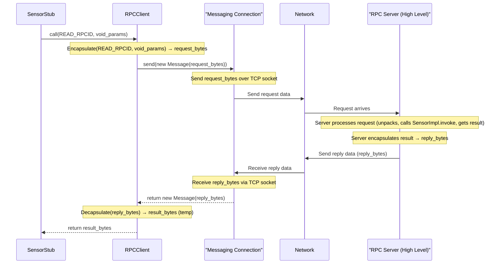

# Chapter 3: RPC Client

In the previous chapters, we met the [RPC Client Stub](01_rpc_client_stub_.md) (like `SensorStub`), which acts as a local stand-in for a remote service, making remote function calls look easy like `sensor.read()`. We also saw the [RPC Server Implementation (Skeleton)](02_rpc_server_implementation__skeleton__.md) (like `SensorImpl`), which contains the *actual* code on the server that performs the requested action.

But there's a missing piece! How does the request from the Stub *actually* travel across the network to reach the server, and how does the response get back? The Stub itself doesn't handle the nitty-gritty network details. It delegates this task to another component: the **RPC Client**.

## What's the Problem? Sending the Message!

Imagine our `SensorStub` wants to call the `read` method on the remote Sensor server. The Stub knows *what* to call (the `read` method, identified by `READ_RPCID`) and it prepares the "no parameters" message (`RPCUtils.marshallVoid()`). But how does it:

1.  Find the right server computer on the network?
2.  Establish a reliable communication channel?
3.  Send the request data (`READ_RPCID` + marshalled parameters)?
4.  Wait patiently for the server to process the request and send back a result?
5.  Receive the result data?

This sounds like a lot of work involving network addresses, ports, sending/receiving bytes, and handling potential network issues. The Stub shouldn't worry about this; it just wants to make the call look simple.

## The RPC Client: Your Personal Network Courier

This is where the **RPC Client** comes in. Think of it as a dedicated **network courier service** that the [RPC Client Stub](01_rpc_client_stub_.md) uses.

*   **The Stub (Customer):** Decides what needs to be done remotely (e.g., "get temperature"). It prepares the order form (marshalled request: RPC ID + parameters).
*   **The RPC Client (Courier Service):** Takes the order form from the Stub. It knows the address of the remote shop (RPC Server). It handles establishing the delivery route (network connection), sends the order form (request), waits for the shop to prepare the item, picks up the packaged item (marshalled response), and delivers it back to the Stub.
*   **The Network (Roads/Mail System):** The underlying infrastructure used by the courier.
*   **The RPC Server (Remote Shop):** Receives the order, processes it, and gives the result back to the courier.

So, the **RPC Client** is:

1.  **A Connection Manager:** It's responsible for connecting to a *specific* RPC Server at a known network address and port.
2.  **A Request/Reply Handler:** It provides a `call` method that takes the details from the Stub, sends them over the network, waits for the response, and returns it.
3.  **A Messaging Layer User:** It doesn't handle raw network sockets directly. Instead, it relies on the lower-level [Messaging Connection](06_messaging_connection_.md) to do the actual sending and receiving of byte sequences.

## How the Stub Uses the RPC Client

Remember this line from `SensorStub.java`?

```java
// Inside SensorStub.read()
// ... marshall parameters ...
byte[] response = rpcclient.call((byte)Common.READ_RPCID, request);
// ... unmarshall response ...
```

Here's what's happening:

1.  The `SensorStub` has an instance of `RPCClient` (named `rpcclient`) that was given to it when it was created. This `rpcclient` object is already configured to talk to the Sensor server.
2.  The stub calls the `call` method on its `rpcclient` object.
3.  It passes two things to `call`:
    *   `Common.READ_RPCID`: The unique number identifying the remote `read` method.
    *   `request`: The marshalled parameters (in this case, the bytes representing "no parameters").
4.  The stub then *waits*. The `rpcclient.call()` method will not return until it gets a response back from the server.
5.  When `rpcclient.call()` finally returns, it gives back the raw byte array (`response`) containing the marshalled result (the temperature) sent by the server.

The `RPCClient` object handles all the communication steps in between.

## Inside the RPC Client: Connecting and Calling

Let's peek inside `RPCClient.java` to see how it works.

**1. Connecting to the Server (`connect`)**

Before the Stub can make any calls, the `RPCClient` needs to establish a connection to the RPC Server. This usually happens once when the client application starts up.

```java
// File: src/main/java/no/hvl/dat110/rpc/RPCClient.java (Simplified)
package no.hvl.dat110.rpc;

import no.hvl.dat110.messaging.*;

public class RPCClient {

    // Holds the connection details and methods for sending/receiving messages
    private MessagingClient msgclient;
    private MessageConnection connection;

    // Constructor: remembers server address and port
    public RPCClient(String server, int port) {
        // Creates a client object from the messaging layer
        msgclient = new MessagingClient(server, port);
    }

    // Establishes the actual network connection
    public void connect() {
        // Use the messaging client to connect and store the connection
        connection = msgclient.connect();
        // Now we have an active link to the server!
    }

    // ... call method is next ...

    // Closes the network connection
    public void disconnect() {
        // Close the underlying messaging connection
        if (connection != null) {
            connection.close();
        }
    }
}
```

*   The constructor just stores the server's address (`server`, `port`) by creating a `MessagingClient` (from the [Messaging Connection](06_messaging_connection_.md) layer).
*   The `connect()` method is the important part here. It calls `msgclient.connect()`. This tells the underlying messaging layer to actually create a network connection (like a TCP socket connection) to the specified server and port.
*   The established connection is stored in the `connection` variable. This `connection` object is what we'll use to send and receive messages.

**2. Making the Remote Call (`call`)**

This is the core method used by the Stubs. It orchestrates the request-reply interaction.

```java
// File: src/main/java/no/hvl/dat110/rpc/RPCClient.java (Simplified call method)

public class RPCClient {
    // ... constructor, connect, disconnect, connection variable ...

    public byte[] call(byte rpcid, byte[] params) {

        // 1. Package the request: Combine RPC ID and parameters into
        //    a single byte array using a standard format.
        //    (See RPC Data Marshalling/Unmarshalling chapter for details)
        byte[] requestData = RPCUtils.encapsulate(rpcid, params);

        // 2. Create a Message object (from the messaging layer)
        Message requestMessage = new Message(requestData);

        // 3. Send the message over the established connection
        connection.send(requestMessage);

        // 4. Wait to receive the reply message from the server
        Message replyMessage = connection.receive();

        // 5. Unpack the reply: Extract the actual result bytes
        //    from the received message format.
        //    (See RPC Data Marshalling/Unmarshalling chapter for details)
        byte[] returnval = RPCUtils.decapsulate(replyMessage.getData());

        // 6. Return the marshalled result bytes to the Stub
        return returnval;
    }
}
```

Let's break down the `call` method:

1.  **Encapsulate Request:** It takes the `rpcid` (e.g., `READ_RPCID`) and the marshalled `params` (e.g., the "void" bytes) and combines them into a single byte array (`requestData`) using `RPCUtils.encapsulate`. This follows a specific format that the server will understand (we'll cover this format in [RPC Data Marshalling/Unmarshalling](05_rpc_data_marshalling_unmarshalling_.md)).
2.  **Create Message:** It wraps the `requestData` into a `Message` object. This is required by the underlying [Messaging Connection](06_messaging_connection_.md) layer.
3.  **Send Message:** It uses the `connection.send()` method (from the messaging layer) to transmit the `requestMessage` over the network to the server.
4.  **Receive Reply:** It calls `connection.receive()`. This method *blocks* – it waits until data arrives back from the server on the same connection. When data arrives, `receive()` returns it as a `Message` object (`replyMessage`).
5.  **Decapsulate Reply:** It extracts the payload data from the `replyMessage` using `replyMessage.getData()` and then uses `RPCUtils.decapsulate` to remove the RPC protocol framing, leaving just the marshalled return value (`returnval`) sent by the server. (Again, see [RPC Data Marshalling/Unmarshalling](05_rpc_data_marshalling_unmarshalling_.md)).
6.  **Return Result:** It returns the `returnval` (the raw bytes of the result) back to the calling code (the `SensorStub`).

## The Flow: From Stub to Server and Back

Here's a diagram showing the RPC Client's role in the communication:



This shows the `RPCClient` acting as the middleman between the high-level `Stub` and the lower-level `Messaging Connection`. It packages the request, sends it, waits for the reply, and unpacks it.

## Conclusion

The **RPC Client** is the engine that powers the client-side of our RPC system. It manages the network connection to a specific server and implements the core `call` method used by stubs. This `call` method handles the full cycle: packaging the request (encapsulation), sending it using the underlying [Messaging Connection](06_messaging_connection_.md), waiting for the reply, and unpacking the result (decapsulation). It effectively hides the complexities of network communication from the [RPC Client Stub](01_rpc_client_stub_.md), allowing the stub to focus on providing a simple, local-like interface for remote procedures.

Now that we understand how the client side sends requests and receives replies, we need to look at the server component that listens for these incoming connections and dispatches the requests to the correct [RPC Server Implementation (Skeleton)](02_rpc_server_implementation__skeleton_.md).

Next up: [RPC Server](04_rpc_server_.md)

---
