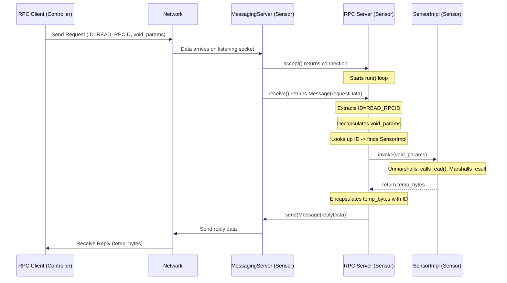

# Chapter 4: RPC Server

In the [previous chapter](03_rpc_client_.md), we saw how the **RPC Client** acts like a courier, taking a request from the [RPC Client Stub](01_rpc_client_stub_.md) (like "get temperature"), sending it across the network, and bringing back the response.

But who is on the other side receiving these requests? When the `RPCClient` sends a message to the Sensor application's address, who is listening? And once the message arrives, how does the Sensor application know *which* piece of code (like the `read()` method in `SensorImpl`) should handle it?

This is the job of the **RPC Server**.

## What's the Problem? Receiving and Directing Traffic

Imagine our Sensor application. It has the `SensorImpl` object, which knows how to actually read the temperature (as discussed in [RPC Server Implementation (Skeleton)](02_rpc_server_implementation__skeleton_.md)). However, `SensorImpl` itself doesn't know anything about network connections or listening for incoming messages.

We need a central component within the Sensor application that acts like a **receptionist** or a **shop manager**:

1.  **Listens:** Constantly waits for new clients (like the Controller's `RPCClient`) to connect.
2.  **Receives Orders:** Accepts incoming request messages sent by clients.
3.  **Understands the Order:** Looks at the request message to figure out which specific action the client wants (e.g., "execute action #1", which corresponds to `READ_RPCID`).
4.  **Delegates:** Finds the correct specialist (the `SensorImpl` object registered for `READ_RPCID`) to handle the request.
5.  **Forwards Request:** Gives the request details (parameters) to the specialist's `invoke` method.
6.  **Collects Result:** Gets the result (the temperature bytes) back from the specialist.
7.  **Sends Back Reply:** Packages the result into a reply message and sends it back to the client who made the request.

This central receptionist is the **RPC Server**.

## The RPC Server: The Shop Manager

Think of the RPC Server like the **manager of our remote Sensor "shop"**.

*   **The Shop Entrance:** The RPC Server opens the shop doors (starts listening on a specific network port using the underlying [Messaging Connection](06_messaging_connection_.md) layer).
*   **Receiving Customers:** When a customer (an `RPCClient`) arrives, the manager establishes a connection.
*   **Taking Orders:** The customer hands over an order form (an RPC request message containing an ID like `READ_RPCID` and any parameters).
*   **Finding the Right Department:** The manager looks at the order ID (`READ_RPCID`) and knows that the "Temperature Reading Department" (`SensorImpl` object) handles this.
*   **Dispatching:** The manager takes the order details (parameters) to the `SensorImpl` department and asks it to process the order (calls its `invoke` method).
*   **Getting the Product:** The `SensorImpl` department finishes its work and gives the packaged product (marshalled temperature bytes) back to the manager.
*   **Returning to Customer:** The manager sends the product (the reply message) back to the waiting customer (`RPCClient`).

The RPC Server orchestrates the entire process on the server side, ensuring requests are received, routed correctly, executed, and the results are returned.

## How the RPC Server Works

The `RPCServer` relies heavily on the lower-level [Messaging Connection](06_messaging_connection_.md) layer to handle the actual network communication (listening for connections, sending/receiving bytes). Its main job is to manage the RPC logic on top of that.

**1. Registration: Knowing Who Does What**

Before the server can handle any requests, it needs to know which "specialist department" ([RPC Server Implementation (Skeleton)](02_rpc_server_implementation__skeleton_.md)) handles which task (RPC ID). This happens through a `register` method.

When the Sensor application starts, it creates the `SensorImpl` object. The `SensorImpl` constructor calls the `RPCServer`'s `register` method.

```java
// Inside SensorDevice.java (Simplified Startup)
public static void main(String[] args) {
    // Create the main RPC Server listening on the Sensor port
    RPCServer sensorserver = new RPCServer(Common.SENSORPORT);

    // Create the SensorImpl specialist. Its constructor will register it.
    // It tells the server: "I handle requests with ID = READ_RPCID"
    SensorImpl sensor = new SensorImpl((byte)Common.READ_RPCID, sensorserver);

    // Start the server's main loop
    sensorserver.run();
    // ... stop server ...
}
```

Let's look at the `RPCServer`'s `register` method and how it stores this information:

```java
// File: src/main/java/no/hvl/dat110/rpc/RPCServer.java (Partial)
package no.hvl.dat110.rpc;

import java.util.HashMap;
import no.hvl.dat110.messaging.*; // Import messaging classes

public class RPCServer {

    private MessagingServer msgserver; // From the Messaging Layer
    private MessageConnection connection; // Represents a client connection

    // A map to store the registered specialists (Skeletons)
    // Key: RPC ID (byte), Value: The Skeleton object (RPCRemoteImpl)
    private HashMap<Byte, RPCRemoteImpl> services;

    // Constructor: Creates the underlying messaging server and the map
    public RPCServer(int port) {
        this.msgserver = new MessagingServer(port); // Setup listener
        this.services = new HashMap<Byte, RPCRemoteImpl>(); // Prepare the registry
    }

    // Called by Skeletons (like SensorImpl) to register themselves
    public void register(byte rpcid, RPCRemoteImpl impl) {
        System.out.println("Registering service: RPC ID = " + rpcid);
        services.put(rpcid, impl); // Store: ID -> Specialist Object
    }

    // ... run method is next ...
    // ... stop method ...
}
```

*   The `RPCServer` keeps a `HashMap` called `services`. Think of this map as the manager's directory.
*   The `register` method takes the `rpcid` (like `Common.READ_RPCID`) and the actual specialist object (`impl`, which is the `SensorImpl` instance) and puts them into the `services` map. Now, the server knows that requests for `READ_RPCID` should go to that specific `SensorImpl` object.

**2. Running the Server: The Main Loop**

The `run()` method is where the RPC Server starts its main job of listening and processing requests.

```java
// File: src/main/java/no/hvl/dat110/rpc/RPCServer.java (Simplified run method)
public class RPCServer {
    // ... constructor, register, services map, msgserver ...

    public void run() {
        // Special case: Register the built-in "stop" service (RPC ID 0)
        RPCRemoteImpl rpcstop = new RPCServerStopImpl(RPCCommon.RPIDSTOP, this);

        System.out.println("RPC SERVER starting to listen...");

        // 1. Wait for a client to connect (using the messaging layer)
        connection = msgserver.accept(); // Blocks until a client connects
        System.out.println("RPC SERVER accepted connection");

        boolean stop = false; // Flag to control the loop
        while (!stop) {
            Message requestmsg = null;
            byte rpcid = 0;

            try {
                // 2. Receive a request message from the connected client
                requestmsg = connection.receive(); // Blocks until message arrives

                // 3. Extract the RPC ID (the first byte of the message data)
                byte[] requestData = requestmsg.getData();
                rpcid = requestData[0]; // Peek at the first byte for the ID

                // 4. Decapsulate: Get the parameters (remove the ID byte)
                // (Details in RPC Data Marshalling/Unmarshalling chapter)
                byte[] params = RPCUtils.decapsulate(requestData);

                // 5. Lookup: Find the specialist for this RPC ID
                RPCRemoteImpl specialist = services.get(rpcid);

                // 6. Invoke: Ask the specialist to handle the request
                byte[] result = specialist.invoke(params); // The specialist does the real work!

                // 7. Encapsulate: Package the result with the RPC ID
                // (Details in RPC Data Marshalling/Unmarshalling chapter)
                byte[] replyData = RPCUtils.encapsulate(rpcid, result);

                // 8. Send Reply: Send the result back to the client
                Message replymsg = new Message(replyData);
                connection.send(replymsg);

            } catch (Exception e) {
                System.err.println("RPC Server Error: " + e.getMessage());
                e.printStackTrace();
                stop = true; // Stop on error
            }

            // Check if the received RPC ID was the special "stop" command
            if (rpcid == RPCCommon.RPIDSTOP) {
                System.out.println("RPC SERVER received stop command.");
                stop = true;
            }
        }
    }
    // ... stop method ...
}
```

Let's break down the `run()` loop:

1.  **Accept Connection:** `msgserver.accept()` tells the underlying [Messaging Connection](06_messaging_connection_.md) layer to wait for a client to connect. This call *blocks* (pauses) until a connection is made. The resulting `connection` object represents the communication link to that specific client.
2.  **Receive Request:** Inside the `while` loop, `connection.receive()` waits for a message to arrive from the connected client. This also *blocks*. When a message arrives, it's stored in `requestmsg`.
3.  **Extract RPC ID:** The first byte of the data within the message (`requestmsg.getData()`) is assumed to be the `rpcid` identifying the desired remote procedure.
4.  **Decapsulate Parameters:** `RPCUtils.decapsulate()` takes the raw message data and extracts the *actual* parameters meant for the remote method, removing the `rpcid` byte. (We'll cover `decapsulate` in the [RPC Data Marshalling/Unmarshalling](05_rpc_data_marshalling_unmarshalling_.md) chapter).
5.  **Lookup Specialist:** `services.get(rpcid)` uses the extracted `rpcid` to look up the corresponding specialist object (e.g., the `SensorImpl` instance) in the `services` map we filled during registration.
6.  **Invoke Specialist:** The crucial step! `specialist.invoke(params)` calls the `invoke` method on the found specialist object (e.g., `SensorImpl.invoke(...)`), passing the extracted parameters. This is where the skeleton unmarshalls the parameters, calls the *real* application logic (`SensorImpl.read()`), gets the result, marshalls it, and returns the marshalled result bytes.
7.  **Encapsulate Reply:** `RPCUtils.encapsulate()` takes the result bytes returned by `invoke` and packages them back into the standard RPC message format, adding the original `rpcid` back. (Covered in [RPC Data Marshalling/Unmarshalling](05_rpc_data_marshalling_unmarshalling_.md)).
8.  **Send Reply:** A new `Message` is created with the encapsulated reply data, and `connection.send()` sends it back to the client over the network.
9.  **Stop Condition:** The loop continues receiving and processing requests until the special `RPIDSTOP` command (RPC ID 0) is received, which sets the `stop` flag to `true` and ends the loop.

## The Big Picture: Request Flow

Here's a diagram showing the RPC Server's role in handling a `read()` request:



The `RPCServer` acts as the central dispatcher, taking incoming network messages facilitated by the `MessagingServer`, understanding the RPC request within, delegating the work to the correct `Skeleton`, and ensuring the reply gets sent back.

## Conclusion

The **RPC Server** is the heart of the server-side RPC mechanism. It listens for incoming client connections using the underlying [Messaging Connection](06_messaging_connection_.md) layer. For each connected client, it enters a loop where it receives request messages, identifies the target procedure using the RPC ID, looks up the registered [RPC Server Implementation (Skeleton)](02_rpc_server_implementation__skeleton_.md), calls its `invoke` method, and sends the marshalled result back in a reply message. It's the essential coordinator that makes remote procedure calls possible from the server's perspective.

We've seen how the RPC Client and Server use `encapsulate` and `decapsulate`, and how Stubs and Skeletons use `marshall` and `unmarshall`. But what do these functions actually *do*? How is data like integers, strings, or even "nothing" (void) converted into bytes and back again? That's the topic of our next chapter.

Next up: [RPC Data Marshalling/Unmarshalling](05_rpc_data_marshalling_unmarshalling_.md)

---
