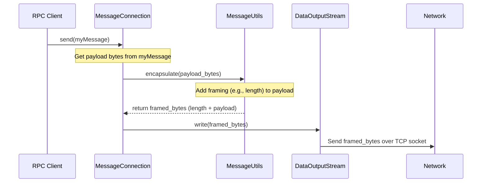
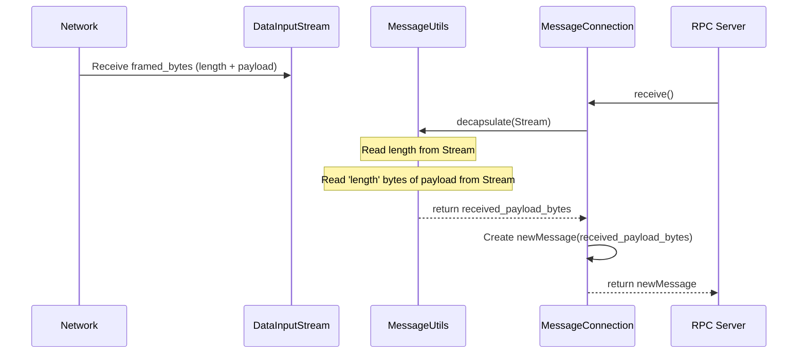

# Chapter 6: Messaging Connection

Welcome to Chapter 6! In the [previous chapter](05_rpc_data_marshalling_unmarshalling_.md), we learned how to pack our Java data (like integers or strings) into boxes of bytes (`byte[]`) using marshalling, and how to label those boxes with an RPC ID using encapsulation. We have our neatly packaged request (like "get temperature") ready to go!

But how does this box of bytes actually get from our program (the client) to the other program (the server) across the unpredictable network? How do we make sure the whole box arrives, and not just parts of it? And how does the receiver know when one box ends and the next one begins if we send multiple boxes?

Dealing directly with raw network connections (called sockets) involves managing streams of bytes, handling potential errors, and figuring out message boundaries. This can be quite tricky, especially for beginners. We need a simpler, more reliable way to just "send this message" and "receive the next message".

## The Problem: Sending Bytes Reliably

Imagine you have your packed box (`byte[]`) containing the RPC request. You want to send it to the server. Sending it over the network is like sending raw data down a pipe.

*   How does the receiver know exactly how many bytes belong to *this specific box*? If you send two boxes back-to-back, the receiver might just see a continuous stream of bytes.
*   What if the network is slow or temporarily interrupted? How do you ensure the complete message is sent and received?

We need a layer that handles these details for us.

## Introducing the Messaging Connection: Your Reliable Network Postman

This is where the **Messaging Connection** layer comes in. Think of it as a super reliable **postal service** designed specifically for sending our pre-packaged `Message` objects.

*   **You (RPC Client/Server):** Prepare your message (the `byte[]` from marshalling/encapsulation) and put it inside a standard envelope – the `Message` object.
*   **Messaging Connection (Postal Service):** You give this `Message` envelope to the `MessageConnection`. It takes care of:
    *   Knowing the recipient's address (established via TCP socket).
    *   Adding special markings (framing information, covered in the [next chapter](07_message_framing_protocol_.md)) so the receiver knows exactly how big the message is.
    *   Using a reliable delivery method (TCP) to ensure the bytes arrive in order.
    *   Delivering *one whole message* at a time.
    *   Receiving *one whole message* at a time.

So, the **Messaging Connection**:

1.  **Represents the Channel:** It's the established communication link (a TCP socket) between a client and a server.
2.  **Abstracts Streams:** It hides the raw `InputStream` and `OutputStream` of the socket.
3.  **Deals in Messages:** It provides methods to `send` and `receive` complete `Message` objects, not just loose bytes.

This makes network communication much cleaner for the layers above it (like the [RPC Client](03_rpc_client_.md) and [RPC Server](04_rpc_server_.md)).

## Key Components of the Messaging Layer

This "postal service" has a few key parts working together:

1.  **`Message` Class:** The standard envelope. It's a simple object that holds the data (`byte[]`) you want to send.

    ```java
    // Simplified representation
    package no.hvl.dat110.messaging;

    public class Message {
        private byte[] data; // The payload (your packed bytes)

        public Message(byte[] data) {
            this.data = data;
        }

        public byte[] getData() {
            return data;
        }
    }
    ```
    This class just acts as a wrapper around the byte array we want to transmit.

2.  **`MessageConnection` Class:** Represents an active, established connection between two points. Once connected, you use this object to send and receive `Message` envelopes. It's like having a direct phone line open.

    ```java
    // Simplified representation
    package no.hvl.dat110.messaging;

    import java.net.Socket;
    // ... other imports ...

    public class MessageConnection {
        private Socket socket; // The underlying network connection
        // ... Input/Output streams needed for sending/receiving ...

        public MessageConnection(Socket socket) {
            this.socket = socket;
            // ... setup input/output streams from socket ...
        }

        public void send(Message message) {
            // ... magic happens here to send the message reliably ...
            // (Uses MessageUtils.encapsulate)
        }

        public Message receive() {
            // ... magic happens here to receive one complete message ...
            // (Uses MessageUtils.decapsulate)
            Message receivedMessage = null;
            // ... read from socket, figure out message boundaries ...
            return receivedMessage;
        }

        public void close() {
            // ... close streams and the socket ...
        }
    }
    ```
    The `send` and `receive` methods are the core here. They handle the details of transmitting `Message` objects over the underlying `socket`.

3.  **`MessagingClient` Class:** Used by the client application (like the `Controller`) to *initiate* a connection *to* a server. It's like dialing the server's phone number.

    ```java
    // File: src/main/java/no/hvl/dat110/messaging/MessagingClient.java (Simplified)
    package no.hvl.dat110.messaging;

    import java.net.Socket;
    import java.io.IOException;

    public class MessagingClient {
        private String server;
        private int port;

        public MessagingClient(String server, int port) {
            this.server = server;
            this.port = port;
        }

        // Connect to the server and return the established connection
        public MessageConnection connect() {
            try {
                // Create a TCP socket connection to the server address/port
                Socket clientSocket = new Socket(server, port);
                // Wrap the socket in our MessageConnection object
                return new MessageConnection(clientSocket);
            } catch (IOException e) {
                System.err.println("Error connecting to server: " + e.getMessage());
                throw new RuntimeException(e);
            }
        }
    }
    ```
    Its main job is the `connect()` method, which creates the network `Socket` and returns the usable `MessageConnection`.

4.  **`MessagingServer` Class:** Used by the server application (like the `Sensor`) to *listen* for incoming connection attempts from clients. It's like the operator waiting for the phone to ring.

    ```java
    // File: src/main/java/no/hvl/dat110/messaging/MessagingServer.java (Simplified)
    package no.hvl.dat110.messaging;

    import java.net.ServerSocket;
    import java.net.Socket;
    import java.io.IOException;

    public class MessagingServer {
        private ServerSocket welcomeSocket; // Listens for connections

        public MessagingServer(int port) {
            try {
                // Create a socket that listens on the specified port
                this.welcomeSocket = new ServerSocket(port);
            } catch (IOException e) {
                 System.err.println("Error starting server: " + e.getMessage());
                 throw new RuntimeException(e);
            }
        }

        // Wait for a client to connect, then return the connection
        public MessageConnection accept() {
            try {
                System.out.println("MessagingServer waiting for connection...");
                // Wait here until a client tries to connect
                Socket connectionSocket = welcomeSocket.accept();
                System.out.println("MessagingServer accepted connection.");
                // Wrap the new client socket in a MessageConnection
                return new MessageConnection(connectionSocket);
            } catch (IOException e) {
                System.err.println("Error accepting connection: " + e.getMessage());
                throw new RuntimeException(e);
            }
        }

        public void stop() { /* ... close welcomeSocket ... */ }
    }
    ```
    Its main job is the `accept()` method, which blocks (waits) until a client connects, then returns a `MessageConnection` representing the link to *that specific client*.

## How the RPC Layer Uses the Messaging Layer

Remember the [RPC Client](03_rpc_client_.md)'s `call` method?

```java
// Inside RPCClient.call() (Simplified)
public byte[] call(byte rpcid, byte[] params) {
    byte[] requestData = RPCUtils.encapsulate(rpcid, params);
    Message requestMessage = new Message(requestData); // Create the envelope

    // Use the Messaging Layer to send
    connection.send(requestMessage); // Hand off to the "postman"

    // Use the Messaging Layer to receive
    Message replyMessage = connection.receive(); // Wait for the return mail

    byte[] returnval = RPCUtils.decapsulate(replyMessage.getData());
    return returnval;
}
```
And the [RPC Server](04_rpc_server_.md)'s `run` loop?

```java
// Inside RPCServer.run() (Simplified loop)
public void run() {
    connection = msgserver.accept(); // Wait for a client connection

    while (!stop) {
        // Use Messaging Layer to receive request
        Message requestmsg = connection.receive();

        // ... process request (decapsulate, lookup, invoke) ...
        byte[] result = specialist.invoke(params);
        byte[] replyData = RPCUtils.encapsulate(rpcid, result);
        Message replymsg = new Message(replyData); // Create reply envelope

        // Use Messaging Layer to send reply
        connection.send(replymsg);

        // ... check for stop condition ...
    }
}
```
Notice how the RPC layer only deals with `Message` objects and the `send`/`receive` methods of the `MessageConnection`. It doesn't worry about sockets or byte streams directly. The `MessagingClient` and `MessagingServer` handle the initial setup (`connect`/`accept`).

## Under the Hood: Sockets and Message Boundaries

So how does `MessageConnection` actually achieve this "send one message, receive one message" magic?

1.  **TCP Sockets:** Underneath, `MessageConnection` uses standard Java `Socket` objects. TCP (Transmission Control Protocol) provides a reliable, ordered stream of bytes between the client and server. This means bytes sent arrive in the same order, and TCP handles retransmitting lost data. However, TCP itself *doesn't* know about message boundaries – it just sees a stream.
2.  **Input/Output Streams:** The `MessageConnection` gets the `InputStream` and `OutputStream` from the `Socket`. It typically wraps these in `DataInputStream` and `DataOutputStream` which provide helpful methods for reading and writing primitive Java types and byte arrays.
3.  **Framing (The Secret Sauce!):** This is the crucial part. Before writing the `Message`'s payload bytes to the `OutputStream`, the `send` method uses a helper function (from `MessageUtils`, covered in the [next chapter](07_message_framing_protocol_.md)) to add **framing information**. The simplest form of framing is adding the *length* of the payload before the payload itself.
4.  **Sending:** The `send` method writes the framing information (e.g., the length) followed by the actual payload bytes to the `DataOutputStream`.
5.  **Receiving:** The `receive` method uses another helper function (from `MessageUtils`) that first reads the framing information (e.g., the length) from the `DataInputStream`. Once it knows the length, it reads *exactly* that many bytes from the stream – this is the payload.
6.  **Reconstructing the Message:** It takes the received payload bytes and puts them into a new `Message` object, which is then returned.

This process of adding and reading the length (or other boundary markers) is called the **Message Framing Protocol**.

Here's a diagram showing the flow when `RPCClient` sends a message via `MessageConnection`:



And when the `RPCServer` receives it:



The `MessageUtils.encapsulate` and `MessageUtils.decapsulate` methods (which implement the framing protocol) are the key to making `MessageConnection.send` and `MessageConnection.receive` work with whole messages.

## Conclusion

The **Messaging Connection** layer provides a vital abstraction over raw network sockets. It establishes a connection (`MessagingClient`, `MessagingServer`) and allows the sending and receiving of discrete `Message` objects (`MessageConnection.send`, `MessageConnection.receive`).

It hides the complexity of byte streams and error handling by leveraging TCP and, crucially, by implementing a framing protocol (via helper functions) to define message boundaries. This allows the higher-level RPC components to communicate reliably without getting bogged down in networking details. They simply work with `Message` objects.

But how exactly does this framing work? How do we add the length information and read it back correctly? That's the topic of our final chapter.

Next up: [Message Framing Protocol](07_message_framing_protocol_.md)

---
