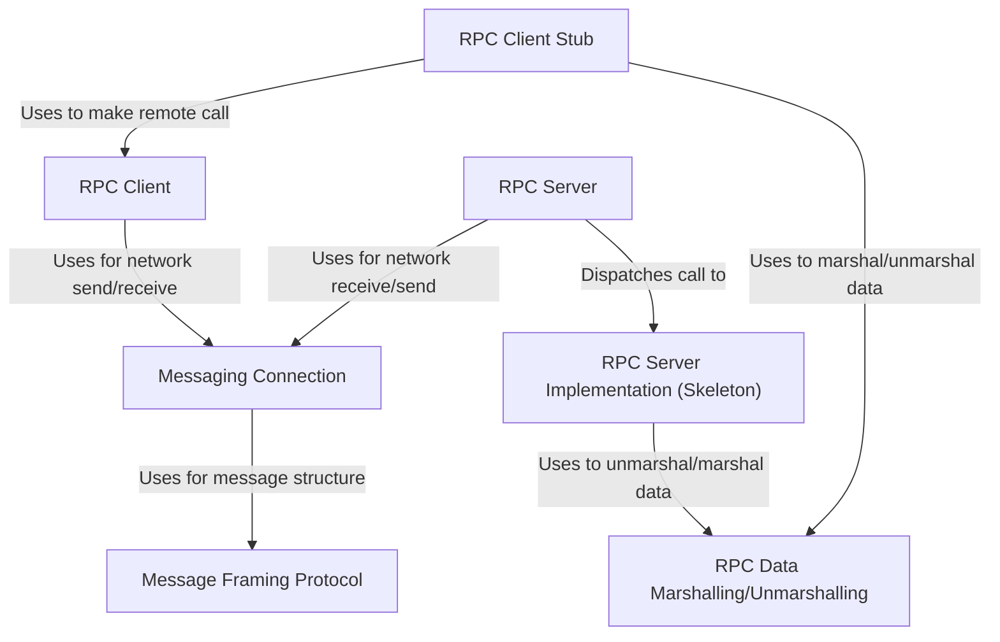

# Project 1 Overview

This project implements a simple **Remote Procedure Call (RPC)** system for an *IoT application* (Sensor, Controller, Display).
It builds the RPC functionality on top of a custom **messaging layer**, which itself uses standard TCP sockets for network communication.
The goal is to allow different parts of the application (like the Controller calling the Sensor) to communicate over the network as if they were just making *local method calls*, hiding the underlying network details through *layered abstractions*.

**Source Repository:** https://github.com/selabhvl/dat110-project1-rpc-startcode 

## Chapters

1. [RPC Client Stub
](01_rpc_client_stub_.md)
2. [RPC Server Implementation (Skeleton)
](02_rpc_server_implementation__skeleton__.md)
3. [RPC Client
](03_rpc_client_.md)
4. [RPC Server
](04_rpc_server_.md)
5. [RPC Data Marshalling/Unmarshalling
](05_rpc_data_marshalling_unmarshalling_.md)
6. [Messaging Connection
](06_messaging_connection_.md)
7. [Message Framing Protocol
](07_message_framing_protocol_.md)

---
