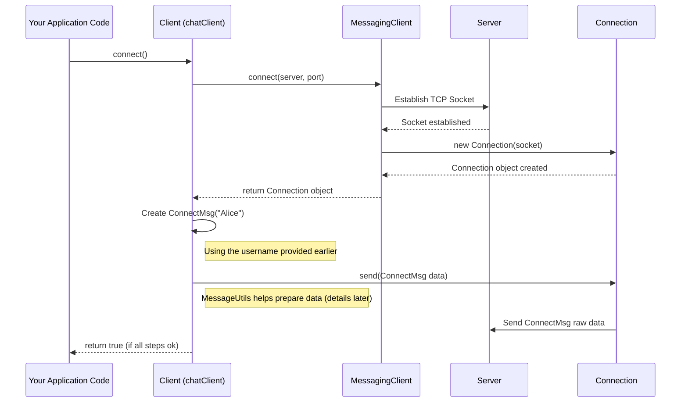

# Chapter 2: Client (Network Interaction Logic)

In [Chapter 1: Message Hierarchy (Communication Protocol)](01_message_hierarchy__communication_protocol__.md), we learned how to create different types of messages (`ConnectMsg`, `PublishMsg`, etc.) to represent specific actions. This is like having different kinds of pre-printed forms for different requests.

But how do we actually *send* these forms (messages) to the central server? And how do we receive replies or messages from others? We need someone – or something – dedicated to handling the communication with the server over the network. That's where the `Client` class comes in!

## What is the `Client`? Our Application's Messenger

Imagine you live in a big apartment building (your application) and want to communicate with the building manager (the server) who lives in a separate office. You wouldn't shout across the courtyard! You'd probably have a dedicated way to send and receive mail or messages.

The `Client` class (`Client.java`) is like your application's **personal messenger**. Its main job is to manage the communication link between your chat application and the central chat server (often called a "broker").

Here's what it does:

1.  **Knows the Server's Address:** It stores the server's network address (like `localhost` or an IP address) and the specific "door number" (port number, e.g., `9091`) it needs to connect to.
2.  **Establishes the Connection:** It handles the process of creating a network connection (like establishing a phone line) to the server.
3.  **Sends Messages:** It takes the message objects we learned about in Chapter 1 (like `ConnectMsg`, `PublishMsg`) and sends them over the network to the server.
4.  **Receives Messages:** It listens for incoming messages from the server and makes them available to the rest of the application.

Essentially, the `Client` hides the messy details of network programming and gives the rest of our application simple commands like `connect()`, `publish("news", "hello everyone!")`, `subscribe("news")`.

## How to Use the `Client`

Let's see how we would use our messenger (`Client`) to connect to the server and then publish a message.

**1. Creating the Messenger (`Client` object)**

First, we need to create an instance of the `Client`, telling it who we are (our username) and where the server is.

```java
// File: src/main/java/no/hvl/dat110/client/Client.java (Conceptual Usage)

String username = "Alice";
String serverHost = "localhost"; // Often the same machine for testing
int serverPort = 9091;         // The port the server is listening on

// Create a new Client instance
Client chatClient = new Client(username, serverHost, serverPort);

System.out.println("Chat client created for user: " + username);
```

*   We provide the `username`, the `serverHost` (where the server is located), and the `serverPort`.
*   This creates our `chatClient` object, ready to communicate but not yet connected.

**2. Connecting to the Server**

Now, we tell our messenger to establish the connection.

```java
// File: src/main/java/no/hvl/dat110/client/Client.java (Conceptual Usage)

// Tell the client to connect to the server
boolean success = chatClient.connect();

if (success) {
	System.out.println("Successfully connected to the server!");
} else {
	System.out.println("Failed to connect to the server.");
}
```

*   Calling `chatClient.connect()` initiates the network connection process.
*   It returns `true` if the connection was successful, `false` otherwise. Behind the scenes, this involves sending a `ConnectMsg` (from Chapter 1) to the server.

**3. Publishing a Message**

Once connected, we can send messages to topics.

```java
// File: src/main/java/no/hvl/dat110/client/Client.java (Conceptual Usage)

String topic = "general";
String messageContent = "Hello from Alice!";

// Tell the client to publish a message to the 'general' topic
chatClient.publish(topic, messageContent);

System.out.println("Sent message to topic '" + topic + "'");
```

*   We call `chatClient.publish()` with the desired `topic` and the `messageContent`.
*   The `Client` takes care of creating the correct `PublishMsg` object (using our username "Alice") and sending it over the established connection.

**4. Other Actions**

The `Client` provides similar simple methods for other actions:

*   `subscribe(String topic)`: To start receiving messages from a topic.
*   `unsubscribe(String topic)`: To stop receiving messages.
*   `createTopic(String topic)`: To ask the server to create a new topic.
*   `deleteTopic(String topic)`: To ask the server to delete a topic.
*   `disconnect()`: To gracefully close the connection and inform the server.
*   `receive()`: To check for and retrieve any incoming messages sent *from* the server.

All these methods use the appropriate message types from Chapter 1 under the hood.

## Under the Hood: How Does `connect()` Work?

Let's peek behind the curtain when you call `chatClient.connect()`. It's a team effort involving a few components:

1.  **`Client` (`Client.java`):** Your main messenger object.
2.  **`MessagingClient` (`MessagingClient.java`):** A helper specifically focused on the initial network socket setup.
3.  **`Connection` (`Connection.java`):** An object that wraps the actual network socket and handles reading/writing raw byte data. (We'll learn more in the [Connection (Network Stream Handling)](07_connection__network_stream_handling__.md) chapter).
4.  **`MessageUtils` (`MessageUtils.java`):** A utility to convert our `Message` objects into raw data suitable for network transport, and vice-versa. (Covered in the [MessageUtils (Serialization/Deserialization)](08_messageutils__serialization_deserialization__.md) chapter).

Here’s a simplified sequence of events:



**Code Glimpse:**

Let's look at parts of the `Client.java` code.

*   **Constructor:** Stores the server info using `MessagingClient`.

    ```java
    // File: src/main/java/no/hvl/dat110/client/Client.java

    private MessagingClient client; // Helper for initial connection
    private Connection connection;   // Handles the active connection
    private String user;           // Stores the username

    public Client(String user, String server, int port) {
    	// Creates the MessagingClient helper with server details
    	client = new MessagingClient(server, port);
    	this.user = user;
    }
    ```
    *   The constructor just sets up the `MessagingClient` helper and stores the `user`.

*   **`connect()` Method:** Uses `MessagingClient` to get a `Connection` and then sends the `ConnectMsg`.

    ```java
    // File: src/main/java/no/hvl/dat110/client/Client.java

    public boolean connect() {
    	boolean connected = false;
    	// Ask MessagingClient helper to establish the network link
    	connection = client.connect(); // Returns a Connection object

    	// Create the specific message for connecting
    	ConnectMsg msg = new ConnectMsg(user);

    	if (connection != null) { // Check if connection succeeded
    		// If yes, send the ConnectMsg over the connection
    		send(msg); // Uses the private helper 'send' method
    		connected = true;
    	}
    	return connected;
    }
    ```
    *   `client.connect()` does the low-level network setup and gives us a `Connection` object.
    *   A `ConnectMsg` is created using the stored `user`.
    *   The `send()` helper method (shown next) is used to actually transmit the message.

*   **`send()` Helper Method:** Prepares and sends *any* message.

    ```java
    // File: src/main/java/no/hvl/dat110/client/Client.java

    // Private helper method to send any type of Message
    private void send(Message msg) {
    	// Convert the Message object (e.g., ConnectMsg, PublishMsg)
    	// into a TransportMessage suitable for network sending.
    	// MessageUtils does this magic (details in Chapter 8).
    	TransportMessage transportMsg = MessageUtils.toTransportMessage(msg);

    	// Tell the Connection object to send the prepared data.
    	// Connection handles the raw network sending (details in Chapter 7).
    	connection.send(transportMsg);
    }
    ```
    *   This method takes any `Message` (like `ConnectMsg`, `PublishMsg`).
    *   It uses `MessageUtils` to package the message for network travel (see [MessageUtils (Serialization/Deserialization)](08_messageutils__serialization_deserialization__.md)). The result is a `TransportMessage` (see [TransportMessage (Network Data Framing)](06_transportmessage__network_data_framing__.md)).
    *   It then tells the `Connection` object to actually send the packaged data over the wire (see [Connection (Network Stream Handling)](07_connection__network_stream_handling__.md)).

*   **`publish()` Method:** Creates a `PublishMsg` and uses `send()`.

    ```java
    // File: src/main/java/no/hvl/dat110/client/Client.java

    public void publish(String topic, String message) {
    	// Create the specific message type for publishing
    	PublishMsg msg = new PublishMsg(user, topic, message);

    	// Use the same send helper to transmit it
    	send(msg);
    }
    ```
    *   Very straightforward: creates the `PublishMsg` with the user, topic, and message content.
    *   Calls the `send()` helper method to handle the rest.

All other action methods (`subscribe`, `unsubscribe`, etc.) work similarly: create the specific `Message` object and call `send()`. The `receive()` method works in reverse, getting data from the `Connection` and using `MessageUtils` to turn it back into a `Message` object.

## Conclusion

The `Client` class acts as a crucial bridge between the high-level logic of our chat application (like wanting to connect or send a message) and the lower-level details of network communication. It provides simple methods (`connect`, `publish`, `subscribe`, etc.) that internally create the correct message types (from Chapter 1) and use helper components (`MessagingClient`, `Connection`, `MessageUtils`) to handle the actual sending and receiving over the network.

You now understand how our application prepares to talk to the server. But how does the application actually start up, create this `Client`, and manage the user interface? That's the role of the application's entry point.

In the next chapter, we'll look at [Chapp (Application Entry Point)](03_chapp__application_entry_point__.md), which ties everything together and launches the chat window.

---

