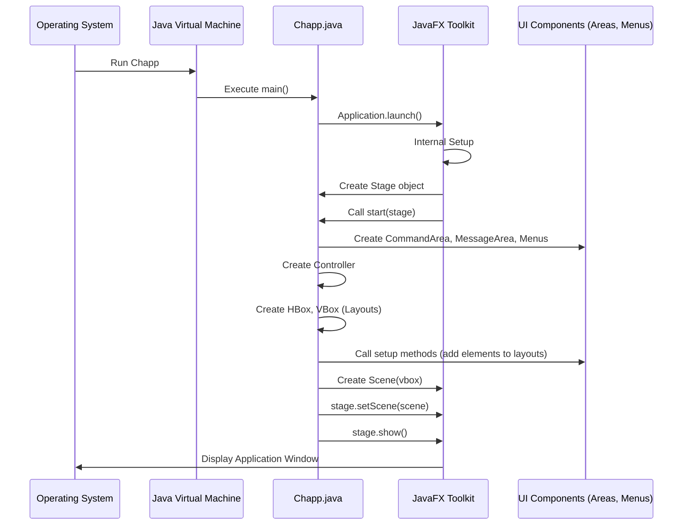

# Chapter 3: Chapp (Application Entry Point)

In the [previous chapter](02_client__network_interaction_logic__.md), we learned about the `Client` class – our application's dedicated messenger responsible for talking to the chat server. We saw how it can `connect`, `publish` messages, and handle other network tasks using the message types defined in [Chapter 1](01_message_hierarchy__communication_protocol__.md).

But having a messenger isn't enough. How does the application even start? How does the chat window appear on the screen? How are the different visual parts (like the place to type messages and the place where messages appear) put together? We need a starting point, a master coordinator for the launch sequence.

## The Stage Manager: `Chapp.java`

Think about putting on a play in a theatre. You have actors (our data and logic), props (buttons, text fields), and maybe even a script (our message protocol). But who turns on the lights, raises the curtain, sets up the stage, and tells everyone when to start? That's the **Stage Manager**.

In our chat application, the `Chapp` class (`Chapp.java`) is our Stage Manager. It's the **Application Entry Point** – the very first piece of our *own* code that runs when you launch the chat application.

Its main jobs are:

1.  **Starting the Show:** It contains the special `main` method that the Java Virtual Machine (JVM) looks for to begin execution.
2.  **Setting the Stage:** It uses JavaFX (a toolkit for building user interfaces) to create the main application window (called a `Stage` in JavaFX).
3.  **Bringing in the Scenery:** It creates the main visual components, like the area for typing commands and the area for displaying messages.
4.  **Arranging the Set:** It organizes these visual components within the main window so they look right.
5.  **Raising the Curtain:** It makes the application window visible to the user.

## How the Application Starts: The `main` Method

Every Java application needs a starting point, a method called `main`. Our `Chapp` class has one too.

```java
// File: src/main/java/no/hvl/dat110/chapp/Chapp.java

// Import necessary JavaFX class
import javafx.application.Application;

// Chapp inherits features from JavaFX's Application class
public class Chapp extends Application {

	// ... (start method will be here) ...

	// The main entry point when the application is launched
	public static void main(String[] args) {
		
		// Tell JavaFX to start the application lifecycle
		Application.launch(args);
		
	}
}
```

*   `public static void main(String[] args)`: This is the standard signature Java looks for. When you run the application, this method is executed first.
*   `Application.launch(args);`: This is the key line for JavaFX applications. Instead of putting all our setup code *directly* in `main`, we tell the JavaFX toolkit to take over. JavaFX then does some internal setup and calls *another* important method in our `Chapp` class: `start`.

## Setting Up the Window: The `start` Method

Because `Chapp` `extends Application`, it gets special abilities from JavaFX. One of these is the `start` method, which JavaFX calls automatically after `launch` is invoked. This is where we build our user interface.

```java
// File: src/main/java/no/hvl/dat110/chapp/Chapp.java

// Import necessary JavaFX classes
import javafx.application.Application;
import javafx.stage.Stage; // Represents the main window
import javafx.scene.Scene; // Represents the content inside the window
// ... other imports ...

public class Chapp extends Application {

	// This method is called by JavaFX after launch()
	@Override // Indicates we are overriding a method from Application
	public void start(Stage stage) {

		// 'stage' is the main window, provided by JavaFX
		stage.setTitle("ChApp - Chat Application"); // Set the title bar text

		// ... (We'll add the content setup here) ...

		// Make the window visible!
		stage.show(); 
	}
	
	// ... (main method is also here) ...
}
```

*   `start(Stage stage)`: JavaFX creates the main window object (`Stage`) and passes it to our `start` method. Think of the `Stage` as the physical theatre building.
*   `stage.setTitle(...)`: Sets the text that appears in the window's title bar.
*   `stage.show()`: This is like opening the doors and turning on the lights – it makes the window appear on the screen. If we forget this, the application might be running, but we wouldn't see anything!

## Bringing the UI Parts Together

Okay, we have a window (`Stage`), but it's empty. We need to create the actual user interface elements. `Chapp` is responsible for creating the main building blocks:

1.  **`CommandArea`**: The section (likely at the bottom or side) where the user types commands like `/connect alice`, `/join general`, or just sends messages.
2.  **`MessageArea`**: The main section where incoming chat messages and notifications are displayed.
3.  **`Menus`**: The menu bar at the top (e.g., File, Options).
4.  **`Controller`**: This isn't a visual part, but it's the "brain" that connects user actions (like clicking "Send") to the underlying logic (like telling the [Client](02_client__network_interaction_logic__.md) to send a message). We'll cover this in detail in the [Controller (UI Logic Coordinator)](05_controller__ui_logic_coordinator__.md) chapter.

Let's create instances of these inside the `start` method:

```java
// File: src/main/java/no/hvl/dat110/chapp/Chapp.java
// Inside the start method, before stage.show()

// Create the UI area for user input
CommandArea carea = new CommandArea(); 
// Create the UI area for displaying messages
MessageArea marea = new MessageArea(); 

// Create the menu bar logic (needs the stage and areas)
Menus menus = new Menus(stage, carea, marea); 

// Create the controller (needs the message area to update it)
Controller controller = new Controller(marea); 
```

At this point, these objects exist in memory, but they aren't arranged visually, nor are they fully connected to each other yet.

## Arranging the UI with Layouts

How do we place the `CommandArea` and `MessageArea` inside the window? JavaFX uses **Layout Panes**. Think of them like organizers or shelves for your UI elements. We'll use two common ones:

*   `HBox`: Arranges things horizontally (side-by-side).
*   `VBox`: Arranges things vertically (one above the other).

We want the command area and message area next to each other, so we'll put them in an `HBox`. We also need to tell these areas about the `Controller` so they know who to talk to when the user does something.

```java
// File: src/main/java/no/hvl/dat110/chapp/Chapp.java
// Inside the start method, after creating controller

// Create a horizontal layout pane
HBox hbox = new HBox(); 

// Tell the command area how to set itself up within the hbox
// and who its controller is.
carea.setupCommandArea(hbox, controller, marea); 
// Tell the message area how to set itself up
marea.setupMessageAera(hbox, controller); 

// Also give the menus access to the controller
menus.setController(controller); 
// Get the actual visual menu bar from the Menus object
MenuBar menuBar = menus.getMenuBar();
```

*   We create an `HBox`.
*   We call `setup...` methods on `carea` and `marea`. These methods (defined within `CommandArea` and `MessageArea` themselves, which we'll see in [Chapter 4](04_ui_areas__commandarea___messagearea__.md)) likely add buttons, text fields, etc., *into* the `hbox`. They also store a reference to the `controller`.
*   We link the `controller` to the `menus` and get the visual `MenuBar`.

Now, we want the `MenuBar` *above* the `HBox` containing the command and message areas. So, we put the `menuBar` and the `hbox` into a `VBox`:

```java
// File: src/main/java/no/hvl/dat110/chapp/Chapp.java
// Inside the start method, after getting the menuBar

// Create a vertical layout pane, putting the menu bar
// on top of the horizontal box (hbox)
VBox vbox = new VBox(menuBar, hbox); 
```

## Putting it All on the Stage: The `Scene`

We have our neatly arranged layout (`vbox`), but how do we put it *inside* the window (`Stage`)? We need one more JavaFX concept: the `Scene`.

Think of the `Stage` as the theatre building, and the `Scene` as the actual stage set, lights, and curtains *within* that building. The `Scene` holds the root layout pane (our `vbox`) and defines the dimensions of the content area.

```java
// File: src/main/java/no/hvl/dat110/chapp/Chapp.java
// Inside the start method, after creating vbox

// Create the scene containing our vertical layout (vbox)
// Set the initial size of the content area to 750x500 pixels
Scene scene = new Scene(vbox, 750, 500); 

// Put the scene onto the stage (our main window)
stage.setScene(scene); 

// Now, finally, make the stage visible!
stage.show(); 
```

*   `new Scene(vbox, 750, 500)`: Creates the scene, telling it that `vbox` is the main content and specifying the desired width and height.
*   `stage.setScene(scene)`: This connects our carefully constructed scene to the main window.
*   `stage.show()`: Raises the curtain! The window appears with the menu bar, command area, and message area all arranged.

## The Launch Sequence (Simplified)

Here's a simplified view of what happens when you run the application:



## Conclusion

The `Chapp` class is the essential starting point for our graphical chat application. As the **Application Entry Point**, it performs the critical tasks of:

*   Providing the `main` method to kick things off.
*   Using JavaFX's `Application.launch` and `start` mechanism.
*   Creating the main window (`Stage`).
*   Instantiating the core UI building blocks (`CommandArea`, `MessageArea`, `Menus`) and the `Controller`.
*   Arranging these blocks using layout panes (`HBox`, `VBox`).
*   Placing the layout into a `Scene` and displaying it on the `Stage`.

Think of `Chapp` as the director who gets everything ready before the main action begins. It sets up the visual structure, but the detailed behavior *within* those UI areas is handled by other components.

Now that we've seen how the application window is built and displayed, we can dive into the details of the visual components themselves. In the next chapter, we'll explore the [UI Areas (CommandArea & MessageArea)](04_ui_areas__commandarea___messagearea__.md) to see how they are constructed and what elements they contain.

---

