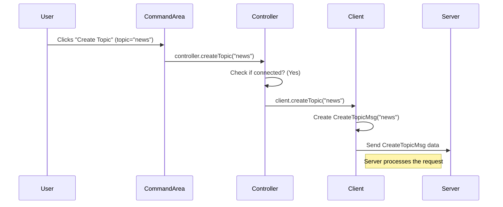

# Chapter 5: Controller (UI Logic Coordinator)

In the [previous chapter](04_ui_areas__commandarea___messagearea__.md), we explored the `CommandArea` (where you type commands) and the `MessageArea` (where you see messages). We saw that when you click a button in the `CommandArea`, it needs to tell *something* to perform the actual action, like connecting to the server or sending a message. Similarly, when a new message arrives from the network, *something* needs to take that message and display it in the `MessageArea`.

But who is this "something"? The `CommandArea` shouldn't know the details of network connections, and the `MessageArea` shouldn't be responsible for listening for incoming data. We need a central coordinator to manage the flow of information between the user interface and the background logic.

## The Director of the Play: Introducing the Controller

Imagine our chat application is like a stage play:
*   The **User Interface** (`CommandArea`, `MessageArea`) are the actors on stage.
*   The **User** is the audience member giving cues (clicking buttons).
*   The **Client** ([Chapter 2](02_client__network_interaction_logic__.md)) is like the backstage crew handling technical things (network communication).
*   The **Message Protocol** ([Chapter 1](01_message_hierarchy__communication_protocol__.md)) is the script they follow.

Who tells the actors what to do based on the cues, and who tells the backstage crew when to perform their tasks? That's the **Director**!

In our application, the `Controller` class (`Controller.java`) acts as this director. It's the **UI Logic Coordinator**. It sits between the UI elements and the `Client` logic, directing the flow of actions and information.

**Its main jobs are:**

1.  **Listen for Cues:** When the user interacts with the `CommandArea` (e.g., clicks the "Connect" button), the `CommandArea` notifies the `Controller`.
2.  **Direct the Action:** The `Controller` interprets the cue and tells the `Client` what to do (e.g., `client.connect()`).
3.  **Handle Incoming Information:** When the `Client` receives something from the server (like a new message), it gives it to the `Controller`.
4.  **Update the Stage:** The `Controller` processes the incoming information and makes sure the `MessageArea` is updated so the user can see it.

Without the `Controller`, the UI and the network logic would be disconnected, unable to work together.

## How the Controller Gets Involved: A Button Click Example

Let's revisit the "Create Topic" button from the `CommandArea` in [Chapter 4](04_ui_areas__commandarea___messagearea__.md).

```java
// File: src/main/java/no/hvl/dat110/chapp/CommandArea.java (Event Handling part)

// Inside setupCommandArea, for the 'Create Topic' button

createTopicBtn.setOnAction((event) -> {
	// This code runs when createTopicBtn is clicked

	String topic = topicField.getText(); // Get text from the topic input field

	if (!topic.isEmpty()) {
		// HERE: CommandArea tells the Controller to do the work!
		controller.createTopic(topic);
		System.out.println("Create Topic button clicked for: " + topic);
	}
});
```

1.  The user types "news" into the `topicField` and clicks `createTopicBtn`.
2.  The `setOnAction` code runs.
3.  It gets the text "news" from `topicField`.
4.  Crucially, it calls `controller.createTopic("news")`. The `CommandArea` delegates the task to the `Controller`. It doesn't know *how* to create a topic; it just knows it needs to ask the `Controller` to do it.

## What Happens Inside the Controller?

So, what does the `Controller` do when its `createTopic("news")` method is called?

1.  **Check Status:** It first checks if the application is actually connected to the server. It doesn't make sense to create a topic if we're not connected!
2.  **Delegate to Client:** If connected, it tells the `Client` object (our network messenger from [Chapter 2](02_client__network_interaction_logic__.md)) to handle the request. It calls something like `client.createTopic("news")`.
3.  **Client Does the Work:** The `Client` then creates the appropriate `CreateTopicMsg` (from [Chapter 1](01_message_hierarchy__communication_protocol__.md)) and sends it over the network to the server.

Here’s a simplified diagram of this flow:



## A Look at the Controller's Code

Let's peek inside `Controller.java`.

**1. Storing Information:** The `Controller` needs to keep track of important details.

```java
// File: src/main/java/no/hvl/dat110/chapp/Controller.java

import no.hvl.dat110.client.*; // Needed for the Client class
import no.hvl.dat110.messages.PublishMsg; // Needed for receiving messages

public class Controller {

	// Information about the user and server
	private String user;
	private String brokerhost;
	private int brokerport;

	// The network messenger
	private Client client;
	// Flag to track connection status
	private boolean isconnected = false;

	// Default values if not set via menus
	private static String DEFAULT_USER = "me";
	private static String DEFAULT_BROKERHOST = "localhost";
	private static int DEFAULT_BROKERPORT = 8080;

	// Constructor - Sets default values initially
	public Controller (MessageArea messagearea) {
		this.brokerport = DEFAULT_BROKERPORT;
		this.brokerhost = DEFAULT_BROKERHOST;
		this.user = DEFAULT_USER;
		// Note: The messagearea isn't stored here in this version,
        // but it's passed to the MessageHandler later.
	}

    // ... methods to get/set user, host, port ...
}
```

*   It stores the `user` name, `brokerhost`, and `brokerport`. These can be changed via the application menus.
*   It holds a reference to the `Client` object (once connected).
*   `isconnected` is a simple boolean flag to know if we have an active connection.

**2. Handling the "Connect" Action:**

```java
// File: src/main/java/no/hvl/dat110/chapp/Controller.java

	public boolean connect () {
		boolean success = true; // Assume success initially

		// Create the Client instance with current user/host/port
		this.client = new Client(user, brokerhost, brokerport);

		// Tell the client to establish the network connection
		client.connect(); // This internally sends a ConnectMsg

		// In a real app, 'connect()' would return true/false
        // based on success. Here we assume it worked.
		if (success) {
			isconnected = true; // Update our status flag
		}

		return success;
	}
```

*   This method is called (likely by the `ConnectBtnHandler` we saw linked in `CommandArea`) when the user wants to connect.
*   It creates a new `Client` instance using the current settings.
*   It calls `client.connect()`, which handles the actual network setup and sends the initial `ConnectMsg`.
*   It updates the `isconnected` flag.

**3. Handling the "Create Topic" Action:**

```java
// File: src/main/java/no/hvl/dat110/chapp/Controller.java

	public void createTopic(String topic) {
		// Only proceed if we are currently connected
		if (isconnected) {
			// Delegate the task to the Client object
			client.createTopic(topic);
		}
	}
```

*   This is the method called by the `CommandArea`'s button handler.
*   It first checks the `isconnected` flag.
*   If `true`, it simply calls the corresponding method on the `client` object: `client.createTopic(topic)`. The `Controller` doesn't need to know the details of *how* the `Client` does this.

Methods like `deleteTopic`, `subscribe`, `unsubscribe`, and `publish` follow the exact same pattern: check `isconnected`, then call the corresponding method on the `client`.

**4. Receiving Messages:** How does the `Controller` get messages *from* the `Client` to eventually show in the `MessageArea`?

```java
// File: src/main/java/no/hvl/dat110/chapp/Controller.java

	public String receive() {
		String message = null; // Start with no message

		// Only try to receive if connected
		if (isconnected) {
			// Ask the client to check for incoming messages
			// client.receive() waits for and reconstructs a message
            // We expect PublishMsg specifically for chat content
			PublishMsg msg = (PublishMsg) client.receive();

			// If the client actually returned a message (not null)
			if (msg != null) {
				// Format it nicely for display
				message = "[" + msg.getUser() + "] " + msg.getMessage();
			}
		}
		// Return the formatted message string, or null if none arrived
		return message;
	}
```

*   This `receive()` method is called periodically by the `MessageHandler` (which belongs to the `MessageArea`).
*   It checks `isconnected`.
*   It calls `client.receive()`. This method in the `Client` waits for data, reconstructs it into a `Message` object (using helpers we'll see later), and returns it. We expect incoming chat messages to be `PublishMsg` type.
*   If a `PublishMsg` is received (`msg != null`), the `Controller` extracts the user and the actual message content.
*   It formats this information into a user-friendly string (e.g., `[Alice] Hello Bob!`).
*   This string is then returned to the `MessageHandler`, which appends it to the `MessageArea`'s `TextArea`.

## The Central Hub

The `Controller` truly acts as the central hub or coordinator:

*   It receives requests triggered by user actions in the `CommandArea`.
*   It validates these requests (e.g., checking `isconnected`).
*   It translates these requests into calls to the `Client`'s methods.
*   It receives processed data (incoming messages) from the `Client`.
*   It formats this data and makes it available for the `MessageArea` to display.

It ensures that the UI components ([Chapter 4](04_ui_areas__commandarea___messagearea__.md)) don't need to know about the complexities of network communication ([Chapter 2](02_client__network_interaction_logic__.md)), and the `Client` doesn't need to know about the specific UI elements like buttons or text areas.

## Conclusion

We've learned that the `Controller` is the essential **UI Logic Coordinator** in our chat application. It acts like a director or a switchboard operator, connecting user interface events to the underlying client logic and relaying incoming information back to the UI for display.

Key takeaways:
*   It decouples the UI (`CommandArea`, `MessageArea`) from the network logic (`Client`).
*   It handles UI events by calling appropriate methods on the `Client`.
*   It provides a way (`receive()`) for the UI to get incoming messages processed by the `Client`.
*   It maintains the application's state, like the connection status (`isconnected`).

Now that we understand how the UI and the `Client` interact via the `Controller`, let's look deeper into how messages are prepared for network transmission. How does our `PublishMsg` object actually get turned into bytes that can be sent over the internet?

In the next chapter, we'll explore [Chapter 6: TransportMessage (Network Data Framing)](06_transportmessage__network_data_framing__.md) to understand how messages are packaged for their journey across the network.

---

