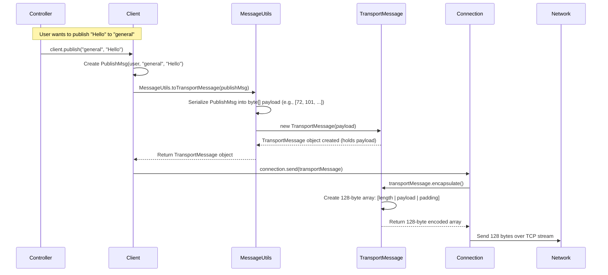

# Chapter 6: TransportMessage (Network Data Framing)

In the [previous chapter](05_controller__ui_logic_coordinator__.md), we saw how the `Controller` acts as the application's director, taking requests from the UI (like sending a message) and telling the `Client` ([Chapter 2](02_client__network_interaction_logic__.md)) what to do. The `Client` then prepares to send a message object (like a `PublishMsg` from [Chapter 1](01_message_hierarchy__communication_protocol__.md)) over the network.

But how does that message object actually travel across the internet? Computers connected via a network send data as streams of raw bytes (ones and zeroes). If our `Client` just dumped all the bytes for `ConnectMsg`, then `PublishMsg`, then another `PublishMsg` into the stream, how would the `Server` know where one message ends and the next one starts?

## The Problem: Finding Message Boundaries in a Stream

Imagine you're receiving a very long letter, but instead of arriving in an envelope, it arrives as one continuous ticker tape of letters with no spaces or punctuation. It would be impossible to read!

```
HELLOWORLDHOWAREYOUIMFINEGOODBYE
```

Network communication is similar. Data arrives as a continuous stream of bytes. The receiver needs a way to figure out: "Okay, *these* specific bytes make up the first message, and *these next* bytes make up the second message." Without clear boundaries, the data is just a jumbled mess.

## The Solution: Data Framing

To solve this, we use **Data Framing**. Think of it like putting each message into its own standard-sized envelope or small shipping box before sending it. This "frame" not only holds the message content (the "payload") but also adds some extra information, like a label on the outside.

In our chat application, the most important piece of information we add is the **length of the payload**.

**Analogy: The Standard Envelope**

Imagine you have messages of different lengths (a short note, a long letter).
1.  You get a standard-sized envelope (maybe it can hold up to 100 characters).
2.  You write your message (the payload). Let's say it's "Hi Bob!" (7 characters).
3.  You put the message inside the envelope.
4.  Crucially, on the *outside* of the envelope, you write: "Payload Length: 7".
5.  You send the envelope.

When your friend receives the standard-sized envelope, they don't need to guess where your message ends. They look at the label ("Payload Length: 7"), open the envelope, and read exactly the first 7 characters. They know those 7 characters constitute the complete message. Anything else in the envelope is just padding, and the *next* envelope they receive will contain the *next* message.

## Our Standard Envelope: `TransportMessage.java`

In our project, the `TransportMessage` class acts as this standard envelope or frame. Its main job is to hold the raw data bytes of the *actual* message we want to send (like the bytes representing a `ConnectMsg` or `PublishMsg`) and provide methods to wrap (frame) and unwrap (unframe) this data.

```java
// File: src/main/java/no/hvl/dat110/messagetransport/TransportMessage.java

public class TransportMessage {

	// The actual message content (raw bytes)
	private byte[] payload;

	// Constructor: Creates a TransportMessage holding the payload
	public TransportMessage(byte[] payload) {
		// We need to make sure the payload isn't too big for our 'envelope'
		if (payload == null || (payload.length + 1 > MessageConfig.SEGMENTSIZE)) {
			// (+1 because we need space for the length byte itself)
			throw new RuntimeException("Payload too large for segment!");
		}
		this.payload = payload;
	}

	// Method to get the payload data back out
	public byte[] getData() {
		return this.payload;
	}

	// ... (encapsulate and decapsulate methods coming next) ...
}
```

*   **`private byte[] payload;`**: This is where the raw data of the original message (e.g., the serialized `PublishMsg`) is stored. How we get these bytes from a `PublishMsg` object is the job of [Chapter 8: MessageUtils (Serialization/Deserialization)](08_messageutils__serialization_deserialization__.md). For now, just know that `payload` holds the core message content as bytes.
*   **`TransportMessage(byte[] payload)`**: The constructor takes these payload bytes and stores them. It also checks if the payload, plus the one extra byte we need for the length, will fit into our standard network packet size (`MessageConfig.SEGMENTSIZE`).

## Fixed Packet Size: `MessageConfig.SEGMENTSIZE`

Our network communication uses fixed-size packets, like using only one size of shipping box. This size is defined in `MessageConfig.java`.

```java
// File: src/main/java/no/hvl/dat110/messagetransport/MessageConfig.java

public class MessageConfig {

	// All our network 'envelopes' will be exactly 128 bytes long
	public static final int SEGMENTSIZE = 128;

	// Other network config (ignore for now)
	public static final int MESSAGINGPORT = 8080;
	public static final String MESSAGINGHOST = "localhost";
}
```

*   **`SEGMENTSIZE = 128`**: This means every chunk of data sent or received over the network using our `TransportMessage` framing will be exactly 128 bytes.

## Packing the Envelope: `encapsulate()`

How do we take our `payload` and put it into the standard 128-byte frame, adding the length information? This process is called **encapsulation**.

The `encapsulate()` method in `TransportMessage` does this:

1.  Creates a new, empty byte array of exactly `SEGMENTSIZE` (128 bytes).
2.  Calculates the length of the `payload`.
3.  Writes this length value into the *very first byte* (index 0) of the 128-byte array.
4.  Copies the actual `payload` bytes into the array, starting right *after* the length byte (at index 1).
5.  Returns the filled 128-byte array. The rest of the array (after the payload) is just padding and doesn't matter.

```java
// File: src/main/java/no/hvl/dat110/messagetransport/TransportMessage.java

public byte[] encapsulate() {

	byte[] encoded; // This will be our 128-byte framed message

	// Create the empty 128-byte array
	encoded = new byte[MessageConfig.SEGMENTSIZE];

	// --- The Framing Magic ---
	// 1. Put the length of the payload into the first byte
	encoded[0] = (byte) (payload.length);

	// 2. Copy the payload bytes starting from the second byte (index 1)
	for (int i = 0; i < payload.length; i++) {
		encoded[i + 1] = payload[i];
	}
	// --- End of Framing ---

	// Return the fully prepared 128-byte segment
	return encoded;
}
```

*   `encoded = new byte[MessageConfig.SEGMENTSIZE];`: Makes the 128-byte "envelope".
*   `encoded[0] = (byte) (payload.length);`: Writes the payload length into the first byte. We cast to `byte` because the length must fit in a single byte (0-255), which is why `SEGMENTSIZE` (128) limits the maximum payload size (to 127 bytes + 1 length byte).
*   `encoded[i + 1] = payload[i];`: Copies the payload bytes one by one into the `encoded` array, starting at index 1.

**Visual Example:**
If our payload is `[72, 101, 108, 108, 111]` (bytes for "Hello"), its length is 5. `encapsulate()` produces a 128-byte array like this:

```
Byte Index:   0    1    2    3    4    5    6   ...   127
Value:      [ 5 | 72 |101 |108 |108 |111 | 0 | ... |  0 ]
             \-/ \---------------------/ \-------------/
            Length    Actual Payload       Padding (unused)
```

This 128-byte `encoded` array is what gets sent over the network by the [Connection](07_connection__network_stream_handling__.md).

## Opening the Envelope: `decapsulate()`

When the receiver gets a 128-byte chunk of data from the network, how does it extract the original `payload`? This is called **decapsulation**.

The `decapsulate()` method does the reverse of `encapsulate()`:

1.  Takes the received 128-byte array (`received`) as input.
2.  Reads the *first byte* (index 0) to find out the `length` of the original payload.
3.  Uses this `length` to know exactly which bytes in the `received` array constitute the payload (from index 1 up to index `length`).
4.  Copies *only* these payload bytes into the `TransportMessage` object's own `payload` field.

```java
// File: src/main/java/no/hvl/dat110/messagetransport/TransportMessage.java

import java.util.Arrays; // Needed for Arrays.copyOfRange

public void decapsulate(byte[] received) { // 'received' is the 128-byte array from network

	// --- The Un-Framing Magic ---
	// 1. Read the payload length from the first byte
	int len = received[0];

	// 2. Extract the payload bytes from the received array
	//    Starts at index 1, and copies 'len' bytes.
	payload = Arrays.copyOfRange(received, 1, len + 1);
	// --- End of Un-Framing ---

	// Now, 'this.payload' holds the original message bytes again!
}
```

*   `int len = received[0];`: Gets the length stored in the first byte.
*   `payload = Arrays.copyOfRange(received, 1, len + 1);`: This is a handy Java utility. It copies a portion of the `received` array.
    *   `1`: Start copying from index 1 (where the payload begins).
    *   `len + 1`: Copy up to (but *not including*) this index. Since we start at 1 and want `len` bytes, the end index is `1 + len`.
*   After this, the `payload` field of the `TransportMessage` object holds the extracted data.

## How It Fits Together

Here's a simplified view of how `TransportMessage` is used when sending a message:



1.  The `Client` gets a `Message` object (like `PublishMsg`).
2.  It asks `MessageUtils` ([Chapter 8](08_messageutils__serialization_deserialization__.md)) to convert this object into a `TransportMessage`.
3.  `MessageUtils` first turns the `PublishMsg` into its raw byte `payload`.
4.  `MessageUtils` creates a `TransportMessage` containing this `payload`.
5.  The `Client` tells the `Connection` ([Chapter 7](07_connection__network_stream_handling__.md)) to send this `TransportMessage`.
6.  The `Connection` calls `transportMessage.encapsulate()` to get the framed 128-byte array.
7.  The `Connection` sends these 128 bytes over the network.

Receiving works in reverse, with the `Connection` reading 128 bytes, creating an empty `TransportMessage`, calling `decapsulate()` on it, and then passing the `TransportMessage` (now containing the extracted payload) to `MessageUtils` to turn it back into a `PublishMsg`.

## Conclusion

We've learned that sending raw data over a network stream is problematic because the receiver doesn't know where messages start and end. **Data Framing** solves this by wrapping the message data (payload) in a structure that includes metadata, like the payload's length.

The `TransportMessage` class implements this framing in our project:
*   It holds the raw message `payload` (as bytes).
*   It uses a fixed `SEGMENTSIZE` (128 bytes) for all network transmissions.
*   The `encapsulate()` method creates the 128-byte frame by writing the `payload` length in the first byte, followed by the `payload` itself.
*   The `decapsulate()` method extracts the original `payload` from a received 128-byte frame by reading the length from the first byte.

This framing ensures that the receiver can reliably reconstruct messages even when they arrive as part of a continuous byte stream.

Now that we understand how a single message is packaged into a `TransportMessage` frame, how are these frames actually sent and received over the network connection itself? In the next chapter, we'll explore [Chapter 7: Connection (Network Stream Handling)](07_connection__network_stream_handling__.md) to see how the application manages the input and output streams for network communication.

---

