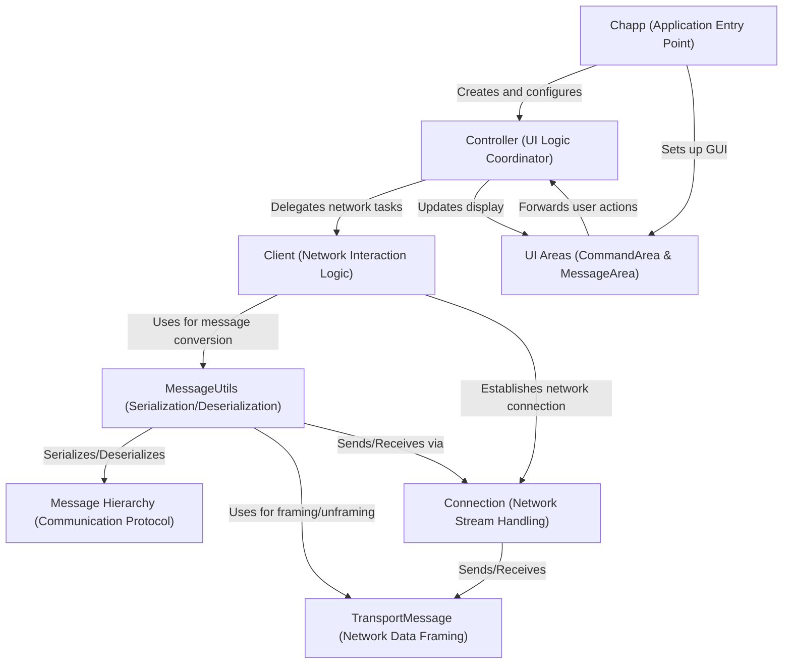

# Project 2 Overview

This project is a simple **JavaFX Chat Application** (*ChApp*).
It allows users to connect to a central *message broker* (server), subscribe to chat *topics*, and publish/receive messages on those topics.
The application has a graphical user interface (**GUI**) for interaction and handles the underlying **network communication** and message formatting.

**Source Repository:** https://github.com/selabhvl/dat110-project2-mom-startcode

## Chapters

1. [Message Hierarchy (Communication Protocol)
](01_message_hierarchy__communication_protocol__.md)
2. [Client (Network Interaction Logic)
](02_client__network_interaction_logic__.md)
3. [Chapp (Application Entry Point)
](03_chapp__application_entry_point__.md)
4. [UI Areas (CommandArea & MessageArea)
](04_ui_areas__commandarea___messagearea__.md)
5. [Controller (UI Logic Coordinator)
](05_controller__ui_logic_coordinator__.md)
6. [TransportMessage (Network Data Framing)
](06_transportmessage__network_data_framing__.md)
7. [Connection (Network Stream Handling)
](07_connection__network_stream_handling__.md)
8. [MessageUtils (Serialization/Deserialization)
](08_messageutils__serialization_deserialization__.md)

---
