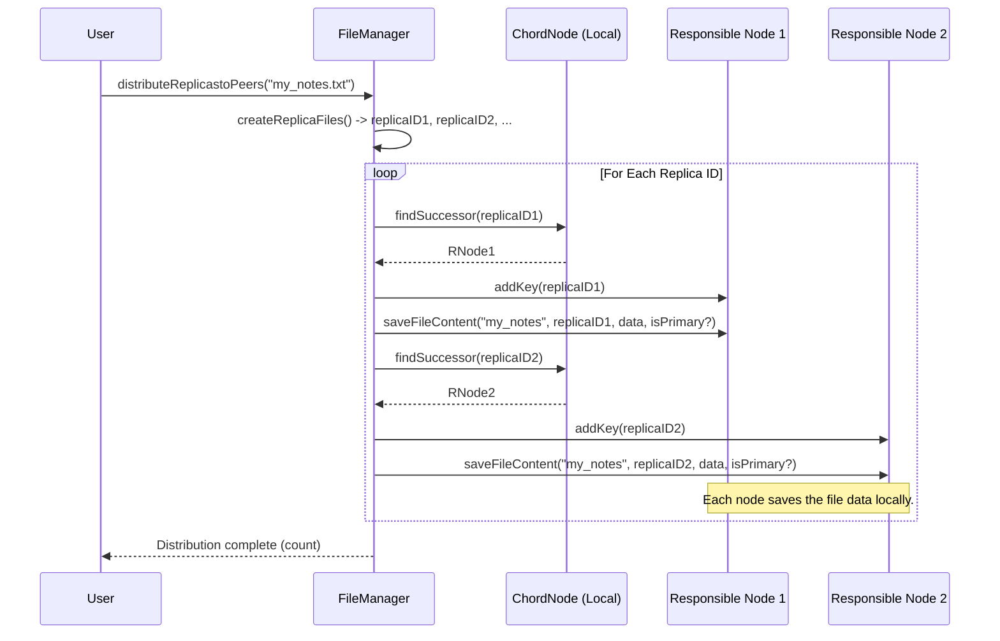

# Chapter 1: File Management & Replication

Welcome to the first chapter of the DAT110 Project 3 tutorial! We're going to start by looking at how our distributed system handles files.

Imagine you have an important digital document, like your homework assignment. If you only store it on your laptop, what happens if your laptop breaks? You lose the file! That's a big problem. In a system with many computers working together (a distributed system), we want to make sure files are safe and available even if some computers fail or leave the network.

This chapter introduces **File Management & Replication**, the part of our system responsible for keeping files safe and findable. Think of it like a super-organized librarian or filing clerk for our network.

**What You'll Learn:**

*   Why we need to make copies (replicas) of files.
*   How the system decides *which* computers (nodes) should store these copies.
*   How the system finds the locations of these copies when you need the file back.

## The Filing Clerk Analogy

Let's stick with our filing clerk analogy. Imagine a large office building where many people work in different offices (these are our computers, or **Nodes**).

1.  **Receiving a Document:** You give an important document (your file) to the central filing clerk (`FileManager`).
2.  **Making Copies:** The clerk knows one copy isn't safe enough. They make several photocopies (replicas) of the document.
3.  **Finding Offices:** The clerk needs to decide which offices should store these copies. They use the building directory (our **Chord** system, which we'll learn more about later) to find the right offices based on some identifier for each photocopy.
4.  **Storing Copies:** The clerk sends each photocopy to its assigned office.
5.  **Finding Copies Later:** When you need the document back, you ask the clerk. The clerk again uses the directory to figure out which offices have copies and tells you where they are.

This is exactly what our File Management & Replication system does for digital files!

## Key Ideas

1.  **Replication:** Making multiple copies of a file and storing them on different computers (Nodes) in the network. If one computer fails, copies still exist on others. This makes the file *reliable* and *available*. We call each copy a **replica**.
2.  **Distribution:** Deciding *where* to store each replica. We don't just put them anywhere! We use a clever system based on unique IDs. Every file (or rather, each replica) gets an ID, usually by [Hashing](04_hashing___id_space_.md) its name. Our distributed directory system, [Chord](05_chord_protocol__ring__lookup__stabilization_.md), tells us exactly which [Node (Peer)](02_node__peer__.md) is responsible for storing a file with a specific ID.
3.  **Lookup:** Finding out which nodes are currently storing the replicas of a specific file.

## Using File Management

Let's see how you'd interact with this system, perhaps from a user interface. The main tool we use is the `FileManager` class.

**Scenario:** You want to upload a file named `my_notes.txt`.

1.  **Prepare the File:** First, the `FileManager` needs to read the file's content from your disk.

    ```java
    // In a real application, you'd get the Node object representing this computer
    NodeInterface myself = ... // Represents the current node in the Chord network

    // Create a FileManager associated with this node
    // We decide to make 3 replicas of each file (N=3)
    int N = 3;
    FileManager fileManager = new FileManager(myself, N);

    // Tell the FileManager where the file is located
    fileManager.setFilepath("/path/to/your/my_notes.txt");

    try {
        // Read the file content into memory
        fileManager.readFile();
        System.out.println("Read file: " + fileManager.getFilename() + ", Size: " + fileManager.getSizeOfByte() + " KB");
    } catch (IOException e) {
        System.err.println("Error reading file: " + e.getMessage());
    }
    ```

    *Explanation:* We create a `FileManager` linked to our current position (`myself`) in the network. We specify we want 3 replicas (`N=3`). `setFilepath` tells it which file we're interested in, and `readFile` loads its name and content.

2.  **Distribute the Replicas:** Now, tell the `FileManager` to create replicas and spread them across the network.

    ```java
    try {
        // This does the core work: creates replica IDs, finds nodes, and sends copies
        int replicas_distributed = fileManager.distributeReplicastoPeers();
        System.out.println("Successfully distributed " + replicas_distributed + " replicas.");
    } catch (RemoteException e) {
        System.err.println("Error distributing file replicas: " + e.getMessage());
    }
    ```

    *Explanation:* The `distributeReplicastoPeers()` method handles making copies, figuring out where they should go using Chord, and telling the responsible nodes to save them. It returns how many copies were successfully stored.

3.  **Finding the File Later:** Imagine another user (or you, later) wants to find `my_notes.txt`.

    ```java
    try {
        // Ask the FileManager to find all nodes that have a replica of "my_notes"
        // Note: We pass the base filename without ".txt" as per how readFile processed it.
        Set<Message> locations = fileManager.requestActiveNodesForFile("my_notes");

        System.out.println("Found " + locations.size() + " locations for the file:");
        for (Message msg : locations) {
            // Each 'Message' contains info about a replica and the node storing it
            System.out.println("- Node: " + msg.getNodeName() + " (Port: " + msg.getPort() + ")");
        }
        // Store these locations for later use (e.g., downloading the file)
        fileManager.setActiveNodesforFile(locations);

    } catch (RemoteException e) {
        System.err.println("Error finding file locations: " + e.getMessage());
    }
    ```

    *Explanation:* `requestActiveNodesForFile()` takes the base filename. It figures out the replica IDs, uses Chord to find the nodes responsible for those IDs, and asks those nodes if they indeed have the replica's metadata. It returns a `Set` of [Message](06_message_.md) objects, each describing a replica and the [Node (Peer)](02_node__peer__.md) storing it.

## How it Works Under the Hood

Let's peek behind the curtain of `FileManager`.

**Distributing Replicas (`distributeReplicastoPeers`)**

1.  **Create Replica IDs:** The `FileManager` doesn't just copy the file content `N` times. It creates `N` *different* identifiers. It usually does this by taking the original filename and adding a number (e.g., `my_notes0`, `my_notes1`, `my_notes2`). Then, it calculates the [Hash](04_hashing___id_space_.md) of each of these unique names to get `N` distinct replica IDs (BigInteger numbers).

    ```java
    // Inside FileManager.java createReplicaFiles() method (simplified)
    // Example: filename = "my_notes", numReplicas = 3
    for (int i = 0; i < numReplicas; i++) {
        String replicaName = filename + i; // e.g., "my_notes0", "my_notes1", ...
        BigInteger replicaHash = Hash.hashOf(replicaName); // Calculate unique ID
        replicafiles[i] = replicaHash; // Store the ID
    }
    ```

2.  **Find Responsible Node:** For *each* `replicaHash`, the `FileManager` uses the [Chord Protocol](05_chord_protocol__ring__lookup__stabilization_.md) (specifically, the `findSuccessor` method of its associated `chordnode`) to determine which [Node (Peer)](02_node__peer__.md) in the network is responsible for storing data with that specific ID.

3.  **Send and Store:** The `FileManager` contacts the responsible node found in step 2 (using [Remote Communication (RMI)](03_remote_communication__rmi__.md)). It tells that node to:
    *   Remember that it's now responsible for this `replicaHash` (`addKey`).
    *   Save the actual file content (`bytesOfFile`) along with the original filename and the `replicaHash` (`saveFileContent`).
    *   Mark one of the replicas randomly as the "primary" copy. This is important for keeping all copies consistent when the file is modified, which we'll discuss in the [Consistency](07_consistency__remote_write_protocol_.md) chapter.

    ```java
    // Inside FileManager.java distributeReplicastoPeers() method (simplified)
    Random rnd = new Random();
    int primaryIndex = rnd.nextInt(numReplicas); // Pick a random primary

    for (int i = 0; i < replicafiles.length; i++) {
        BigInteger replicaHash = replicafiles[i];

        // Ask Chord: "Who is responsible for this ID?"
        NodeInterface successor = chordnode.findSuccessor(replicaHash);

        if (successor != null) {
            // Tell the responsible node: "You are responsible for this ID"
            successor.addKey(replicaHash);

            // Tell the responsible node: "Save this file content for this ID"
            boolean isPrimary = (i == primaryIndex);
            successor.saveFileContent(filename, replicaHash, bytesOfFile, isPrimary);
            counter++; // Count successful distributions
        }
    }
    ```

    *Explanation:* The code iterates through the replica IDs generated earlier. For each ID, it asks its own `chordnode` (using `findSuccessor`) to find the correct node (`successor`) in the distributed network. Then, it remotely calls methods (`addKey`, `saveFileContent`) on that `successor` node to make it store the replica information and content.

Here's a simplified sequence diagram:



**Finding Replicas (`requestActiveNodesForFile`)**

This process is similar but instead of sending data *to* the nodes, we ask them for information *about* the data they already hold.

1.  **Create Replica IDs:** Just like before, generate the `N` replica IDs from the base filename (`my_notes0`, `my_notes1`, etc., and hash them).
2.  **Find Responsible Node:** For *each* `replicaHash`, use `chordnode.findSuccessor(replicaHash)` to find the node responsible for that ID.
3.  **Request Metadata:** Contact the responsible node and ask for the metadata associated with that specific `replicaHash` using the `getFilesMetadata(replicaHash)` method. This metadata is stored as a [Message](06_message_.md) object on the responsible node.
4.  **Collect Results:** Gather all the `Message` objects received from the responsible nodes. This set contains information about all active replicas and where they are stored.

```java
// Inside FileManager.java requestActiveNodesForFile(filename) (simplified)
activeNodesforFile = new HashSet<Message>();
createReplicaFiles(); // Generate replica IDs (e.g., replicafiles array)

for (BigInteger replicaHash : replicafiles) {
    // Ask Chord: "Who is responsible for this ID?"
    NodeInterface successor = chordnode.findSuccessor(replicaHash);

    if (successor != null) {
        // Ask the responsible node: "What info do you have for this ID?"
        Message metadata = successor.getFilesMetadata(replicaHash);

        if (metadata != null) {
            // If the node has the metadata, add it to our set
            activeNodesforFile.add(metadata);
        }
    }
}
return activeNodesforFile; // Return the set of locations/metadata
```

*Explanation:* Similar loop structure, but instead of `saveFileContent`, we call `getFilesMetadata` on the `successor` node. This method returns a `Message` object containing details like the filename, hash, node name, port, etc., which we collect in the `activeNodesforFile` set.

## Conclusion

In this chapter, we learned about the crucial role of **File Management & Replication**. We saw why making copies (replicas) is essential for reliability in a distributed system and how the `FileManager` acts as our coordinator. It uses unique IDs ([Hashing](04_hashing___id_space_.md)) and a distributed directory ([Chord Protocol](05_chord_protocol__ring__lookup__stabilization_.md)) to figure out *where* to store these replicas and how to find them later.

We've seen *what* the `FileManager` does and *how* it interacts with other parts of the system at a high level. We know that it relies on individual computers, or **Nodes**, to actually store the data.

In the next chapter, we'll zoom in on these individual players: the [Node (Peer)](02_node__peer__.md). We'll explore what a Node is, what information it keeps track of, and its basic responsibilities within the larger network.

---
