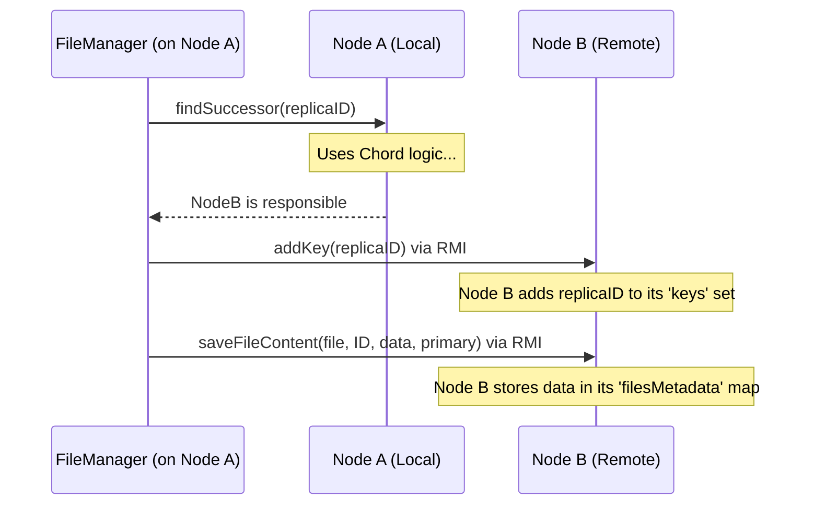

# Chapter 2: Node (Peer)

Welcome to Chapter 2! In the [previous chapter](01_file_management___replication_.md), we learned how our system manages files and creates copies (replicas) to keep them safe. We saw how the `FileManager` acts like a central clerk, deciding *where* to store these copies. But where *exactly* do those copies go? They go to the individual computers participating in our network.

This chapter introduces the concept of a **Node** (also called a **Peer**). Think of it as a single worker or computer that's part of our distributed system.

**What You'll Learn:**

*   What a Node is and why each one is unique.
*   What important information each Node keeps track of (like its neighbors and the files it's holding).
*   How a Node is created and becomes part of the network.

## What is a Node? The Office Building Analogy

Imagine our distributed system is like a very large, circular office building.

*   **Node:** Each individual office in the building is a **Node**. It's a single computer or process running our software.
*   **Unique ID:** Every office has a unique room number (e.g., Office #101, Office #253). Similarly, every Node has a unique **Node ID**. This ID helps us tell nodes apart and organize them. We usually get this ID by taking the Node's network address (like an IP address or a name) and running it through a special function called [Hashing](04_hashing___id_space_.md).
*   **Neighbors:** Since the building is circular, each office knows the office immediately next to it (its **Successor**) and the office immediately before it (its **Predecessor**). Nodes in our system also keep track of their direct neighbors in a logical ring structure, which we'll explore more in the [Chord Protocol](05_chord_protocol__ring__lookup__stabilization__.md) chapter.
*   **Storage:** Each office is responsible for storing certain documents or files. Our Nodes are responsible for storing specific file replicas, determined by the [Hashing](04_hashing___id_space_.md) of the file's replica ID. If a replica's ID matches the Node's responsibilities, that Node stores the file data.

So, a **Node (Peer)** is a fundamental building block – a single, identifiable participant in the network that knows its immediate neighbors and holds a piece of the shared data.

## Key Information a Node Holds

Let's look inside one of these "offices" (our `Node` object in the code). What does it need to know?

1.  **`nodeID` (BigInteger):** The unique identifier for this Node. Calculated using [Hashing](04_hashing___id_space_.md). It's a large number.
2.  **`nodename` (String):** A human-readable name or address for the node (like "node1.example.com" or "192.168.1.10").
3.  **`port` (int):** The network port number this Node uses to listen for incoming connections, crucial for [Remote Communication (RMI)](03_remote_communication__rmi__.md).
4.  **`successor` (NodeInterface):** A reference (like a phone number) to the *next* Node in the logical ring.
5.  **`predecessor` (NodeInterface):** A reference to the *previous* Node in the logical ring.
6.  **`keys` (Set<BigInteger>):** A list of all the file replica IDs that *this* Node is currently responsible for storing. Remember from Chapter 1, the `FileManager` tells a Node to `addKey()` when assigning it a replica.
7.  **`filesMetadata` (Map<BigInteger, Message>):** The actual information about the files this Node is storing. For each `key` (replica ID) the Node is responsible for, it stores a [Message](06_message_.md) object containing details like the original filename, the replica ID, and whether it's the primary copy. This is where the file content itself (or information about it) is managed.

## Creating and Starting a Node

How does a computer become a Node in our system? We use two main classes: `Node` and `NodeServer`.

1.  **`NodeServer`:** This class acts like the building manager for a specific office. Its job is to:
    *   Create the actual `Node` object (the office itself).
    *   Set up the communication infrastructure ([Remote Communication (RMI)](03_remote_communication__rmi__.md)) so other nodes can contact this one. Think of it as installing the phone line in the office.
    *   Register the Node with a central directory (the RMI Registry) using its `nodename`, so others can find it.

2.  **`Node`:** This is the class representing the office we discussed. When `NodeServer` creates a `Node` object, the `Node` constructor does the following:
    *   Takes the `nodename` and `port` as input.
    *   Calculates its unique `nodeID` using `Hash.hashOf(nodename)`.
    *   Initializes its internal state: sets up empty storage for `keys` and `filesMetadata`, and prepares other components like those for lookups and updates (which we'll cover later).

**Example: Starting a Node**

Let's see simplified code for starting a Node named "node101" that listens on port 9091.

```java
// File: src/main/java/no/hvl/dat110/middleware/NodeServer.java (Simplified)

import java.rmi.registry.LocateRegistry;
import java.rmi.registry.Registry;
import no.hvl.dat110.rpc.interfaces.NodeInterface;

public class NodeServer {

    private String nodename;
    private int port;
    private NodeInterface chordnode; // Holds the actual Node object

    public NodeServer(String nodename, int port) {
        this.nodename = nodename;
        this.port = port;
        start(); // Start the server immediately
        // In the real code, Chord protocols are started here too
    }

    public void start() {
        try {
            // 1. Create the Node object (the "office")
            chordnode = new Node(nodename, port); // Calls the Node constructor

            // 2. Set up the RMI Registry (the "phone directory") on the specified port
            Registry registry = LocateRegistry.createRegistry(port);

            // 3. Register this Node in the directory with its name
            registry.bind(nodename, chordnode);

            System.out.println(nodename + " server running on port " + port);

        } catch (Exception e) {
            System.err.println("Error starting Node Server: " + e.getMessage());
        }
    }

    public NodeInterface getNode() {
        return chordnode; // Method to get the created Node object
    }

    // --- Main method to run this example ---
    public static void main(String[] args) {
        // Start a node named "node101" on port 9091
        new NodeServer("node101", 9091);
    }
}
```

*Explanation:*
1.  We create a `NodeServer` instance, giving it a name ("node101") and a port (9091).
2.  The `start()` method is called.
3.  Inside `start()`, `new Node("node101", 9091)` creates our actual Node participant. The `Node` constructor calculates its unique ID from "node101".
4.  `LocateRegistry.createRegistry(port)` sets up the RMI communication listener on port 9091.
5.  `registry.bind(nodename, chordnode)` makes this specific `Node` object available over the network under the name "node101". Now other nodes can find and talk to it using [Remote Communication (RMI)](03_remote_communication__rmi__.md).

**Inside the `Node` Constructor**

What happens when `new Node(nodename, port)` is called?

```java
// File: src/main/java/no/hvl/dat110/middleware/Node.java (Simplified Constructor)

import java.math.BigInteger;
import java.rmi.RemoteException;
import java.rmi.server.UnicastRemoteObject;
import java.util.HashSet;
import java.util.HashMap;
// ... other imports

// Node extends UnicastRemoteObject to allow RMI calls
public class Node extends UnicastRemoteObject implements NodeInterface {

    private BigInteger nodeID;
    protected String nodename;
    private int port;
    private NodeInterface successor;
    private NodeInterface predecessor;
    private Set<BigInteger> keys;           // Stores IDs of files this node is responsible for
    private Map<BigInteger, Message> filesMetadata; // Stores info about those files

    // ... other fields for Chord, Mutex, etc.

    public Node(String nodename, int port) throws RemoteException {
        super(); // Needed for UnicastRemoteObject
        this.port = port;
        this.nodename = nodename;

        // Calculate the unique ID using Hashing
        this.nodeID = Hash.hashOf(nodename);

        // Initialize storage - initially empty
        this.keys = new HashSet<BigInteger>();
        this.filesMetadata = new HashMap<BigInteger, Message>();

        // Initialize successor and predecessor to null (will be set later by Chord)
        this.successor = null;
        this.predecessor = null;

        // ... initialize other helper objects (Lookup, Updater, Mutex)

        System.out.println("Node created: " + nodename + " (ID: " + nodeID + ")");
    }

    // ... other methods like getNodeID(), addKey(), getFilesMetadata() ...
}
```

*Explanation:*
The constructor simply takes the name and port, calculates the `nodeID` using the `Hash.hashOf()` method (which we'll explore in [Hashing & ID Space](04_hashing___id_space_.md)), and prepares empty containers (`HashSet`, `HashMap`) to store the `keys` (file replica IDs) and `filesMetadata` it will eventually be responsible for. It also initializes its neighbors (`successor`, `predecessor`) to `null` - the [Chord Protocol](05_chord_protocol__ring__lookup__stabilization__.md) will be responsible for finding and setting these later.

## How Nodes Interact (A Glimpse)

Nodes don't just sit there; they interact. We saw in Chapter 1 how the `FileManager` interacts with Nodes. For example, to store a file replica:

1.  The `FileManager` calculates the replica ID (a `BigInteger`).
2.  It uses the [Chord Protocol](05_chord_protocol__ring__lookup__stabilization_.md) (specifically, the `findSuccessor` method on *its own* Node) to find the Node responsible for that ID. Let's say it finds "Node 253".
3.  The `FileManager` then uses [Remote Communication (RMI)](03_remote_communication__rmi__.md) to call methods *on* "Node 253".
4.  It might call `Node253.addKey(replicaID)` to tell Node 253 it's now responsible for this ID.
5.  It might call `Node253.saveFileContent(filename, replicaID, fileData, isPrimary)` to send the actual file data and metadata for storage. Node 253 would then store this information in its `keys` set and `filesMetadata` map.

Here's a simplified sequence diagram showing this:



This shows that a Node isn't just passive storage. It actively participates by responding to requests from other parts of the system, managing its own set of responsibilities (`keys`), and storing the associated data (`filesMetadata`).

## Conclusion

We've now met the individual workers in our distributed system: the **Nodes** or **Peers**. Each Node is like an office in our circular building – it has a unique ID (`nodeID`), knows its neighbors (`successor`, `predecessor`), and is responsible for storing a specific set of file replicas (`keys` and `filesMetadata`).

We saw how a `NodeServer` brings a `Node` to life and connects it to the network's communication system. Understanding the Node is crucial because *everything* in the distributed system ultimately happens *on* or *between* these Nodes.

In the next chapter, we'll dive deeper into *how* these Nodes talk to each other across the network using [Remote Communication (RMI)](03_remote_communication__rmi__.md). We'll see how the `FileManager` (or any Node) can call methods on a remote Node as if it were right there!

---
