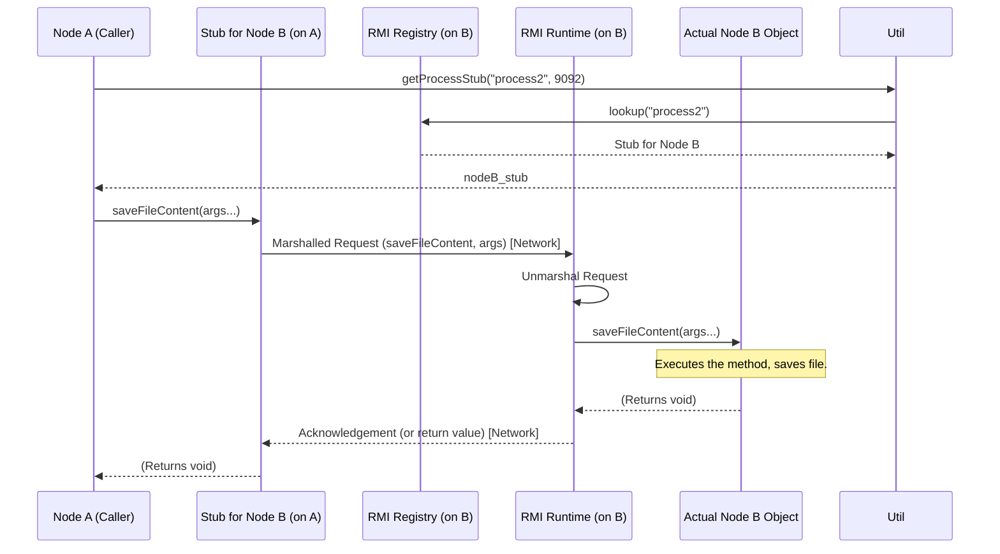

# Chapter 3: Remote Communication (RMI)

Welcome to Chapter 3! In the [previous chapter](02_node__peer__.md), we met the individual computers, or **Nodes (Peers)**, that make up our distributed system. We learned that each Node is like an office in a large building, with its own ID, neighbors, and responsibility for storing certain files.

But how do these separate offices talk to each other? If the `FileManager` on Node A decides that Node B should store a file replica, how does Node A *tell* Node B to do that? They need a way to communicate across the network.

This chapter introduces **Remote Communication (RMI)**, the technology that lets our Nodes interact as if they were making direct calls to each other, even when they're physically separated.

**What You'll Learn:**

*   What Remote Method Invocation (RMI) is and why it's useful.
*   How one Node can "call a function" on another Node across the network.
*   The basic components needed for RMI to work (Interfaces, Stubs, Registry).

## The Office Phone System Analogy

Think back to our office building analogy for Nodes. How does Office A ask Office B to file a document? Office A doesn't physically walk over there. Instead, Office A uses the **internal phone system**.

1.  **Look up the number:** Office A looks up Office B's extension number in the building directory.
2.  **Dial the number:** Office A dials the extension.
3.  **Make the request:** When Office B answers, Office A says, "Hi, could you please file this document under ID XYZ?"
4.  **Get confirmation:** Office B performs the task and confirms, "Okay, document XYZ is filed."

**Java RMI (Remote Method Invocation)** works exactly like this for our software Nodes:

*   **Building Directory:** The **RMI Registry** is like the central phone directory where Nodes register their names and "extensions" (network addresses/ports).
*   **Phone Call:** Making an RMI call is like dialing another Node.
*   **Request:** Asking the other Node to "file the document" is like *invoking a method* (calling a function) on the remote Node object.
*   **Confirmation:** Getting the confirmation back is like receiving the *return value* from the remote method.

RMI allows a piece of code running on one computer (Node A) to call a method on an object residing on a *different* computer (Node B) seamlessly, as if the object were right there in Node A's own memory.

## Key RMI Concepts

To make this phone system work, we need a few pieces:

1.  **The Remote Interface (`NodeInterface`):** This is like a menu of services or a list of requests that an "office" (Node) knows how to handle. It defines *which methods* can be called remotely. Any Node wanting to be callable by others must promise to implement the methods listed in this interface.

    *Analogy:* The phone directory might list "Office B - Filing Services, Document Retrieval". The interface defines *what* you can ask Office B to do.

2.  **The Server Object (`Node`):** This is the actual object living on the remote computer that *implements* the Remote Interface. It contains the real code that performs the requested task when called.

    *Analogy:* The actual person or department in Office B who performs the filing or retrieval when called.

3.  **The Stub:** This is a special helper object that lives on the *caller's* machine (Node A). When Node A wants to call a method on Node B, it actually calls the method on the Stub object. The Stub looks exactly like the real remote object (it implements the same `NodeInterface`), but its job is purely to handle the network communication: package up the request, send it to Node B, wait for the response, and unpack it.

    *Analogy:* This is like a "speed dial" button on Office A's phone labeled "Office B Filing". Pressing the button *looks* like you're directly talking to Office B, but the phone system (the Stub) handles the dialing and connection behind the scenes.

4.  **The RMI Registry:** A simple name server where server objects (like our Nodes) register themselves under a unique name. Clients (like other Nodes or the `FileManager`) can look up these names in the Registry to get the corresponding Stub object, which allows them to make remote calls.

    *Analogy:* The central building phone directory where Office B registers its extension number under the name "Office B". Office A looks up "Office B" to get the extension (the Stub).

## How Nodes Use RMI

Let's revisit the scenario from Chapter 1: The `FileManager` (running on Node A) needs to tell Node B to store a replica of a file.

**Use Case:** Node A needs to call the `saveFileContent(filename, fileID, data, isPrimary)` method on Node B.

**Step 1: Find Node B's "Phone Number" (Get the Stub)**

Node A needs to get the Stub object for Node B. It knows Node B's name (e.g., "nodeB_process") and the port number where Node B's RMI Registry is running (e.g., 9092). It uses a helper function `Util.getProcessStub` to connect to Node B's Registry and ask for the object named "nodeB_process". The Registry sends back the Stub.

```java
// Somewhere in Node A's code (e.g., inside FileManager)
String targetNodeName = "process2"; // Name Node B registered with
int targetPort = 9092;          // Port Node B's RMI registry runs on

try {
    // Use a utility function to look up Node B in its RMI registry
    // This returns the STUB object for Node B
    NodeInterface nodeB_stub = Util.getProcessStub(targetNodeName, targetPort);

    if (nodeB_stub != null) {
        System.out.println("Successfully obtained a connection (stub) to " + targetNodeName);
        // Now we can use nodeB_stub to call methods on the actual Node B
    } else {
        System.out.println("Could not find or connect to " + targetNodeName);
    }

} catch (Exception e) {
    System.err.println("Error connecting to Node B: " + e.getMessage());
}
```

*Explanation:* `Util.getProcessStub` acts like looking up "process2" in the phone directory at extension 9092. If successful, it returns `nodeB_stub`, which is our "speed dial" button for Node B.

**Step 2: Make the "Phone Call" (Invoke the Remote Method)**

Now that Node A has the `nodeB_stub`, it can call methods on it just like any regular Java object. RMI handles the magic of sending the call over the network to the *real* Node B.

```java
// Continuing from Step 1, assuming nodeB_stub was obtained successfully

String filename = "my_notes";
BigInteger replicaID = someBigIntegerID; // The calculated ID for this replica
byte[] fileData = someByteArray;     // The actual content of the file
boolean isPrimary = false;

try {
    // Call the method directly on the stub object!
    System.out.println("Asking Node B to save the file...");
    nodeB_stub.saveFileContent(filename, replicaID, fileData, isPrimary);
    System.out.println("Request sent to Node B successfully.");

    // We could also call other methods defined in NodeInterface, e.g.,
    // BigInteger nodeB_ID = nodeB_stub.getNodeID();
    // System.out.println("Node B's ID is: " + nodeB_ID);

} catch (RemoteException e) {
    // This exception occurs if there's a network problem during the call
    System.err.println("Error calling remote method on Node B: " + e.getMessage());
}
```

*Explanation:* We simply call `nodeB_stub.saveFileContent(...)`. Even though `nodeB_stub` is an object running on Node A, this call results in the *actual* `saveFileContent` method being executed on the *real* `Node` object running on Node B's computer. If `saveFileContent` had a return value, it would be sent back and appear as the result of this call. `RemoteException` is caught because network errors can happen during the remote communication.

## Under the Hood: How RMI Works

Let's peek behind the curtain. What happens when `nodeB_stub.saveFileContent(...)` is called?

1.  **Stub Packs:** The `nodeB_stub` on Node A takes the method name ("saveFileContent") and the arguments (`filename`, `replicaID`, `fileData`, `isPrimary`) and bundles them into a message. This is called *marshalling*.
2.  **Network Send:** The stub sends this message over the network to the IP address and port associated with Node B (which it learned from the RMI Registry).
3.  **Server Receives:** Node B's RMI system is constantly listening for incoming network messages on its port (9092 in our example). It receives the message from Node A.
4.  **Server Unpacks:** Node B's RMI system unpacks the message (*unmarshalling*), figuring out which method needs to be called (`saveFileContent`) and what the arguments are.
5.  **Actual Call:** The RMI system then calls the `saveFileContent` method on the *real* `Node` object that Node B registered earlier.
6.  **Execution:** The `Node` object on Node B executes the `saveFileContent` code, saving the file data to its local storage (`filesMetadata` map, etc.).
7.  **(If there's a return value):** If the method had a return value, Node B's RMI system would package it up (marshal) and send it back to Node A over the network.
8.  **(Stub Receives):** Node A's stub would receive the response message, unpack it (unmarshal), and return the value to the original caller. (In our `saveFileContent` example, the method returns `void`, so there's no return value step).

Here’s a simplified sequence diagram:



**Key Code Pieces Enabling RMI:**

1.  **The Interface (`NodeInterface.java`):** Must extend `java.rmi.Remote`. Methods must declare `throws RemoteException`.

    ```java
    // File: src/main/java/no/hvl/dat110/rpc/interfaces/NodeInterface.java (Simplified)
    package no.hvl.dat110.rpc.interfaces;

    import java.math.BigInteger;
    import java.rmi.Remote;
    import java.rmi.RemoteException;
    // ... other imports

    public interface NodeInterface extends Remote { // Must extend Remote

        // Example methods that can be called remotely
        BigInteger getNodeID() throws RemoteException; // Must throw RemoteException
        NodeInterface findSuccessor(BigInteger key) throws RemoteException;
        void saveFileContent(String filename, BigInteger fileID, byte[] bytesOfFile, boolean primary)
            throws RemoteException;

        // ... other methods
    }
    ```

2.  **The Server Implementation (`Node.java`):** Must implement the `NodeInterface`. Usually extends `java.rmi.server.UnicastRemoteObject` to handle server-side RMI logic easily.

    ```java
    // File: src/main/java/no/hvl/dat110/middleware/Node.java (Simplified)
    package no.hvl.dat110.middleware;

    import java.rmi.RemoteException;
    import java.rmi.server.UnicastRemoteObject;
    // ... other imports
    import no.hvl.dat110.rpc.interfaces.NodeInterface;

    // Extends UnicastRemoteObject, implements the interface
    public class Node extends UnicastRemoteObject implements NodeInterface {

        // ... fields like nodeID, nodename, port, filesMetadata ...

        public Node(String nodename, int port) throws RemoteException {
            super(); // Important call for UnicastRemoteObject
            // ... initialize fields ...
        }

        @Override // Implement methods from NodeInterface
        public void saveFileContent(String filename, BigInteger fileID, byte[] bytesOfFile, boolean primary)
                throws RemoteException {
            System.out.println("Node " + nodename + ": Received request to save file " + filename);
            // ... Actual logic to store the file in filesMetadata ...
            System.out.println("Node " + nodename + ": File saved successfully.");
        }

        // ... implementations for other NodeInterface methods ...
    }
    ```

3.  **Server Registration (`NodeServer.java`):** Creates the `Node` object and binds it to the RMI Registry.

    ```java
    // File: src/main/java/no/hvl/dat110/middleware/NodeServer.java (Simplified Start)
    package no.hvl.dat110.middleware;

    import java.rmi.registry.LocateRegistry;
    import java.rmi.registry.Registry;
    import no.hvl.dat110.rpc.interfaces.NodeInterface;

    public class NodeServer {
        // ... fields: nodename, port, chordnode ...

        public void start() {
            try {
                // 1. Create the actual Node object that will handle calls
                chordnode = new Node(nodename, port); // 'chordnode' is a NodeInterface

                // 2. Create the RMI Registry on the specified port
                Registry registry = LocateRegistry.createRegistry(port);

                // 3. Register the Node object with a name in the registry
                // Now others can look up "nodename" on this "port"
                registry.bind(nodename, chordnode);

                System.out.println(nodename + " server ready on port " + port);

            } catch (Exception e) {
                System.err.println("Node Server Error: " + e.getMessage());
            }
        }
        // ... constructor and main method ...
    }
    ```

4.  **Client Lookup (`Util.java`):** Finds the registry and looks up the remote object by name to get the stub.

    ```java
    // File: src/main/java/no/hvl/dat110/util/Util.java (Simplified getProcessStub)
    package no.hvl.dat110.util;

    import java.rmi.NotBoundException;
    import java.rmi.RemoteException;
    import java.rmi.registry.LocateRegistry;
    import java.rmi.registry.Registry;
    import no.hvl.dat110.rpc.interfaces.NodeInterface;

    public class Util {

        public static NodeInterface getProcessStub(String name, int port) {
            NodeInterface nodestub = null;
            Registry registry = null;
            try {
                // 1. Get a reference to the RMI registry running on 'localhost' at 'port'
                // (Assumes client and server are on the same machine for simulation)
                registry = LocateRegistry.getRegistry("localhost", port);

                // 2. Look up the object registered under 'name'
                // This returns the STUB object
                nodestub = (NodeInterface) registry.lookup(name);

            } catch (NotBoundException | RemoteException e) {
                System.err.println("Failed to get stub for " + name + ":" + port + " - " + e.getMessage());
                return null; // Return null if lookup fails
            }
            return nodestub;
        }
        // ... other utility methods ...
    }
    ```

## Conclusion

In this chapter, we explored **Remote Method Invocation (RMI)**, the "internal phone system" of our distributed application. We learned that RMI allows objects on one [Node (Peer)](02_node__peer__.md) to call methods on objects residing on another Node across the network, almost as easily as calling a local method. We saw the key components: the `NodeInterface` (the menu of services), the `Node` object (the actual worker), the RMI Registry (the phone directory), and the Stub (the speed dial button that handles the network details).

This ability for Nodes to communicate and trigger actions on each other is fundamental to building a distributed system. It's how file replicas get stored, how Nodes find their neighbors, and how the whole system coordinates its activities.

Now that we know *how* Nodes talk, we need to understand *what* they often talk *about*. One crucial piece of information is the unique identifier assigned to both Nodes and files. In the next chapter, we'll dive into [Hashing & ID Space](04_hashing___id_space_.md) to see how these unique IDs are created and why they are so important for organizing our distributed system.

---
