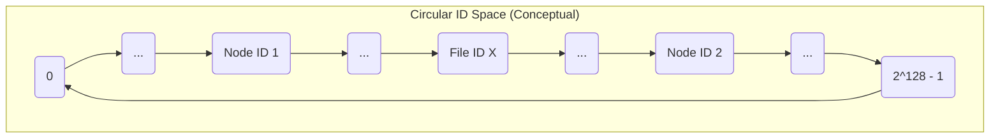

# Chapter 4: Hashing & ID Space

Welcome to Chapter 4! In the [previous chapter](03_remote_communication__rmi__.md), we learned how our individual [Nodes (Peers)](02_node__peer__.md) can talk to each other across the network using **Remote Communication (RMI)**, like using an office phone system.

Now, imagine our building again. To make the phone system work, every office needs a unique extension number. Also, if we want to file documents efficiently, each document (or its copy) needs a unique filing code. How do we come up with these unique numbers or codes in a consistent way?

This chapter introduces **Hashing & ID Space**. This is the universal addressing system for our distributed "building." It defines how we generate unique numerical identifiers (IDs) for everything – both the offices ([Nodes (Peers)](02_node__peer__.md)) and the file copies ([File Management & Replication](01_file_management___replication_.md)) – and describes the "space" or range where all these addresses live.

**What You'll Learn:**

*   What hashing is and how it creates unique IDs (like fingerprints).
*   How we use the MD5 algorithm for hashing in this project.
*   What the ID Space is (the range of all possible IDs).
*   Why this ID space is "circular" and why that's important.

## The Problem: Assigning Unique Addresses

In our distributed system, we have many Nodes and many file replicas. We need a reliable way to:

1.  Give every Node a unique ID so we can tell them apart and organize them.
2.  Give every file replica a unique ID so we know which Node is responsible for storing it.

If Node A wants to find Node B, it needs Node B's unique ID. If a user wants to find a file, the system needs to know the IDs of its replicas to figure out where they are stored. We can't just assign numbers randomly (what if two things get the same number?) or sequentially (what happens when nodes join and leave?). We need a deterministic and consistent method.

## Key Concepts

### 1. Hashing: The Fingerprint Generator

Imagine a magical machine. You feed it any piece of text (like a Node's name "node101" or a file replica's name "my_notes0"), and it always spits out a unique, fixed-size string of characters or numbers based on the input. This is essentially what a **hash function** does.

*   **Input:** Any data (in our case, usually a String like a name).
*   **Output:** A fixed-size value, typically a sequence of numbers and letters (or just a very large number), called the **hash value** or **digest**.
*   **Key Properties:**
    *   **Deterministic:** The *same* input always produces the *same* output hash. (Putting "node101" in always gives the same result).
    *   **Uniform:** Different inputs should ideally produce very different outputs, spreading the hashes out.
    *   **One-way:** It's practically impossible to figure out the original input just by looking at the output hash.
    *   **Collision Resistant:** It's very unlikely that two *different* inputs will accidentally produce the *same* output hash (like two different people having the same fingerprint).

In this project, we use a specific hash function called **MD5 (Message Digest 5)**. MD5 takes any input and produces a 128-bit output. We represent this 128-bit output as a very large non-negative integer (`BigInteger` in Java).

**Analogy:** Think of MD5 as a super-precise fingerprint generator. Every person (input string) gets a unique fingerprint (hash value).

### 2. ID Space: The Range of All Addresses

The MD5 hash function produces 128-bit outputs. How many possible unique IDs can we generate with 128 bits? That's 2<sup>128</sup>, which is an astronomically large number!

2<sup>128</sup> = 340,282,366,920,938,463,463,374,607,431,768,211,456

This enormous range of possible IDs, from 0 up to 2<sup>128</sup> - 1, is called the **ID Space**. Every Node ID and every file replica ID generated by our MD5 hash function will be a number somewhere within this space.

**Analogy:** If our building used 3-digit room numbers, the ID space would be 000 to 999 (1000 possible addresses). Our MD5 ID space is vastly larger.

### 3. Circular ID Space: Wrapping Around

Imagine all these possible ID numbers arranged not on a straight line, but on a huge circle, like the numbers on a clock face. The largest number (2<sup>128</sup> - 1) is immediately followed by 0, completing the circle.



*Explanation:* This diagram shows a conceptual ring. IDs are points on this circle. The circle connects the maximum ID back to 0. Nodes and File Replicas get assigned IDs that place them somewhere on this ring.

This circular arrangement is fundamental to how the [Chord Protocol (Ring, Lookup, Stabilization)](05_chord_protocol__ring__lookup__stabilization_.md) works. It ensures there are no "start" or "end" points, making it easy to define concepts like "the next node on the ring" (successor) regardless of where you are.

## How We Use Hashing and the ID Space

We use a utility class called `Hash` to perform these operations.

**1. Assigning a Node ID:**

When a [Node (Peer)](02_node__peer__.md) starts, its unique name (like "node101" or the process name like "process1") is fed into the hash function to get its permanent `nodeID`.

```java
// In Node.java constructor (Simplified)
String nodename = "process1"; // Example name for this node
BigInteger nodeID;

// Use the Hash utility to calculate the ID
nodeID = Hash.hashOf(nodename);

System.out.println("Node " + nodename + " has ID: " + nodeID);
```

*Explanation:* We call `Hash.hashOf()` with the node's name. It runs the MD5 algorithm and returns a unique `BigInteger` which becomes the `nodeID`. This ID determines the node's position on the circular ID space.

*Example Output (IDs will vary):*
`Node process1 has ID: 184883359565900980586981169341156351448`

**2. Assigning File Replica IDs:**

As we saw in [File Management & Replication](01_file_management___replication_.md), when distributing a file, the `FileManager` creates multiple replica names (e.g., "my_notes0", "my_notes1", "my_notes2") and hashes *each one* to get distinct replica IDs.

```java
// In FileManager.java createReplicaFiles() method (Simplified)
String baseFilename = "my_notes";
int numReplicas = 3;
BigInteger[] replicaIDs = new BigInteger[numReplicas];

for (int i = 0; i < numReplicas; i++) {
    String replicaName = baseFilename + i; // e.g., "my_notes0"
    // Use the Hash utility for each replica name
    replicaIDs[i] = Hash.hashOf(replicaName);
    System.out.println("Replica " + replicaName + " has ID: " + replicaIDs[i]);
}
```

*Explanation:* Each unique replica name ("my_notes0", "my_notes1", etc.) is hashed separately. This produces multiple distinct `BigInteger` IDs, each representing a point on the circular ID space where a copy of the file should ideally be managed.

*Example Output (IDs will vary):*
`Replica my_notes0 has ID: 26845416607232347001079434980358746769`
`Replica my_notes1 has ID: 337557115089051893325617838048617738677`
`Replica my_notes2 has ID: 179507865398391841007180138972716939810`

**3. Determining Responsibility:**

These generated IDs (both for nodes and file replicas) are crucial for the [Chord Protocol (Ring, Lookup, Stabilization)](05_chord_protocol__ring__lookup__stabilization_.md). Chord uses these IDs and the circular ID space to determine which Node is *responsible* for which range of IDs, and therefore, which Node should store which file replica. (We'll see exactly how in the next chapter!)

## Under the Hood: The `Hash.java` Utility

Let's peek inside the `Hash.java` utility class to see how it works.

**`Hash.hashOf(String entity)`:**

This method takes a string input and returns the MD5 hash as a `BigInteger`.

```java
// File: src/main/java/no/hvl/dat110/util/Hash.java (Simplified hashOf)
import java.math.BigInteger;
import java.security.MessageDigest;
import java.security.NoSuchAlgorithmException;
import java.util.HexFormat; // Used to convert byte array to hex string

public class Hash {

    public static BigInteger hashOf(String entity) {
        BigInteger result = null;
        try {
            // 1. Get an MD5 message digest instance
            MessageDigest md = MessageDigest.getInstance("MD5");

            // 2. Convert the input string to bytes
            byte[] entityBytes = entity.getBytes();

            // 3. Compute the MD5 hash (digest) of the bytes
            byte[] hashBytes = md.digest(entityBytes); // Returns 16 bytes for MD5

            // 4. Convert the byte array hash into a hexadecimal string
            String hexHash = HexFormat.of().formatHex(hashBytes);

            // 5. Convert the hexadecimal string into a BigInteger
            // The '16' means the input string is base-16 (hex)
            result = new BigInteger(hexHash, 16);

            // Ensure the BigInteger is non-negative
            result = result.signum() >= 0 ? result : BigInteger.ZERO; // Adjust if negative

        } catch (NoSuchAlgorithmException e) {
            // This happens if "MD5" algorithm is not supported by the Java env
            e.printStackTrace();
        }
        return result;
    }
    // ... other methods ...
}
```

*Explanation:*
1.  `MessageDigest.getInstance("MD5")`: Gets the Java security object ready to perform MD5 hashing.
2.  `entity.getBytes()`: Converts the input string (e.g., "node101") into raw bytes.
3.  `md.digest(entityBytes)`: Performs the core MD5 calculation on the bytes, producing a 16-byte array (128 bits).
4.  `HexFormat.of().formatHex(hashBytes)`: Converts the 16 raw bytes into a 32-character hexadecimal string (like "d41d8cd98f00b204e9800998ecf8427e").
5.  `new BigInteger(hexHash, 16)`: Parses the hexadecimal string to create the final `BigInteger` representing the ID.
6.  The check `result.signum() >= 0` handles a technicality where `BigInteger` might interpret the leading bit as a sign bit; we ensure our IDs are always positive.

**`Hash.bitSize()` and `Hash.addressSize()`:**

These methods provide information about the ID space.

```java
// File: src/main/java/no/hvl/dat110/util/Hash.java (Simplified bitSize/addressSize)
public class Hash {
    // ... hashOf method ...

    public static int bitSize() {
        try {
            // Ask the MD5 algorithm for its digest length in bytes
            MessageDigest md = MessageDigest.getInstance("MD5");
            int digestlenBytes = md.getDigestLength(); // This is 16 for MD5
            // Convert bytes to bits
            return digestlenBytes * 8; // 16 * 8 = 128 bits
        } catch (NoSuchAlgorithmException e) {
            throw new RuntimeException(e); // Should not happen for MD5
        }
    }

    public static BigInteger addressSize() {
        // Calculate 2 raised to the power of the number of bits
        int bits = bitSize(); // Get 128
        BigInteger base = BigInteger.valueOf(2);
        BigInteger size = base.pow(bits); // 2^128
        return size;
    }
    // ... toHex method ...
}
```

*Explanation:*
*   `bitSize()`: Determines the size of the hash output in bits (always 128 for MD5).
*   `addressSize()`: Calculates the total number of possible unique IDs in the space by computing 2<sup>bits</sup> (2<sup>128</sup>).

## Conclusion

In this chapter, we learned about the crucial concept of **Hashing & ID Space**. We saw how hash functions, specifically **MD5**, act like fingerprint generators to create unique, large numerical IDs (`BigInteger`) for both [Nodes (Peers)](02_node__peer__.md) and file replicas based on their names.

These IDs all exist within a vast **ID Space** (0 to 2<sup>128</sup>-1), which we visualize as being **circular**. This consistent way of assigning addresses and the circular nature of the space are the absolute foundation for organizing our distributed system.

Now that we know how everything gets a unique address and where these addresses live, how do we use this to actually build the network structure, find specific nodes, and determine who is responsible for which file replica IDs? That's exactly what we'll cover in the next chapter on the [Chord Protocol (Ring, Lookup, Stabilization)](05_chord_protocol__ring__lookup__stabilization_.md).

---
