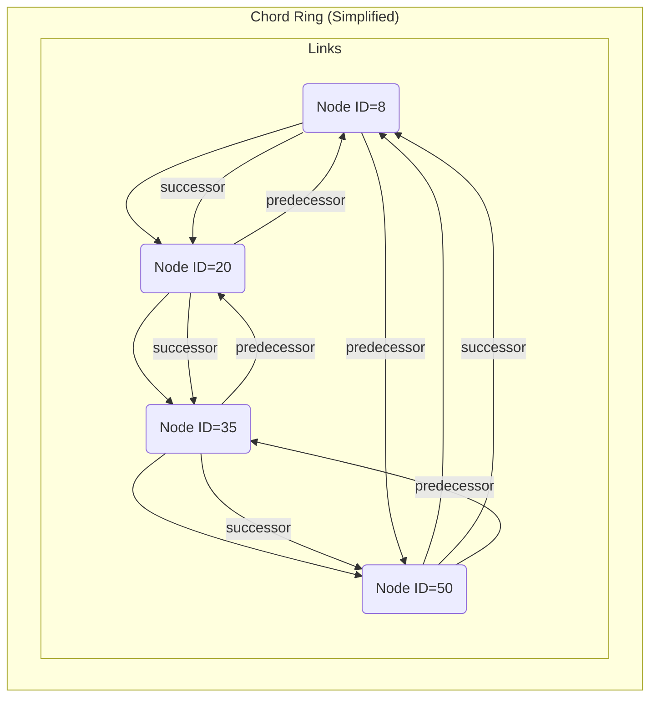
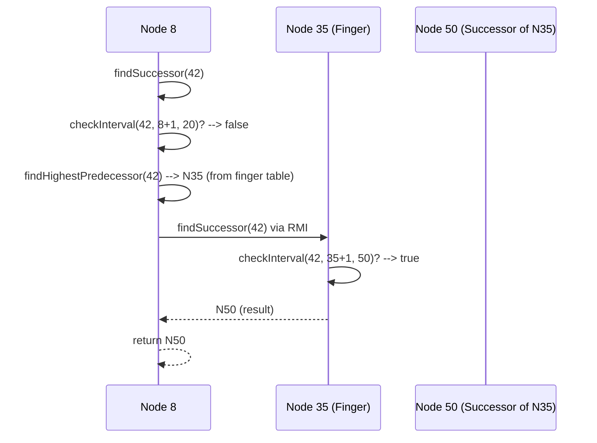

# Chapter 5: Chord Protocol (Ring, Lookup, Stabilization)

Welcome to Chapter 5! In the [previous chapter](04_hashing___id_space_.md), we learned how **Hashing & ID Space** provides a unique numerical address (ID) for every [Node (Peer)](02_node__peer__.md) and file replica, placing them all within a vast, circular range of numbers.

Now, imagine our office building again. Every office has a unique room number (its ID from Chapter 4). But how do we know which office is next to which? How do we quickly find the office responsible for holding a specific document (using its file replica ID)? And what happens if a new office opens or an existing one closes down? We need a system to manage the building's layout, navigate it, and keep the directory up-to-date.

This chapter introduces the **Chord Protocol**. Think of Chord as the intelligent directory and navigation system for our distributed building. It defines:

1.  **Ring:** How nodes organize themselves into a logical circle based on their IDs.
2.  **Lookup:** How any node can efficiently find the specific node responsible for a given ID (like a file replica ID).
3.  **Stabilization:** How the system handles nodes joining or leaving the network, keeping the ring structure correct over time.

**What You'll Learn:**

*   How nodes form a logical ring using their IDs.
*   How Chord finds the correct node for a specific ID (`findSuccessor`).
*   Why the ring needs to be maintained (`Stabilization`) and how it's done.
*   How finger tables help speed up lookups (basic idea).

## The Problem: Finding Who Has What

Let's revisit the core task from [File Management & Replication](01_file_management___replication_.md). Suppose you want to store a file, and the `FileManager` calculates that replica "my_notes1" gets the ID `3375...677` (a huge number from Chapter 4). Which [Node (Peer)](02_node__peer__.md) in the network should store this replica?

We can't just ask every single node – that would be incredibly slow in a large network. We need an efficient way to look up the responsible node based on the replica's ID. This is the main problem Chord solves.

## Key Concepts of Chord

### 1. The Ring: A Circle of Nodes

Chord organizes nodes in a logical ring according to their numerical IDs (obtained via [Hashing & ID Space](04_hashing___id_space_.md)). Imagine placing the nodes on the giant circular ID space we discussed in Chapter 4.

*   Each node connects to the node immediately following it in ID order. This next node is called its **successor**.
*   Each node also often keeps track of the node immediately preceding it, its **predecessor**.



*Explanation:* Nodes (like N8, N20, etc.) are arranged in a circle based on their IDs. Each node knows its direct `successor` (the next one clockwise) and `predecessor` (the previous one counter-clockwise).

**Responsibility:** A node is responsible for storing all the file replica IDs (`keys`) that fall between its predecessor's ID and its own ID. In the diagram, Node 35 would be responsible for keys with IDs like 21, 22, ..., up to 35. The successor node is always responsible for its own ID.

### 2. Lookup: Finding the Responsible Node (`findSuccessor`)

The core operation in Chord is `findSuccessor(key)`. Given a key (like a file replica ID), this function finds the *first* node in the ring whose ID is equal to or greater than the key (moving clockwise around the ring). This node is the one responsible for that key.

**How does it work (simplified)?**

1.  **Check Locally:** A node first checks if the `key` falls between its own ID and its successor's ID. If yes, the successor is the answer!
2.  **Ask Someone Else:** If the key is not handled by the immediate successor, the node needs to ask another node further along the ring to continue the search.
3.  **Forward the Request:** The node intelligently chooses another node (usually using a "finger table" - see below) that is closer to the key and forwards the `findSuccessor(key)` request to that node. This process repeats until the responsible node is found.

**Analogy:** You're in Office 8 and need to find who handles file ID 42.
1.  You check your successor, Office 20. Is 42 between 8 and 20? No.
2.  You need to jump further. Instead of asking Office 20 (who would ask Office 35, etc.), you might have a shortcut in your directory (finger table) that says "For IDs around 40-50, try asking Office 35 directly."
3.  You call Office 35 and ask it: `findSuccessor(42)`.
4.  Office 35 checks its successor, Office 50. Is 42 between 35 and 50? Yes!
5.  Office 35 tells you (or the original requester) that Office 50 is responsible for ID 42.

**Finger Tables (The Shortcuts):** Asking only the successor can be slow in a large ring. Each node maintains a "finger table," which is like a list of shortcuts. It contains pointers to nodes at exponentially increasing distances around the ring (e.g., the node 1 step away, 2 steps away, 4 steps away, 8 steps away, etc., in terms of ID distance). When doing a lookup, a node checks its finger table to find the farthest node it knows that is still *before* the target key. It then forwards the request to that node, significantly speeding up the search. Think of it as having express elevators in the building directory.

### 3. Stabilization: Keeping the Ring Healthy

Nodes can join and leave the network at any time. When this happens, the ring structure (successors, predecessors, finger tables) needs to be updated to reflect the changes. This process is called **stabilization**.

Nodes periodically run stabilization protocols:

*   **Check Successor:** A node asks its successor, "Who is your predecessor?". If the successor's predecessor is actually a node *between* the current node and the successor, that node should become the current node's new successor. (This handles nodes joining).
*   **Notify Successor:** A node periodically tells its successor, "Hey, I exist, and I think you are my successor." This allows the successor to update its predecessor if needed.
*   **Check Predecessor:** A node periodically checks if its predecessor is still responding (alive). If not, it sets its predecessor to `null`. (This handles nodes leaving abruptly).
*   **Fix Fingers:** Nodes periodically recalculate their finger table entries to ensure the shortcuts point to the correct, live nodes.

**Analogy:** Stabilization is like the building management periodically:
*   Checking if the office listed next door is still the correct one or if a new office opened in between.
*   Reminding the office next door that you exist.
*   Checking if the office listed before yours is still occupied.
*   Updating the express elevator directory (finger table).

## Using Chord in Our Project

The `FileManager` (and Nodes themselves) rely heavily on Chord, primarily through the `findSuccessor` method implemented in `ChordLookup.java` and accessed via the `NodeInterface`.

**Scenario:** `FileManager` needs to find where to store replica ID `key = 3375...677`. It runs on a node we'll call `currentNode`.

1.  **Initiate Lookup:** The `FileManager` calls `findSuccessor(key)` on its *local* `currentNode` object.

    ```java
    // In FileManager, needing to find the node for replicaId
    BigInteger replicaId = Hash.hashOf("my_notes1"); // Get the ID
    NodeInterface currentNode = ... // Get the Node object FileManager is running on

    try {
        // Ask the local node to find the node responsible for replicaId
        NodeInterface responsibleNode = currentNode.findSuccessor(replicaId);

        if (responsibleNode != null) {
            System.out.println("Node responsible for ID " + replicaId + " is: " + responsibleNode.getNodeName());
            // Now FileManager can use RMI to contact responsibleNode
            // e.g., responsibleNode.saveFileContent(...)
        } else {
            System.out.println("Could not find responsible node for ID " + replicaId);
        }
    } catch (RemoteException e) {
        System.err.println("Error during Chord lookup: " + e.getMessage());
    }
    ```

    *Explanation:* The `FileManager`, using its associated `NodeInterface` (`currentNode`), calls the `findSuccessor` method with the target `replicaId`. Chord handles the potentially complex lookup process across the network transparently. The result (`responsibleNode`) is an RMI stub ([Chapter 3](03_remote_communication__rmi_.md)) for the node that should manage this ID.

2.  **Chord Does the Work:** The `findSuccessor` implementation within `currentNode` (and potentially other nodes it contacts via RMI) executes the Chord lookup algorithm described earlier (checking successor, using finger tables, forwarding requests) until the correct node is identified.

3.  **Result:** The `findSuccessor` call returns a reference (`NodeInterface` stub) to the responsible node. The `FileManager` can then use this reference to interact with that node (e.g., to store or retrieve the file replica) using [Remote Communication (RMI)](03_remote_communication__rmi_.md).

## Under the Hood: How Chord Finds Things

Let's look at the core `findSuccessor` logic in `ChordLookup.java`.

**`findSuccessor(key)` Method:**

```java
// File: src/main/java/no/hvl/dat110/chordoperations/ChordLookup.java (Simplified findSuccessor)

public NodeInterface findSuccessor(BigInteger key) throws RemoteException {

    // Get my own successor node
    NodeInterface successor = node.getSuccessor();
    BigInteger nodeID = node.getNodeID();
    BigInteger succID = successor.getNodeID();

    // 1. Is the key between me (exclusive) and my successor (inclusive)?
    // Util.checkInterval handles the wrap-around logic for the circular ID space
    if (Util.checkInterval(key, nodeID.add(BigInteger.ONE), succID)) {
        // Yes! My successor is responsible for the key.
        return successor;
    } else {
        // 2. No. Need to ask someone closer to the key.
        // Find the best node in my finger table to forward the request to.
        NodeInterface highestPred = findHighestPredecessor(key);

        // 3. Ask that node to continue the search.
        // This is a recursive RMI call!
        return highestPred.findSuccessor(key);
    }
}
```

*Explanation:*
1.  It first checks if the `key` logically falls between its own `nodeID` and its direct `successor`'s ID (`succID`). The `Util.checkInterval` function correctly handles the circular nature of the ID space (where the successor might have a smaller ID than the current node if it wraps around past 0).
2.  If the successor is responsible, it's returned immediately.
3.  If not, it calls `findHighestPredecessor(key)` (explained below) to find the node in its finger table that is "closest" to the `key` without going past it.
4.  It then makes a *remote call* (using RMI) to that `highestPred` node, asking *it* to `findSuccessor(key)`. This forwards the search efficiently around the ring.

**`findHighestPredecessor(key)` Method:**

This helper method searches the node's finger table to find the best shortcut.

```java
// File: src/main/java/no/hvl/dat110/chordoperations/ChordLookup.java (Simplified findHighestPredecessor)

private NodeInterface findHighestPredecessor(BigInteger key) throws RemoteException {
    // Get my finger table (list of shortcuts)
    List<NodeInterface> fingers = node.getFingerTable();
    BigInteger nodeID = node.getNodeID();

    // Iterate backwards through the finger table (from farthest to closest shortcut)
    for (int i = fingers.size() - 1; i >= 0; i--) {
        NodeInterface fingerNode = fingers.get(i);

        if (fingerNode != null) {
            BigInteger fingerID = fingerNode.getNodeID();
            // Check if this finger node is between me and the key (exclusive)
            if (Util.checkInterval(fingerID, nodeID.add(BigInteger.ONE), key.subtract(BigInteger.ONE))) {
                // Found the best shortcut! Return this node.
                return fingerNode;
            }
        }
    }
    // If no finger is better than myself, return myself.
    return node; // 'node' refers to the current Node object
}
```

*Explanation:* It looks through the finger table entries (`fingers`) from the end (longest jump) to the beginning (shortest jump - the successor). It returns the first finger node it finds whose ID is strictly between the current node's ID and the target `key`. This ensures we make the biggest possible jump towards the key without overshooting it. If no suitable finger is found, it means the current node itself is the closest predecessor, so it returns `node`.

**Sequence Diagram: `findSuccessor(42)` (Example)**

Imagine Node 8 initiates `findSuccessor(42)`. Let's say its finger table points to Node 35 as a shortcut for IDs in that range.



*Explanation:* Node 8 checks its successor (N20), fails. Finds N35 in its finger table as the highest predecessor for 42. It remotely calls `findSuccessor(42)` on N35. N35 checks *its* successor (N50). Since 42 is between 35 and 50, N35 returns N50 as the result back to N8.

**Stabilization Logic:**

The stabilization code (`StabilizationProtocols.java`) runs periodically in the background:

*   `stabilizeRing()`: Asks successor (`succ`) for its predecessor (`predsucc`). If `predsucc` has an ID between `nodeID` and `succID`, it means `predsucc` just joined and should be the new successor. The current node updates its successor to `predsucc` and notifies `predsucc`.
*   `notify(potential_pred)`: Called remotely on a node (e.g., `succ`) by another node (`potential_pred`) claiming to be its predecessor. The receiving node (`succ`) checks if `potential_pred`'s ID is between its current predecessor's ID and its own ID. If yes, it updates its predecessor to `potential_pred`.
*   `checkPredecessor()`: Pings the current predecessor using RMI (`Util.getProcessStub`). If the RMI call fails (returns null or throws exception), it means the predecessor is gone, so the node sets its predecessor reference to `null`.
*   `fixFingerTable()`: Periodically recalculates all finger table entries. For each entry `i`, it computes `start = (nodeID + 2^i) mod addressSize` and calls `findSuccessor(start)` to find the node responsible for that ID, updating the `i`-th finger.

```java
// File: src/main/java/no/hvl/dat110/chordoperations/StabilizationProtocols.java (Simplified stabilizeRing logic)

private void stabilizeRing() {
    try {
        NodeInterface succ = chordnode.getSuccessor(); // My successor
        NodeInterface pred_of_succ = succ.getPredecessor(); // Ask successor for its predecessor (RMI call)

        if (pred_of_succ != null) {
            BigInteger nodeID = chordnode.getNodeID();
            BigInteger succID = succ.getNodeID();
            BigInteger pred_of_succ_ID = pred_of_succ.getNodeID();

            // Is pred_of_succ between me and my successor?
            boolean cond = Util.checkInterval(pred_of_succ_ID, nodeID.add(BigInteger.ONE), succID.subtract(BigInteger.ONE));

            if (cond) {
                // Yes, pred_of_succ should be my new successor
                chordnode.setSuccessor(pred_of_succ);
            }
        }
        // Always notify my current successor that I exist
        // (This allows the successor to update its predecessor if needed)
        chordnode.getSuccessor().notify(chordnode);

    } catch (RemoteException e) { /* ... handle error ... */ }
}
```

*Explanation:* This snippet shows the core check. If a node (`pred_of_succ`) exists between the current node (`chordnode`) and its successor (`succ`), `chordnode` adopts `pred_of_succ` as its new direct successor. It then always notifies its (potentially updated) successor.

## Conclusion

In this chapter, we explored the **Chord Protocol**, the backbone of our distributed system's organization. We learned how nodes use their unique IDs ([Hashing & ID Space](04_hashing___id_space_.md)) to form a logical **Ring**. We saw how the crucial **Lookup** operation (`findSuccessor`) efficiently finds the node responsible for any given ID, using successor pointers and finger table shortcuts. Finally, we understood the importance of **Stabilization** protocols, which keep the ring structure accurate even when nodes join or leave, ensuring the system remains robust and navigable. Chord provides the essential directory and navigation services for our distributed office building.

Now that we know how nodes are organized and how they find each other, let's look closer at what they actually pass around when communicating. In the next chapter, we'll examine the [Message](06_message_.md) structure, which is used not only for communication requests but also for storing the metadata about the file replicas managed by each node.

---
