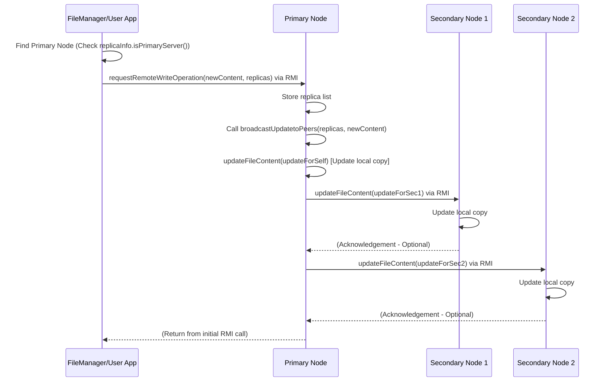

# Chapter 7: Consistency (Remote-Write Protocol)

Welcome to Chapter 7! In the [previous chapter](06_message_.md), we learned about the `Message` structure, a standardized way to package information when nodes communicate or store file metadata. We saw that each [Node (Peer)](02_node__peer__.md) keeps track of the file replicas it stores using these `Message` objects.

Now, remember from [Chapter 1](01_file_management___replication_.md) that we make multiple copies (replicas) of each file and store them on different nodes for safety. But this creates a new challenge: what happens if someone updates the file? If we change the content of "my_notes.txt" on one node, how do we make sure all the other copies get the same changes? If we don't keep them synchronized, different users might see different versions of the file, leading to confusion!

This chapter introduces a strategy called the **Remote-Write Protocol** (a type of Primary-Copy protocol) to solve this problem and maintain **Consistency** among replicas.

**What You'll Learn:**

*   Why keeping replicas consistent after updates is important.
*   The "Primary Copy" strategy (Remote-Write Protocol).
*   How to find the primary replica for a file.
*   How updates are sent to the primary and then broadcast to other replicas.

## The Problem: Keeping Copies in Sync

Imagine you and your friends are working together on a shared digital document, like a presentation slide. To make sure the work isn't lost if one computer crashes, the system automatically saves copies of the slide on several different computers (our [Nodes (Peers)](02_node__peer__.md)).

Now, you decide to change the title on your copy of the slide. If *only* your copy is updated, your friends looking at their copies won't see the new title! Their copies are now *inconsistent* with yours. We need a rule or procedure to ensure that when one copy is updated, all other copies are eventually updated too.

## Key Concept: The Remote-Write (Primary Copy) Strategy

The Remote-Write protocol uses a simple but effective strategy: designate one specific copy of the file as the "master" or **Primary** replica. All other copies are considered **Secondary** replicas.

Here's how it works, using our shared document analogy:

1.  **Designate a Master Copy:** One office (Node) holding a copy of the document is marked as having the "Master Copy" (Primary Replica). The `FileManager` did this randomly when distributing the file (remember the `isPrimary` flag in `saveFileContent` from Chapter 1?).
2.  **Updates Go to the Master:** Anyone wanting to change the document *must* send their proposed changes *only* to the office holding the Master Copy (the Primary Node). They are not allowed to change their local secondary copies directly.
3.  **Master Updates Itself:** The Primary Node first updates its own Master Copy with the changes.
4.  **Master Tells Others:** After updating itself, the Primary Node sends a message to *all* other offices (Secondary Nodes) that have a copy, telling them: "Update your copy with these changes!"
5.  **Secondaries Update:** Each Secondary Node receives the update instruction from the Primary and updates its local copy accordingly.

This way, all updates are channeled through the Primary, which ensures the changes are applied consistently across all replicas.

## Using the Remote-Write Protocol

Let's see how a user (interacting via the `FileManager`) would update a file using this protocol. Suppose we want to update the content of "my_notes.txt".

**Step 1: Find the Primary Node**

First, the `FileManager` needs to know which node holds the primary replica for "my_notes.txt". It already knows how to find all nodes holding replicas using `requestActiveNodesForFile` (from Chapter 1), which returns a set of `Message` objects. Each `Message` object has an `isPrimaryServer()` flag.

```java
// --- In FileManager or user application code ---

// Assume we already have the set of active nodes for "my_notes"
// Set<Message> activeNodes = fileManager.requestActiveNodesForFile("my_notes");

NodeInterface primaryNode = null;
Set<Message> replicas = fileManager.getActiveNodesforFile(); // Get the set of replica locations

if (replicas != null && !replicas.isEmpty()) {
    // Loop through the Message objects describing each replica
    for (Message replicaInfo : replicas) {
        // Check the flag we learned about in Chapter 6!
        if (replicaInfo.isPrimaryServer()) {
            System.out.println("Found primary replica on node: " + replicaInfo.getNodeName());
            // Use the utility from Chapter 3 to get an RMI stub for the primary
            primaryNode = Util.getProcessStub(replicaInfo.getNodeName(), replicaInfo.getPort());
            break; // Found it, stop searching
        }
    }
}

if (primaryNode == null) {
    System.err.println("Error: Could not find the primary node for the file!");
    // Handle error...
}
```

*Explanation:* The code iterates through the `Set<Message>` called `replicas`. Each `Message` describes a node holding a copy. It checks the `isPrimaryServer()` boolean flag inside each `Message`. When it finds the one where this flag is `true`, it uses `Util.getProcessStub` (our RMI lookup tool from [Chapter 3](03_remote_communication__rmi_.md)) to get a connection (stub) to that primary node and stores it in `primaryNode`.

**Step 2: Send Update Request to the Primary**

Now that we have the `primaryNode` stub, we can send the new file content to it. We don't send it to any other nodes. The `NodeInterface` has a specific method for this: `requestRemoteWriteOperation`. We need to send the new content (`byte[] new_content`) and also the full list of all replicas (`replicas`) so the primary knows who else to notify.

```java
// --- Continuing in FileManager or user application code ---

// Let's say 'new_content' is a byte array with the updated file data
byte[] new_content = "Updated content for my notes.".getBytes();

// Make sure we found the primary and have the list of all replicas
if (primaryNode != null && replicas != null && !replicas.isEmpty()) {
    try {
        System.out.println("Sending update request to primary node: " + primaryNode.getNodeName());

        // Call the special RMI method on the primary node ONLY
        primaryNode.requestRemoteWriteOperation(new_content, replicas);

        System.out.println("Update request sent successfully.");

    } catch (RemoteException e) {
        System.err.println("Error sending remote write request: " + e.getMessage());
    }
}
```

*Explanation:* We simply use the `primaryNode` stub obtained in Step 1 and call the `requestRemoteWriteOperation` method via RMI. We pass the `new_content` and the `replicas` set (which contains `Message` objects describing all copies, including the primary and secondaries).

This call triggers the primary node to start the update process. The `FileManager`'s job is now done for initiating the update.

## Internal Implementation: How the Update Spreads

What happens after the primary node receives the `requestRemoteWriteOperation` call?

**1. Primary Node Receives the Request (`Node.requestRemoteWriteOperation`)**

The primary node's implementation of this method takes the new content and the list of all replicas. Its main job is to immediately trigger the broadcast of this update to all peers (including itself).

```java
// File: src/main/java/no/hvl/dat110/middleware/Node.java (Simplified method)

@Override
public void requestRemoteWriteOperation(byte[] updates, Set<Message> activenodes) throws RemoteException {
    System.out.println("Node " + nodename + " (Primary): Received remote write request.");

    // Store the list of active nodes needed for broadcasting
    this.activenodesforfile = activenodes;

    // Immediately call the broadcast method (which will update self and others)
    // Note: 'updater' is an instance of UpdateOperations helper class
    updater.broadcastUpdatetoPeers(activenodesforfile, updates);

    System.out.println("Node " + nodename + " (Primary): Broadcast initiated.");
}
```

*Explanation:* This method on the primary node receives the `updates` (new content) and the `activenodes` list. It saves the list and then calls the `broadcastUpdatetoPeers` method (likely within its `UpdateOperations` helper object) to handle the actual distribution of the update.

**2. Primary Broadcasts to All Peers (`UpdateOperations.broadcastUpdatetoPeers`)**

This method orchestrates sending the update to *all* nodes that hold a replica (including the primary itself).

```java
// File: src/main/java/no/hvl/dat110/middleware/UpdateOperations.java (Simplified method)

public void broadcastUpdatetoPeers(Set<Message> activenodesforfile, byte[] updates) throws RemoteException {
    System.out.println("Broadcasting updates to " + activenodesforfile.size() + " peers.");

    // Helper to group updates if a node holds multiple replicas (not shown in detail)
    Map<String, List<Message>> perNodeUpdates = buildPerNodeUpdates(activenodesforfile, updates);

    // Iterate through each node that needs updating
    perNodeUpdates.forEach((peerNodeIdStr, updateMessagesForPeer) -> {
        Message firstMsg = updateMessagesForPeer.get(0); // Get info for RMI lookup
        String peerName = firstMsg.getNodeName();
        int peerPort = firstMsg.getPort();

        try {
            // Is this update for myself (the primary node)?
            if (peerNodeIdStr.equals(node.getNodeID().toString())) {
                System.out.println("Updating local replicas (on Primary)...");
                updateFileContent(updateMessagesForPeer); // Update myself directly
            } else {
                // It's for a secondary node, contact it via RMI
                System.out.println("Sending update to secondary: " + peerName);
                NodeInterface secondaryNodeStub = Util.getProcessStub(peerName, peerPort);
                if (secondaryNodeStub != null) {
                    // Call updateFileContent on the secondary node
                    secondaryNodeStub.updateFileContent(updateMessagesForPeer);
                } else {
                    System.err.println("Could not get stub for secondary: " + peerName);
                }
            }
        } catch (RemoteException e) {
            System.err.println("Error updating peer " + peerName + ": " + e.getMessage());
        }
    });
    System.out.println("Broadcast finished.");
}
```

*Explanation:*
1.  It first organizes the updates per node (using `buildPerNodeUpdates`, which handles cases where one node might store multiple replicas of the *same* file, though that's less common here).
2.  It then loops through each unique node (`peerNodeIdStr`) that needs updating.
3.  **Self-Update:** If the `peerNodeIdStr` matches the primary node's own ID, it calls `updateFileContent` locally to update its own copy.
4.  **Remote Update:** If it's a different node (a secondary), it gets an RMI stub for that node (`secondaryNodeStub`) and remotely calls the `updateFileContent` method on that secondary node, passing the new content details.

**3. Secondary Node Updates Itself (`Node.updateFileContent`)**

When a secondary node receives the `updateFileContent` call via RMI from the primary, it simply updates its local replica information.

```java
// File: src/main/java/no/hvl/dat110/middleware/Node.java (Simplified method)

@Override
public void updateFileContent(List<Message> updates) throws RemoteException {
    // This method receives a list, in case one node holds multiple replicas

    for(Message update : updates) {
        BigInteger replicaID = update.getHashOfFile();
        byte[] newContent = update.getBytesOfFile();
        String filename = update.getNameOfFile(); // For logging

        System.out.println("Node " + nodename + " (Secondary): Received update for " + filename + " (Replica ID: " + replicaID + ")");

        // Find the existing metadata Message for this replica in the local map
        Message existingMetadata = filesMetadata.get(replicaID);

        if (existingMetadata != null) {
            // Update the content (in a real system, this might write to disk)
            // For simplicity here, we might update the metadata if it held the bytes,
            // or assume a separate storage mechanism is updated.
            // existingMetadata.setBytesOfFile(newContent); // If bytes were in metadata
            System.out.println("Updating local storage for replica ID: " + replicaID);
            // updateLocalStorage(replicaID, newContent); // Hypothetical update

            // Maybe update the Lamport clock too (for ordering)
            // existingMetadata.setClock(...)

            System.out.println("Node " + nodename + " (Secondary): Update complete for " + replicaID);
        } else {
            System.err.println("Node " + nodename + ": Received update for unknown replica ID: " + replicaID);
        }
    }
}
```

*Explanation:* This method, running on the secondary node, receives the update information. It finds the corresponding replica's metadata in its `filesMetadata` map using the `replicaID`. It then performs the actual update (e.g., saving the `newContent` to disk or updating an in-memory cache) and logs the completion.

**Sequence Diagram: Remote Write**

Here's how the whole process looks:



*Explanation:* The client finds the primary, sends the write request. The primary updates itself locally and then sends `updateFileContent` calls to all secondaries (Secondary1, Secondary2). Each secondary updates its local copy.

## What About Simultaneous Updates?

This Remote-Write protocol ensures that if one update completes, all replicas will eventually become consistent. However, it has a limitation: what if two different users try to update the *same file* at almost the *exact same time*?

Both users might find the primary node. User A sends their update, and just milliseconds later, User B sends their update. The primary might process A's request, broadcast it, and *then* process B's request and broadcast that. The final state will reflect User B's changes. But what if the primary processes B first, then A? The final state would reflect User A's changes. This potential inconsistency, depending on the exact timing of requests, is called a **race condition**.

The simple Remote-Write protocol doesn't solve this concurrency problem by itself. We need an additional mechanism to ensure that only one update process can happen at a time for a specific file. This concept is called **mutual exclusion**.

## Conclusion

In this chapter, we tackled the problem of keeping multiple file copies (replicas) consistent after updates. We learned about the **Remote-Write Protocol**, a primary-copy strategy where:

1.  One replica is designated **Primary**.
2.  All updates are sent *only* to the Primary.
3.  The Primary updates itself and then **broadcasts** the update to all **Secondary** replicas.

We saw how the `FileManager` finds the primary using the `isPrimaryServer` flag in the [Message](06_message_.md) objects and how the update propagates through RMI calls like `requestRemoteWriteOperation` and `updateFileContent`. This protocol helps ensure that replicas don't permanently diverge after updates.

However, we also touched upon the limitation of handling simultaneous update requests. To address this and ensure only one client can modify a file at a time, we need mechanisms for locking. That's exactly what we'll explore in the next chapter on [Distributed Mutual Exclusion](08_distributed_mutual_exclusion_.md).

---
