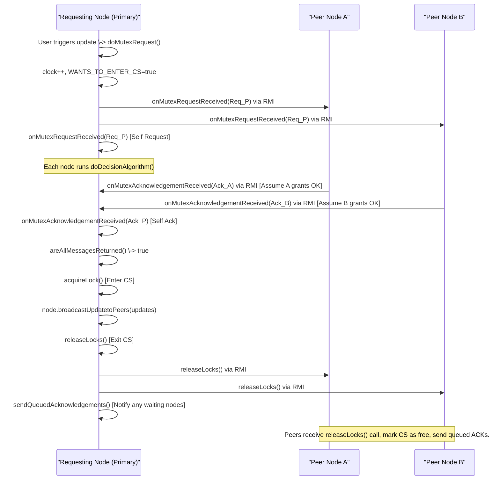

# Chapter 8: Distributed Mutual Exclusion

Welcome to the final chapter! In the [previous chapter](07_consistency__remote_write_protocol_.md), we learned how the Remote-Write protocol helps keep file replicas consistent by funneling all updates through a single **Primary** node. However, we also noted a potential problem: what if two different users try to update the *same file* at almost the *exact same time*? Both might send their requests to the Primary node nearly simultaneously. Without a coordination mechanism, the final state of the file might depend unpredictably on which request gets processed first, leading to a "race condition".

This chapter introduces **Distributed Mutual Exclusion**, a protocol designed to solve exactly this problem. It ensures that even in a system with no central controller, only one [Node (Peer)](02_node__peer__.md) can modify a specific file replica (or enter the "critical section" related to it) at any given time.

**What You'll Learn:**

*   Why we need to control access when multiple nodes want to update the same file concurrently.
*   What a "critical section" is.
*   How nodes can coordinate using Lamport clocks and voting to achieve mutual exclusion.
*   How a node requests and obtains permission (a "lock") before modifying a file.

## The Problem: Colliding Updates

Imagine our shared file is like a physical file cabinet in an office building. Several different offices ([Nodes (Peers)](02_node__peer__.md)) might realize they need to update the same file in the cabinet at the same time. If they all rush to the cabinet simultaneously and try to write their changes, the file could end up garbled or reflecting only the changes from the last person who wrote, potentially overwriting important information from others.

We need a system to ensure only one office gets to open the cabinet and modify the file at a time, while others wait their turn politely.

## Key Concepts: The Traffic Light System

Think of Distributed Mutual Exclusion as a sophisticated traffic light system for accessing the shared file cabinet (our file replica).

1.  **Critical Section:** This is the action of accessing and modifying the shared resource – opening the cabinet and writing to the file. Our goal is to allow only one "car" (node's update request) into this section at a time.
2.  **Mutual Exclusion:** This is the "one car at a time" rule enforced by the traffic light.
3.  **Distributed Coordination:** Unlike a real traffic intersection with one controller, our "traffic lights" are controlled by agreement among *all* the offices (nodes) that hold a copy of the file. There's no single boss.
4.  **Logical Clocks (Lamport Clocks):** How do we decide who goes first if multiple offices request access at roughly the same time? We use Lamport Clocks, which act like sequential ticket numbers. Each request gets a "timestamp" (a number from the clock). Lower numbers generally get priority. If two requests have the exact same timestamp, we use the unique [Node ID](04_hashing___id_space_.md) (like the office room number) to break the tie consistently (e.g., the lower ID goes first). We saw this clock in the [Message](06_message_.md) chapter.
5.  **Voting/Permission:** Before an office can approach the file cabinet (enter the critical section), it must send a request message to *all* other offices holding a copy of that file. It must then wait until it receives an "OK" (permission message, or vote) back from *every single one* of them. This ensures everyone agrees it's this office's turn.

## Using Mutual Exclusion for File Updates

How does a user, perhaps through the application's GUI, trigger an update that uses this mutual exclusion mechanism? The process builds upon what we learned in the [Consistency (Remote-Write Protocol)](07_consistency__remote_write_protocol_.md) chapter.

1.  **User Initiates Update:** The user modifies the file content in the application (like in the `FileContentUpdate` GUI).
2.  **Identify Primary & Peers:** The application (e.g., using `FileManager`) finds the primary node and the set of all active nodes (`activepeers`) holding replicas for the file, just like in Chapter 7.
3.  **Request Lock (Mutex):** Instead of directly calling the update broadcast, the application now calls a special method on the *primary* node: `requestMutexWriteOperation`. This method initiates the mutual exclusion protocol (the voting process).
4.  **Wait for Permission:** The primary node executes the protocol. It requests permission from all `activepeers` (including itself) and waits for replies.
5.  **If Granted:** Once the primary node receives permission from everyone, it knows it has exclusive access (the "lock").
6.  **Perform Update:** Only now does the primary node proceed with the update broadcast (`broadcastUpdatetoPeers`) as described in Chapter 7.
7.  **Release Lock:** After the update broadcast is complete (or has been reliably initiated), the primary node releases the lock, sending messages to all peers informing them that the critical section is now free. This allows the next waiting node (if any) to proceed.

**Example Code Triggering the Process (GUI):**

Let's look at the `FileContentUpdate.java` code snippet, which shows how the update button might trigger this. `selectedpeer` here is assumed to be the *primary* node for the file being updated. `selectedpeerdata` is a [Message](06_message_.md) object containing metadata about the file on the primary.

```java
// File: src/main/java/no/hvl/dat110/gui/FileContentUpdate.java (Simplified btnUpdateContent)

private void btnUpdateContent() {
    String newcontent = txtArea.getText(); // Get the new text from the GUI

    try {
        // Get the list of all nodes holding replicas for this file
        Set<Message> activepeers = filemanager.getActiveNodesforFile();
        if (activepeers == null) {
            activepeers = filemanager.requestActiveNodesForFile(selectedpeerdata.getNameOfFile());
        }
        if (activepeers == null || activepeers.isEmpty()) {
            JOptionPane.showMessageDialog(null, "Cannot find replica locations!", "Error", JOptionPane.ERROR_MESSAGE);
            return;
        }

        // --- Mutual Exclusion Start ---
        System.out.println("Requesting mutex lock from primary: " + selectedpeer.getNodeName());
        // selectedpeer is the primary node's RMI stub
        // selectedpeerdata contains info like clock, node ID for the request message
        boolean lockGranted = selectedpeer.requestMutexWriteOperation(
                selectedpeerdata,          // Message with request info (clock, ID)
                newcontent.getBytes(),     // The actual updates to be applied LATER
                activepeers                // Set of all nodes involved in voting
        );
        // --- Mutual Exclusion End (blocks until granted or failed) ---

        JOptionPane.showMessageDialog(null, "Access granted? " + lockGranted, "Message", JOptionPane.INFORMATION_MESSAGE);

        if (lockGranted) {
            System.out.println("Lock acquired! Update should have been broadcast by primary.");
            // NOTE: The actual broadcastUpdatetoPeers is called *inside* the primary node
            //       after it successfully acquires the lock within requestMutexWriteOperation.
            //       The primary also needs to release the lock eventually.

            // --- Release Lock (implicitly handled by primary or needs explicit call?) ---
            // The provided code seems to have the primary release locks *before* requesting?
            // Let's assume the primary releases *after* the update.
            // It might call multicastReleaseLocks internally or the client might trigger it.
            // selectedpeer.multicastReleaseLocks(activepeers); // Maybe called by primary internally
        } else {
             System.out.println("Failed to acquire lock.");
        }

    } catch (RemoteException e) {
        JOptionPane.showMessageDialog(null, "RMI Error: " + e.getMessage(), "Error", JOptionPane.ERROR_MESSAGE);
        e.printStackTrace();
    }
}
```

*Explanation:*
1.  It gets the updated text and the list of all nodes (`activepeers`) holding replicas.
2.  It calls `selectedpeer.requestMutexWriteOperation(...)` via [Remote Communication (RMI)](03_remote_communication__rmi_.md) on the primary node.
3.  It passes:
    *   `selectedpeerdata`: A [Message](06_message_.md) object that the `MutualExclusion` logic will use to store the Lamport clock time and ID of this request.
    *   `newcontent.getBytes()`: The actual file changes. The primary node will hold onto this and only broadcast it *after* getting the lock.
    *   `activepeers`: The list of all nodes who need to vote.
4.  This call **blocks** (waits) until the primary node successfully gets permission from all peers (returns `true`) or fails/times out (returns `false`).
5.  If `lockGranted` is `true`, the user knows the primary node has acquired the lock and has initiated the update broadcast (from Chapter 7) within its locked critical section.

## Internal Implementation: The Voting Protocol

Let's peek inside the `MutualExclusion.java` class on a [Node (Peer)](02_node__peer__.md) to see how this voting happens.

**Scenario:** Node P (Primary) receives `requestMutexWriteOperation` and needs to get permission from Node A and Node B (and itself).

**Step 1: Initiate Request (`doMutexRequest`)**

When `requestMutexWriteOperation` is called on Node P, it delegates to `MutualExclusion.doMutexRequest`.

```java
// File: src/main/java/no/hvl/dat110/middleware/MutualExclusion.java (Simplified doMutexRequest)

public synchronized boolean doMutexRequest(Message message, byte[] updates) throws RemoteException {
    logger.info(node.nodename + " wants to access CS");
    // Clear previous acknowledgements and queued requests
    queueack.clear();
    mutexqueue.clear();

    // 1. Increment local Lamport clock
    clock.increment();
    // 2. Set clock on the outgoing request message
    message.setClock(clock.getClock());
    node.getMessage().setClock(clock.getClock()); // Update node's own message clock too

    // 3. Mark intention to enter CS
    WANTS_TO_ENTER_CS = true;

    // 4. Get unique list of peers to send requests to
    List<Message> activenodes = removeDuplicatePeersBeforeVoting();

    // 5. Send request to all peers (including self)
    multicastMessage(message, activenodes);

    // --- Wait for Replies ---
    // (Simplified: loop or wait mechanism needed here to check areAllMessagesReturned)
    long startTime = System.currentTimeMillis();
    while (!areAllMessagesReturned(activenodes.size())) {
        // Wait for acknowledgements to arrive via onMutexAcknowledgementReceived
        // Add a timeout to prevent infinite waiting
        if (System.currentTimeMillis() - startTime > 5000) { // 5 sec timeout
             logger.warn(node.nodename + " timed out waiting for ACKs.");
             WANTS_TO_ENTER_CS = false;
             return false; // Failed to get lock
        }
        try { Thread.sleep(100); } catch (InterruptedException e) {} // Pause briefly
    }
    // --- All Replies Received ---

    // 6. Acquire the lock (enter critical section)
    acquireLock();
    logger.info(node.nodename + " LOCK ACQUIRED");

    // --- Critical Section Start ---
    node.broadcastUpdatetoPeers(updates); // Perform the actual update (from Chapter 7)
    // --- Critical Section End ---

    // 7. Release the lock and notify queued processes
    releaseLocks(); // Mark CS as free
    multicastReleaseLocks(node.getActiveNodesforFile()); // Tell peers lock is free
    sendQueuedAcknowledgements(); // Tell waiting nodes they can try now

    mutexqueue.clear();
    return true; // Success!
}

// Helper to send request messages
private void multicastMessage(Message message, List<Message> activenodes) throws RemoteException {
    logger.info("Multicasting mutex request to " + activenodes.size() + " peers.");
    for (Message m : activenodes) {
        NodeInterface stub = Util.getProcessStub(m.getNodeName(), m.getPort());
        if (stub != null) {
            // Make RMI call to each peer
            stub.onMutexRequestReceived(message);
        } // else handle error: node might be down
    }
}
```

*Explanation:*
1.  Increments its Lamport clock (`clock.increment()`) to get a unique timestamp for this request.
2.  Sets this timestamp on the outgoing `message`.
3.  Sets `WANTS_TO_ENTER_CS = true`.
4.  Gets the list of unique peers involved.
5.  Calls `multicastMessage` to send an `onMutexRequestReceived` RMI call to every peer (Node A, Node B, and itself).
6.  It then enters a waiting loop (`while (!areAllMessagesReturned(...)`) until it receives acknowledgments (`queueack`) from all peers. (This internal waiting logic is crucial).
7.  Once all ACKs are received, it calls `acquireLock()` (sets `CS_BUSY = true`), performs the `broadcastUpdatetoPeers` from Chapter 7, and then releases the lock using `releaseLocks()` and `multicastReleaseLocks`.

**Step 2: Handling Received Requests (`onMutexRequestReceived`, `doDecisionAlgorithm`)**

Now, what happens when Node A receives the `onMutexRequestReceived(message)` call from Node P?

```java
// File: src/main/java/no/hvl/dat110/middleware/MutualExclusion.java (Simplified Request Handling)

public synchronized void onMutexRequestReceived(Message message) throws RemoteException {
    // Increment local clock because an event occurred
    clock.increment();
    clock.adjustClock(Math.max(clock.getClock(), message.getClock())); // Adjust clock based on message

    // Decide whether to grant permission immediately or queue the request
    int caseid = -1;
    if (!CS_BUSY && !WANTS_TO_ENTER_CS) { // Case 0: I'm idle
        caseid = 0;
    } else if (CS_BUSY) {                // Case 1: I'm in the CS
        caseid = 1;
    } else {                             // Case 2: I also want to enter CS
        caseid = 2;
    }

    doDecisionAlgorithm(message, mutexqueue, caseid);
}

public void doDecisionAlgorithm(Message message, List<Message> queue, int condition) throws RemoteException {
    String requesterName = message.getNodeName();
    int requesterPort = message.getPort();

    switch (condition) {
        case 0: // Idle: Grant permission immediately
            NodeInterface requesterStub = Util.getProcessStub(requesterName, requesterPort);
            if (requesterStub != null) {
                 // Send ACK back to the requester (Node P)
                requesterStub.onMutexAcknowledgementReceived(node.getMessage());
            }
            break;
        case 1: // Busy: Queue the request, don't reply yet
            logger.info(node.nodename + " is BUSY, queueing request from " + requesterName);
            queue.add(message);
            break;
        case 2: // Also Wants: Compare timestamps (and NodeIDs if timestamps equal)
            int requesterClock = message.getClock();
            int myClock = node.getMessage().getClock();
            BigInteger requesterID = message.getNodeID();
            BigInteger myID = node.getNodeID();

            // Grant permission if requester has lower clock, or same clock and lower ID
            if (requesterClock < myClock || (requesterClock == myClock && requesterID.compareTo(myID) < 0)) {
                 NodeInterface stub = Util.getProcessStub(requesterName, requesterPort);
                 if (stub != null) {
                     // Send ACK back
                     stub.onMutexAcknowledgementReceived(node.getMessage());
                 }
            } else {
                 // Requester has higher priority or equal, queue their request
                 logger.info(node.nodename + " wants lock too, queueing request from " + requesterName);
                 queue.add(message);
            }
            break;
    }
}
```

*Explanation:*
1.  Node A receives the request, increments its clock.
2.  It checks its own state (`CS_BUSY`, `WANTS_TO_ENTER_CS`).
3.  `doDecisionAlgorithm` decides:
    *   **Case 0 (Idle):** Node A isn't using the resource and doesn't want it. It immediately sends an "OK" (`onMutexAcknowledgementReceived`) back to Node P via RMI.
    *   **Case 1 (Busy):** Node A is currently *in* the critical section. It cannot grant permission now, so it adds Node P's request to its `mutexqueue` and does *not* reply yet.
    *   **Case 2 (Wants):** Node A also wants to enter the critical section. It compares its own request's Lamport timestamp (`myClock`) with Node P's request timestamp (`requesterClock`).
        *   If Node P has a lower timestamp (or the same timestamp but a lower Node ID), Node A grants permission (sends ACK back). Node P has priority.
        *   Otherwise, Node A has priority. It queues Node P's request in `mutexqueue` and does *not* reply yet.

**Step 3: Receiving Acknowledgements (`onMutexAcknowledgementReceived`)**

When Node P receives an "OK" message back from Node A (or B, or itself), the `onMutexAcknowledgementReceived` method is called on Node P.

```java
// File: src/main/java/no/hvl/dat110/middleware/MutualExclusion.java (Simplified ACK Handling)

public synchronized void onMutexAcknowledgementReceived(Message message) throws RemoteException {
    logger.info(node.nodename + " received ACK from " + message.getNodeName());
    // Add the ACK to the list
    queueack.add(message);
    // The waiting loop in doMutexRequest will check if queueack.size() is now sufficient
}

// Helper called by doMutexRequest
private boolean areAllMessagesReturned(int numvoters) throws RemoteException {
    //logger.info(node.getNodeName()+": Size of queueack = "+queueack.size()+", Voters = "+numvoters);
    return queueack.size() >= numvoters;
}
```

*Explanation:* This method simply adds the received acknowledgment [Message](06_message_.md) to the `queueack` list. The loop inside `doMutexRequest` continuously checks `areAllMessagesReturned` to see if enough ACKs have arrived.

**Step 4: Releasing the Lock (`releaseLocks`, `multicastReleaseLocks`)**

After Node P finishes its update broadcast inside the critical section, it calls `releaseLocks` and `multicastReleaseLocks`.

```java
// File: src/main/java/no/hvl/dat110/middleware/MutualExclusion.java (Simplified Release)

public synchronized void releaseLocks() {
    WANTS_TO_ENTER_CS = false;
    CS_BUSY = false;
    logger.info(node.nodename + " LOCK RELEASED");
}

// This is called by the node *leaving* the CS
public void multicastReleaseLocks(Set<Message> activenodes) throws RemoteException {
    logger.info("Multicasting release message to "+ activenodes.size()+" peers.");
    // Remove self from the list, no need to tell self
    Set<Message> others = new HashSet<>(activenodes);
    others.removeIf(m -> m.getNodeID().equals(node.getNodeID()));

    for (Message m : others) {
        NodeInterface stub = Util.getProcessStub(m.getNodeName(), m.getPort());
        if (stub != null) {
            try {
                // Tell the other peer to call its local releaseLocks method
                stub.releaseLocks(); // This remote call triggers the method below on the peer
            } catch (RemoteException e) {
                logger.error("Failed releasing lock on peer "+m.getNodeName()+": "+e.getMessage());
            }
        }
    }
    // Also send acknowledgements to any processes waiting in our queue
    sendQueuedAcknowledgements();
}

// This method is called *remotely* on a peer when the lock holder releases
@Override
public synchronized void releaseLocks() throws RemoteException {
    // Mark lock as free on this peer
    releaseLocks();
    // Check if we had queued requests, and send ACKs to them now
    sendQueuedAcknowledgements();
}

// Helper to process the queue of waiting requests after releasing the lock
private synchronized void sendQueuedAcknowledgements() throws RemoteException {
    List<Message> processed = new ArrayList<>();
    for(Message waiting_msg : mutexqueue) {
        NodeInterface stub = Util.getProcessStub(waiting_msg.getNodeName(), waiting_msg.getPort());
         if (stub != null) {
             logger.info("Sending delayed ACK to queued node " + waiting_msg.getNodeName());
             stub.onMutexAcknowledgementReceived(node.getMessage());
             processed.add(waiting_msg);
         }
    }
    mutexqueue.removeAll(processed); // Remove processed requests from queue
}
```

*Explanation:*
1.  `releaseLocks()`: Resets the `WANTS_TO_ENTER_CS` and `CS_BUSY` flags locally.
2.  `multicastReleaseLocks()`: Sends a `releaseLocks()` RMI call to all *other* peers involved. This tells them the critical section is now free.
3.  `sendQueuedAcknowledgements()`: Critically, after releasing the lock, the node checks its `mutexqueue`. For any requests it had previously deferred (because it was busy or had priority), it now sends the "OK" acknowledgment message back to those waiting nodes. This allows the next node in line (by timestamp/ID priority) to potentially acquire the lock.

**Sequence Diagram: Mutex Request**

Here's a simplified flow for Node P requesting access from A and B:



*Explanation:* Node P initiates the request, sending it to A, B, and itself. Each node decides whether to grant permission immediately or queue the request based on clocks and state. Assuming P gets priority, A and B send acknowledgments back. Once P receives all ACKs, it enters the critical section, performs the update broadcast, and then releases the lock by notifying A and B.

## Conclusion

In this final chapter, we explored **Distributed Mutual Exclusion**, a crucial protocol for coordinating access to shared resources like file replicas in a distributed system. We saw how the naive approach to updates could lead to conflicts (race conditions) when multiple nodes try to write concurrently.

We learned how nodes can act like a distributed traffic light system, using a **voting mechanism** based on **Lamport clocks** and **Node IDs** to ensure only one node enters the **critical section** (file update process) at a time. A node wanting access must request permission from all relevant peers and wait for acknowledgments before proceeding. After completing its update, it releases the "lock," allowing other waiting nodes to potentially acquire it. This ensures orderly, conflict-free updates even without a central coordinator.

Understanding these core concepts – from file replication and node management to communication, hashing, network structure (Chord), message passing, consistency protocols, and finally, mutual exclusion – provides a solid foundation for building robust and reliable distributed systems like the one in `DAT110-project3`. Congratulations on completing the tutorial!

---
