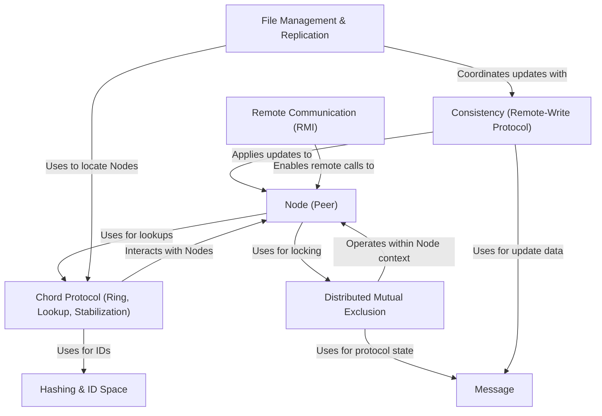

# Project 3 Overview

This project implements a *distributed file storage system*.
It uses the **Chord protocol** to organize participating computers (nodes) into a logical *ring*.
Files are **replicated** (copied) across multiple nodes for availability and fault tolerance.
The system includes mechanisms for **finding** file replicas, ensuring **consistency** when files are updated using a primary copy strategy, and managing **concurrent access** using distributed mutual exclusion. **Hashing** assigns unique IDs to nodes and files, and **RMI** is used for communication between nodes.

**Source Repository:** [None](None)

## Chapters

1. [File Management & Replication
](01_file_management___replication_.md)
2. [Node (Peer)
](02_node__peer__.md)
3. [Remote Communication (RMI)
](03_remote_communication__rmi__.md)
4. [Hashing & ID Space
](04_hashing___id_space_.md)
5. [Chord Protocol (Ring, Lookup, Stabilization)
](05_chord_protocol__ring__lookup__stabilization__.md)
6. [Message
](06_message_.md)
7. [Consistency (Remote-Write Protocol)
](07_consistency__remote_write_protocol__.md)
8. [Distributed Mutual Exclusion
](08_distributed_mutual_exclusion_.md)

---
